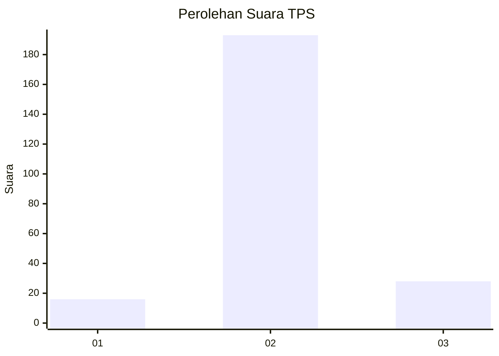
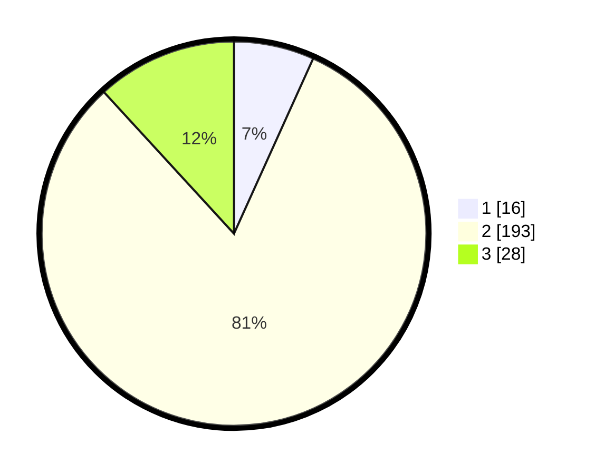

# Hasil

## Grafik

## Tabel

| No. | Nama Paslon    | Suara | Suara (raw) | Persentase |
|:--- |:-------------- | -----:| -----------:| ----------:|
| 1   | ANIES MUHAIMIN | 16    | [16][p-1]   | 6,75       |
| 2   | PRABOWO GIBRAN | 193   | [193][p-2]  | 81,43      |
| 3   | GANJAR MAHFUD  | 28    | [28][p-3]   | 11,81      |

[p-1]: https://github.com/gigit-pemilu/pemilu-2024/blob/main/pilpres/hitung-suara/sub/35-jawa-timur/sub/17-jombang/sub/11-sumobito/sub/2010-mlaras/sub/011-tps/sub/paslon-1.txt
[p-2]: https://github.com/gigit-pemilu/pemilu-2024/blob/main/pilpres/hitung-suara/sub/35-jawa-timur/sub/17-jombang/sub/11-sumobito/sub/2010-mlaras/sub/011-tps/sub/paslon-2.txt
[p-3]: https://github.com/gigit-pemilu/pemilu-2024/blob/main/pilpres/hitung-suara/sub/35-jawa-timur/sub/17-jombang/sub/11-sumobito/sub/2010-mlaras/sub/011-tps/sub/paslon-3.txt

## Foto C Plano

https://sirekap-obj-formc.kpu.go.id/d01c/pemilu/ppwp/35/17/11/20/10/3517112010011-20240217-201145--a97bc467-e0ff-4d0b-9242-4d81e3fc1eb4.jpg

https://sirekap-obj-formc.kpu.go.id/d01c/pemilu/ppwp/35/17/11/20/10/3517112010011-20240219-232353--5c82e613-561c-466f-8337-4c9d79edcaac.jpg

https://sirekap-obj-formc.kpu.go.id/d01c/pemilu/ppwp/35/17/11/20/10/3517112010011-20240219-232352--747e8092-fb5e-457c-b0b9-c8c78f90b259.jpg

## Metadata

| Key        | Value               |
| ---------- | ------------------- |
| Time Stamp | 2024-02-24 22:31:28 |

