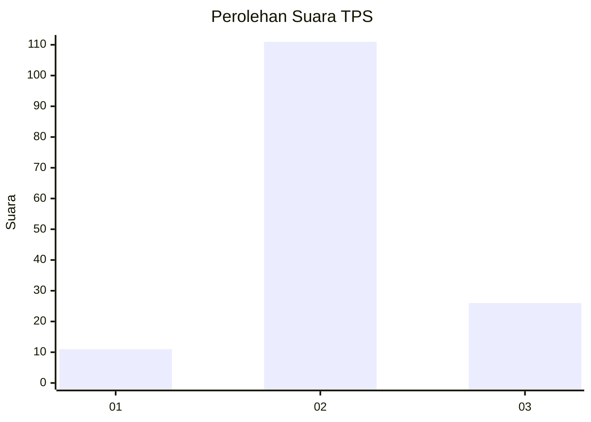

# Hasil

## Grafik

## Tabel

| No. | Nama Paslon    | Suara | Suara (raw) | Persentase |
|:--- |:-------------- | -----:| -----------:| ----------:|
| 1   | ANIES MUHAIMIN | 11    | [11][p-1]   | 7,43       |
| 2   | PRABOWO GIBRAN | 111   | [111][p-2]  | 75,00      |
| 3   | GANJAR MAHFUD  | 26    | [26][p-3]   | 17,57      |

[p-1]: https://github.com/gigit-pemilu/pemilu-2024/blob/main/pilpres/hitung-suara/sub/35-jawa-timur/sub/17-jombang/sub/11-sumobito/sub/2014-curahmalang/sub/018-tps/sub/paslon-1.txt
[p-2]: https://github.com/gigit-pemilu/pemilu-2024/blob/main/pilpres/hitung-suara/sub/35-jawa-timur/sub/17-jombang/sub/11-sumobito/sub/2014-curahmalang/sub/018-tps/sub/paslon-2.txt
[p-3]: https://github.com/gigit-pemilu/pemilu-2024/blob/main/pilpres/hitung-suara/sub/35-jawa-timur/sub/17-jombang/sub/11-sumobito/sub/2014-curahmalang/sub/018-tps/sub/paslon-3.txt

## Foto C Plano

https://sirekap-obj-formc.kpu.go.id/a2dc/pemilu/ppwp/35/17/11/20/14/3517112014018-20240214-221700--7f4ce0af-bf92-4918-bf9a-537fcce0fdfd.jpg

https://sirekap-obj-formc.kpu.go.id/a2dc/pemilu/ppwp/35/17/11/20/14/3517112014018-20240214-222722--39d33a47-73b1-40b0-9d78-678028ed17bf.jpg

https://sirekap-obj-formc.kpu.go.id/a2dc/pemilu/ppwp/35/17/11/20/14/3517112014018-20240214-222959--281b1c9a-58ed-42c0-8416-7e525a0396b8.jpg

## Metadata

| Key        | Value               |
| ---------- | ------------------- |
| Time Stamp | 2024-02-19 06:16:00 |

