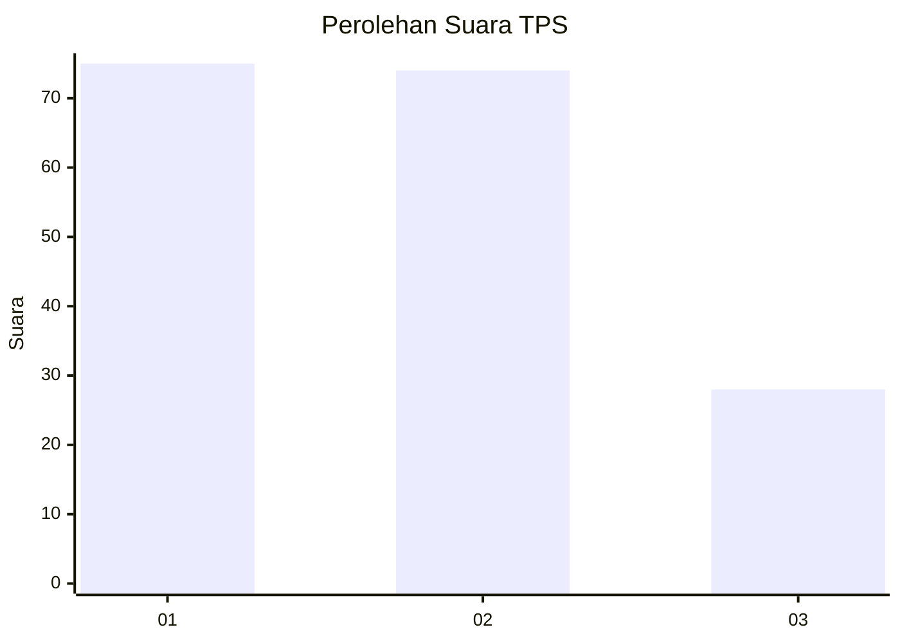
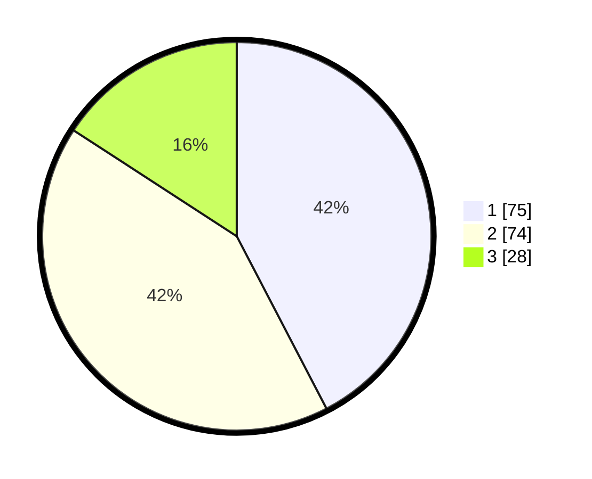

# Hasil

## Grafik

## Tabel

| No. | Nama Paslon    | Suara | Suara (raw) | Persentase |
|:--- |:-------------- | -----:| -----------:| ----------:|
| 1   | ANIES MUHAIMIN | 75    | [75][p-1]   | 42,37      |
| 2   | PRABOWO GIBRAN | 74    | [74][p-2]   | 41,81      |
| 3   | GANJAR MAHFUD  | 28    | [28][p-3]   | 15,82      |

[p-1]: https://github.com/gigit-pemilu/pemilu-2024-35-jawa-timur/blob/main/pilpres/hitung-suara/sub/35-jawa-timur/sub/17-jombang/sub/11-sumobito/sub/2017-talunkidul/sub/003-tps/sub/paslon-1.txt
[p-2]: https://github.com/gigit-pemilu/pemilu-2024-35-jawa-timur/blob/main/pilpres/hitung-suara/sub/35-jawa-timur/sub/17-jombang/sub/11-sumobito/sub/2017-talunkidul/sub/003-tps/sub/paslon-2.txt
[p-3]: https://github.com/gigit-pemilu/pemilu-2024-35-jawa-timur/blob/main/pilpres/hitung-suara/sub/35-jawa-timur/sub/17-jombang/sub/11-sumobito/sub/2017-talunkidul/sub/003-tps/sub/paslon-3.txt

## Foto C Plano

https://sirekap-obj-formc.kpu.go.id/04c7/pemilu/ppwp/35/17/11/20/17/3517112017003-20240219-205358--94ae6cd2-a712-4915-867b-728d331d961e.jpg

https://sirekap-obj-formc.kpu.go.id/04c7/pemilu/ppwp/35/17/11/20/17/3517112017003-20240219-202800--3818a4f7-3dde-49ed-9d98-4cd3fb6f1828.jpg

https://sirekap-obj-formc.kpu.go.id/04c7/pemilu/ppwp/35/17/11/20/17/3517112017003-20240219-205610--b463228b-7273-4159-a69f-9a5865ddd98a.jpg

## Metadata

| Key        | Value               |
| ---------- | ------------------- |
| Time Stamp | 2024-02-19 22:00:00 |

