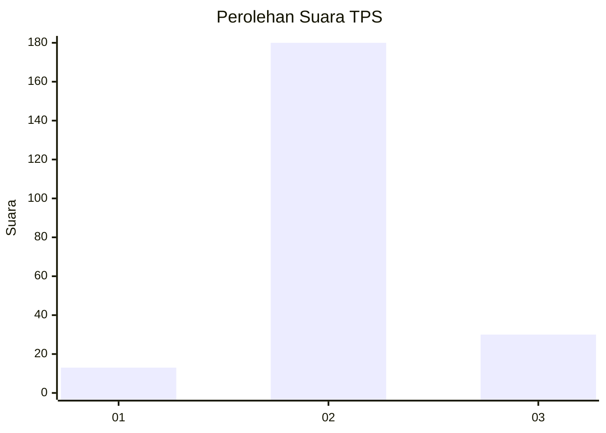
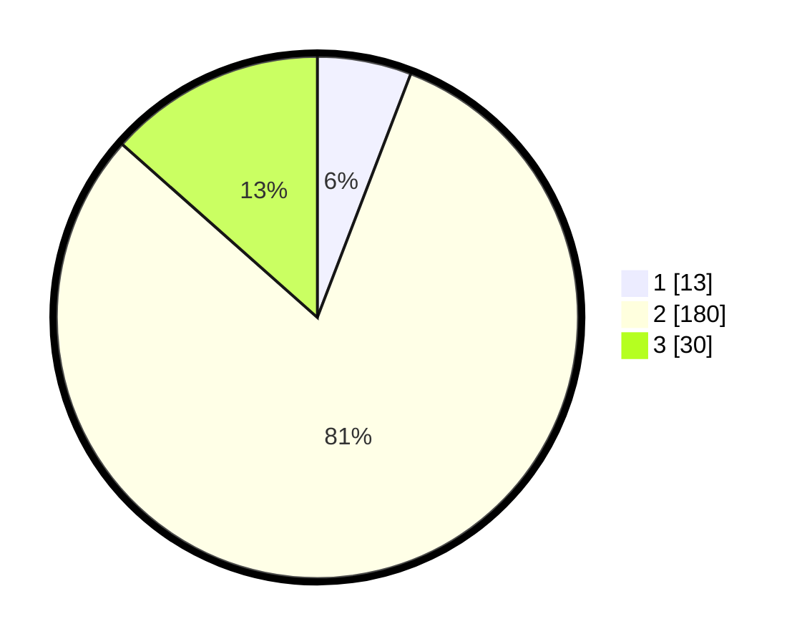

# Hasil

## Grafik

## Tabel

| No. | Nama Paslon    | Suara | Suara (raw) | Persentase |
|:--- |:-------------- | -----:| -----------:| ----------:|
| 1   | ANIES MUHAIMIN | 13    | [13][p-1]   | 5,83       |
| 2   | PRABOWO GIBRAN | 180   | [180][p-2]  | 80,72      |
| 3   | GANJAR MAHFUD  | 30    | [30][p-3]   | 13,45      |

[p-1]: https://github.com/gigit-pemilu/pemilu-2024/blob/main/pilpres/hitung-suara/sub/35-jawa-timur/sub/17-jombang/sub/11-sumobito/sub/2019-bakalan/sub/007-tps/sub/paslon-1.txt
[p-2]: https://github.com/gigit-pemilu/pemilu-2024/blob/main/pilpres/hitung-suara/sub/35-jawa-timur/sub/17-jombang/sub/11-sumobito/sub/2019-bakalan/sub/007-tps/sub/paslon-2.txt
[p-3]: https://github.com/gigit-pemilu/pemilu-2024/blob/main/pilpres/hitung-suara/sub/35-jawa-timur/sub/17-jombang/sub/11-sumobito/sub/2019-bakalan/sub/007-tps/sub/paslon-3.txt

## Foto C Plano

https://sirekap-obj-formc.kpu.go.id/94e9/pemilu/ppwp/35/17/11/20/19/3517112019007-20240215-022631--2132c1c1-8484-4149-95c9-ab0ebbe22d96.jpg

https://sirekap-obj-formc.kpu.go.id/94e9/pemilu/ppwp/35/17/11/20/19/3517112019007-20240215-022710--b8026915-e5ee-448e-a8c6-730d1dd5fd5e.jpg

https://sirekap-obj-formc.kpu.go.id/94e9/pemilu/ppwp/35/17/11/20/19/3517112019007-20240215-022805--5c220fe6-463b-40f2-8fc5-fb7602cd50cd.jpg

## Metadata

| Key        | Value               |
| ---------- | ------------------- |
| Time Stamp | 2024-02-19 06:16:00 |

