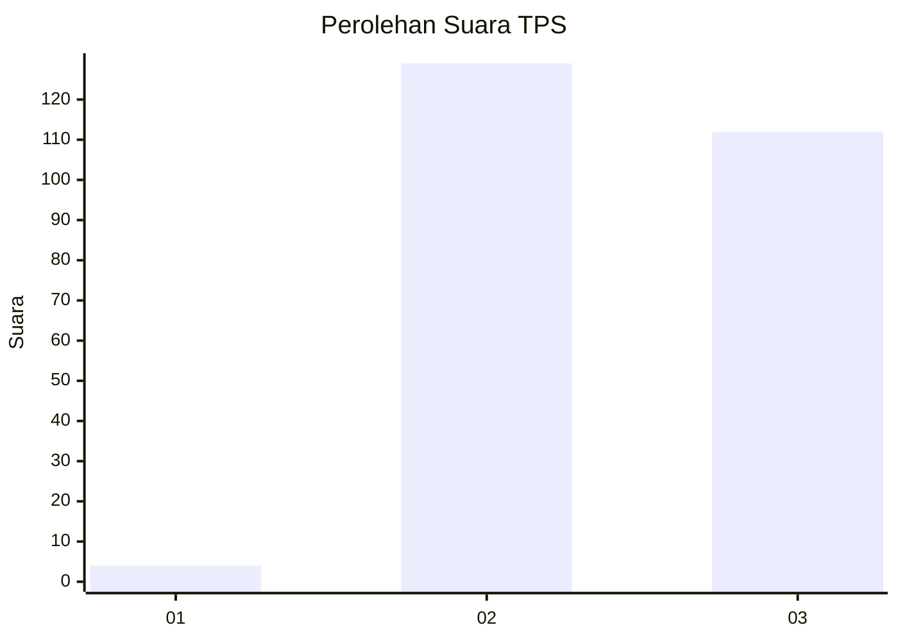
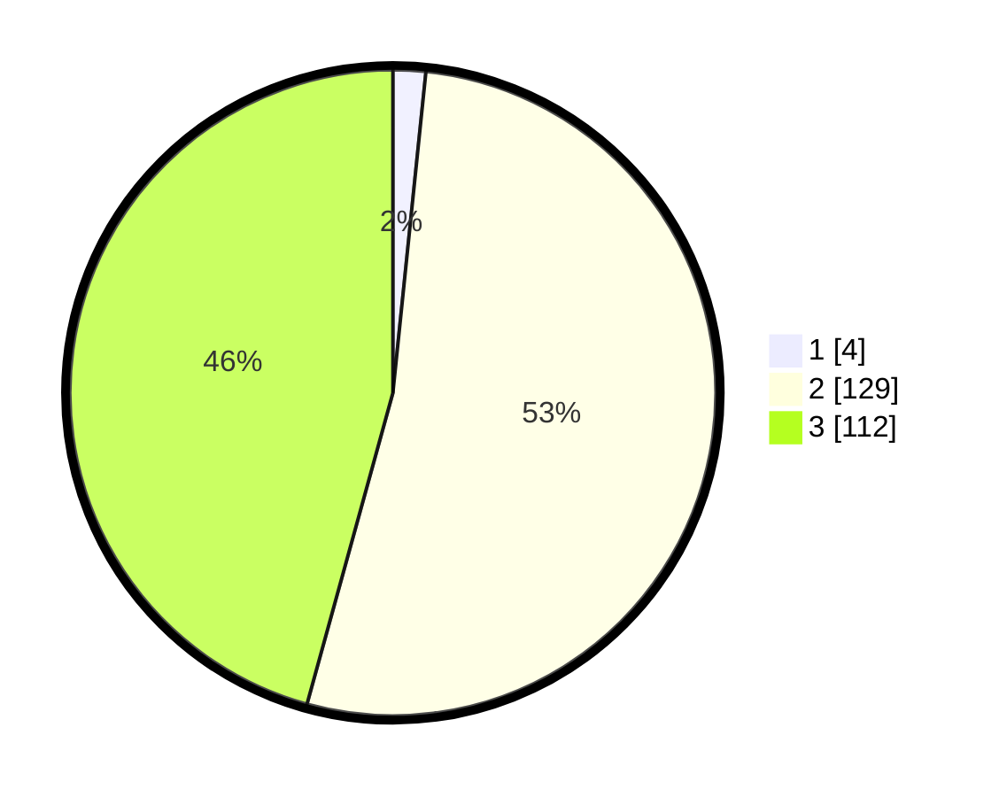

# Hasil

## Grafik

## Tabel

| No. | Nama Paslon    | Suara | Suara (raw) | Persentase |
|:--- |:-------------- | -----:| -----------:| ----------:|
| 1   | ANIES MUHAIMIN | 4     | [4][p-1]    | 1,63       |
| 2   | PRABOWO GIBRAN | 129   | [129][p-2]  | 52,65      |
| 3   | GANJAR MAHFUD  | 112   | [112][p-3]  | 45,71      |

[p-1]: https://github.com/gigit-pemilu/pemilu-2024-35-jawa-timur/blob/main/pilpres/hitung-suara/sub/35-jawa-timur/sub/18-nganjuk/sub/01-sawahan/sub/2006-duren/sub/002-tps/sub/paslon-1.txt
[p-2]: https://github.com/gigit-pemilu/pemilu-2024-35-jawa-timur/blob/main/pilpres/hitung-suara/sub/35-jawa-timur/sub/18-nganjuk/sub/01-sawahan/sub/2006-duren/sub/002-tps/sub/paslon-2.txt
[p-3]: https://github.com/gigit-pemilu/pemilu-2024-35-jawa-timur/blob/main/pilpres/hitung-suara/sub/35-jawa-timur/sub/18-nganjuk/sub/01-sawahan/sub/2006-duren/sub/002-tps/sub/paslon-3.txt

## Foto C Plano

https://sirekap-obj-formc.kpu.go.id/8a73/pemilu/ppwp/35/18/01/20/06/3518012006002-20240217-132451--bd9f4d4d-e169-4a6b-97c1-1f7e03d425a4.jpg

https://sirekap-obj-formc.kpu.go.id/8a73/pemilu/ppwp/35/18/01/20/06/3518012006002-20240217-132139--b3bc6b6e-0b08-40b6-8703-d090263de712.jpg

https://sirekap-obj-formc.kpu.go.id/8a73/pemilu/ppwp/35/18/01/20/06/3518012006002-20240217-132331--61957b4a-3716-402f-81fa-8e8e4c9469b7.jpg

## Metadata

| Key        | Value               |
| ---------- | ------------------- |
| Time Stamp | 2024-02-17 14:45:18 |

