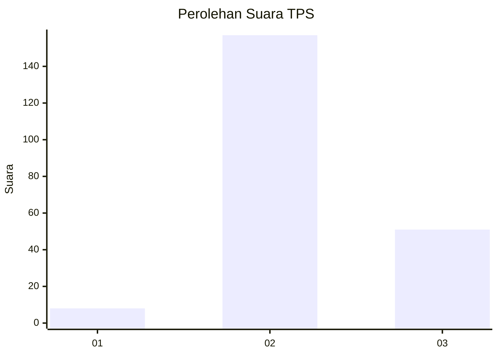
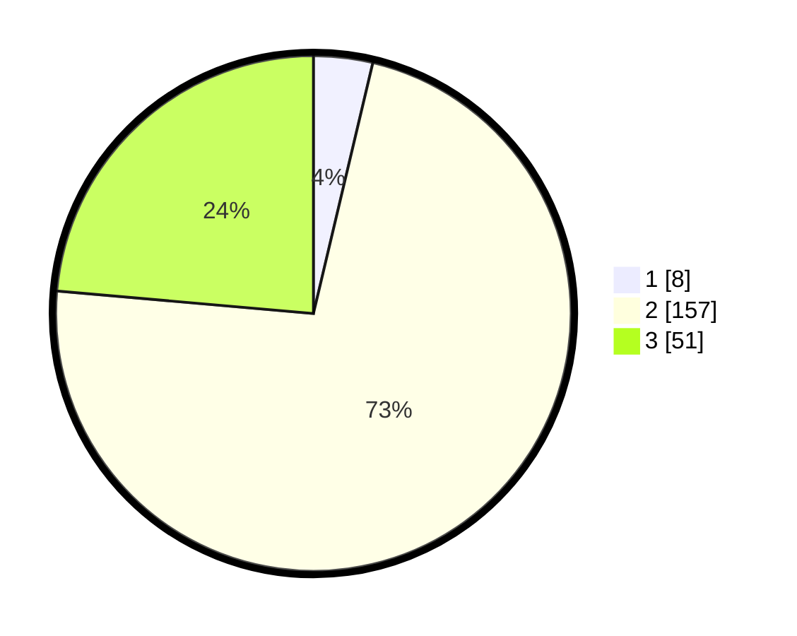

# Hasil

## Grafik

## Tabel

| No. | Nama Paslon    | Suara | Suara (raw) | Persentase |
|:--- |:-------------- | -----:| -----------:| ----------:|
| 1   | ANIES MUHAIMIN | 8     | [8][p-1]    | 3,70       |
| 2   | PRABOWO GIBRAN | 157   | [157][p-2]  | 72,69      |
| 3   | GANJAR MAHFUD  | 51    | [51][p-3]   | 23,61      |

[p-1]: https://github.com/gigit-pemilu/pemilu-2024-35-jawa-timur/blob/main/pilpres/hitung-suara/sub/35-jawa-timur/sub/18-nganjuk/sub/02-ngetos/sub/2001-kuncir/sub/003-tps/sub/paslon-1.txt
[p-2]: https://github.com/gigit-pemilu/pemilu-2024-35-jawa-timur/blob/main/pilpres/hitung-suara/sub/35-jawa-timur/sub/18-nganjuk/sub/02-ngetos/sub/2001-kuncir/sub/003-tps/sub/paslon-2.txt
[p-3]: https://github.com/gigit-pemilu/pemilu-2024-35-jawa-timur/blob/main/pilpres/hitung-suara/sub/35-jawa-timur/sub/18-nganjuk/sub/02-ngetos/sub/2001-kuncir/sub/003-tps/sub/paslon-3.txt

## Foto C Plano

https://sirekap-obj-formc.kpu.go.id/32b1/pemilu/ppwp/35/18/02/20/01/3518022001003-20240217-081830--ea404314-f329-4ad5-8dd5-53e1bbb97e3e.jpg

https://sirekap-obj-formc.kpu.go.id/32b1/pemilu/ppwp/35/18/02/20/01/3518022001003-20240215-004052--9275513c-e82f-4e73-a461-8fe65081729b.jpg

https://sirekap-obj-formc.kpu.go.id/32b1/pemilu/ppwp/35/18/02/20/01/3518022001003-20240215-004155--dd7e164d-77c5-4542-814b-55ff78c6eac9.jpg

## Metadata

| Key        | Value               |
| ---------- | ------------------- |
| Time Stamp | 2024-02-17 14:45:18 |

