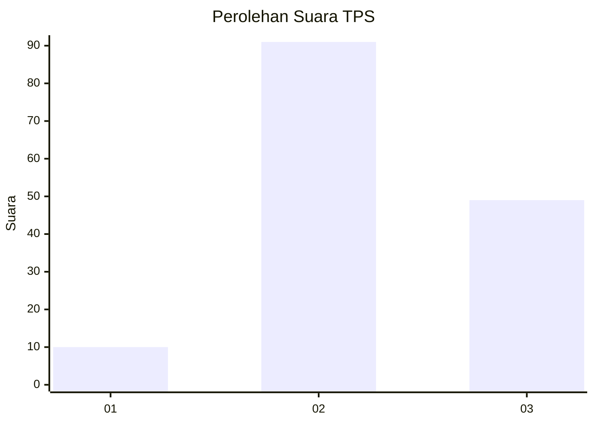
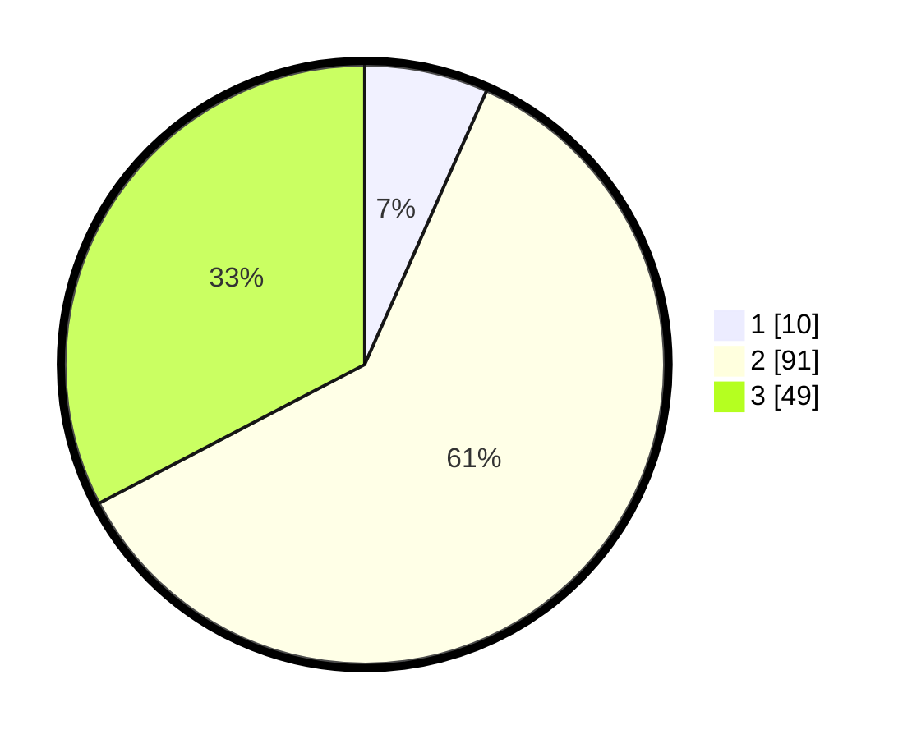

# Hasil

## Grafik

## Tabel

| No. | Nama Paslon    | Suara | Suara (raw) | Persentase |
|:--- |:-------------- | -----:| -----------:| ----------:|
| 1   | ANIES MUHAIMIN | 10    | [10][p-1]   | 6,67       |
| 2   | PRABOWO GIBRAN | 91    | [91][p-2]   | 60,67      |
| 3   | GANJAR MAHFUD  | 49    | [49][p-3]   | 32,67      |

[p-1]: https://github.com/gigit-pemilu/pemilu-2024/blob/main/pilpres/hitung-suara/sub/35-jawa-timur/sub/18-nganjuk/sub/02-ngetos/sub/2002-kepel/sub/012-tps/sub/paslon-1.txt
[p-2]: https://github.com/gigit-pemilu/pemilu-2024/blob/main/pilpres/hitung-suara/sub/35-jawa-timur/sub/18-nganjuk/sub/02-ngetos/sub/2002-kepel/sub/012-tps/sub/paslon-2.txt
[p-3]: https://github.com/gigit-pemilu/pemilu-2024/blob/main/pilpres/hitung-suara/sub/35-jawa-timur/sub/18-nganjuk/sub/02-ngetos/sub/2002-kepel/sub/012-tps/sub/paslon-3.txt

## Foto C Plano

https://sirekap-obj-formc.kpu.go.id/c516/pemilu/ppwp/35/18/02/20/02/3518022002012-20240217-200949--03e7e681-e8ec-451a-81bb-77c6552c7a44.jpg

https://sirekap-obj-formc.kpu.go.id/c516/pemilu/ppwp/35/18/02/20/02/3518022002012-20240217-201118--b34614e8-db67-4c0e-a294-797f9cc0cf6b.jpg

https://sirekap-obj-formc.kpu.go.id/c516/pemilu/ppwp/35/18/02/20/02/3518022002012-20240217-201251--40dd62ed-e15d-43b6-a8a3-bdf5d92c78b9.jpg

## Metadata

| Key        | Value               |
| ---------- | ------------------- |
| Time Stamp | 2024-02-25 12:00:00 |

