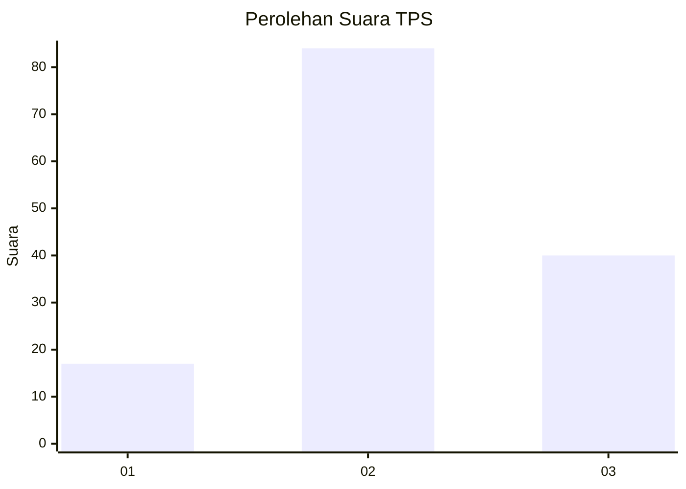
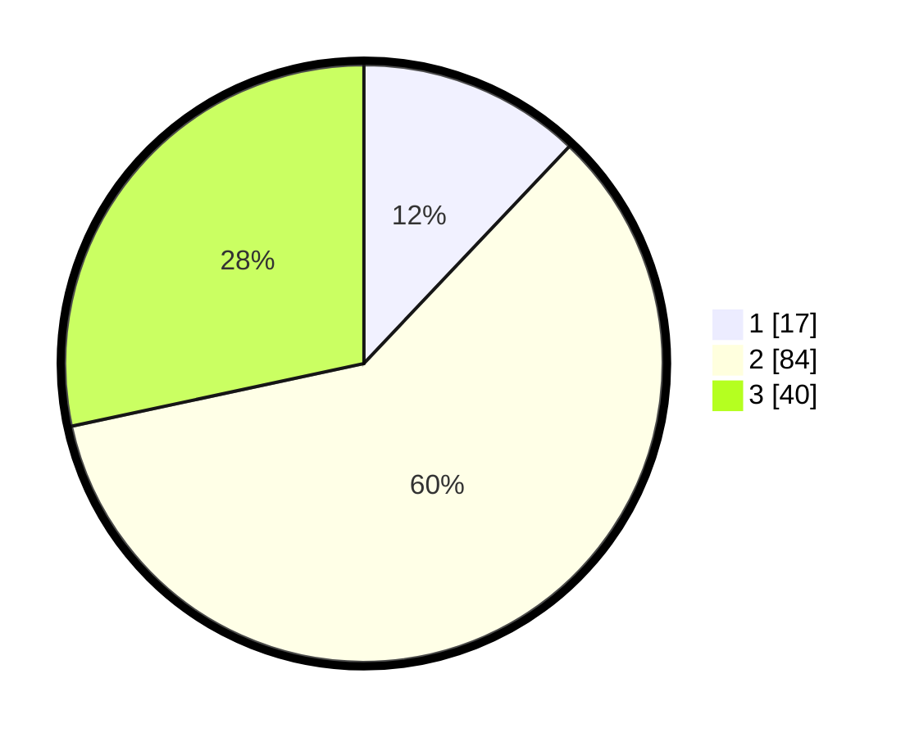

# Hasil

## Grafik

## Tabel

| No. | Nama Paslon    | Suara | Suara (raw) | Persentase |
|:--- |:-------------- | -----:| -----------:| ----------:|
| 1   | ANIES MUHAIMIN | 17    | [17][p-1]   | 12,06      |
| 2   | PRABOWO GIBRAN | 84    | [84][p-2]   | 59,57      |
| 3   | GANJAR MAHFUD  | 40    | [40][p-3]   | 28,37      |

[p-1]: https://github.com/gigit-pemilu/pemilu-2024-35-jawa-timur/blob/main/pilpres/hitung-suara/sub/35-jawa-timur/sub/18-nganjuk/sub/02-ngetos/sub/2002-kepel/sub/015-tps/sub/paslon-1.txt
[p-2]: https://github.com/gigit-pemilu/pemilu-2024-35-jawa-timur/blob/main/pilpres/hitung-suara/sub/35-jawa-timur/sub/18-nganjuk/sub/02-ngetos/sub/2002-kepel/sub/015-tps/sub/paslon-2.txt
[p-3]: https://github.com/gigit-pemilu/pemilu-2024-35-jawa-timur/blob/main/pilpres/hitung-suara/sub/35-jawa-timur/sub/18-nganjuk/sub/02-ngetos/sub/2002-kepel/sub/015-tps/sub/paslon-3.txt

## Foto C Plano

https://sirekap-obj-formc.kpu.go.id/d9bf/pemilu/ppwp/35/18/02/20/02/3518022002015-20240214-224124--8e51d5bc-4fd3-4fb4-bb0f-86ef71a8e65a.jpg

https://sirekap-obj-formc.kpu.go.id/d9bf/pemilu/ppwp/35/18/02/20/02/3518022002015-20240214-224300--3d8466cd-0a7c-42a8-a432-5fa9470b4519.jpg

https://sirekap-obj-formc.kpu.go.id/d9bf/pemilu/ppwp/35/18/02/20/02/3518022002015-20240214-224532--95d6e0c0-1e12-4e75-813c-f40f81d2d89a.jpg

## Metadata

| Key        | Value               |
| ---------- | ------------------- |
| Time Stamp | 2024-02-24 22:31:28 |

