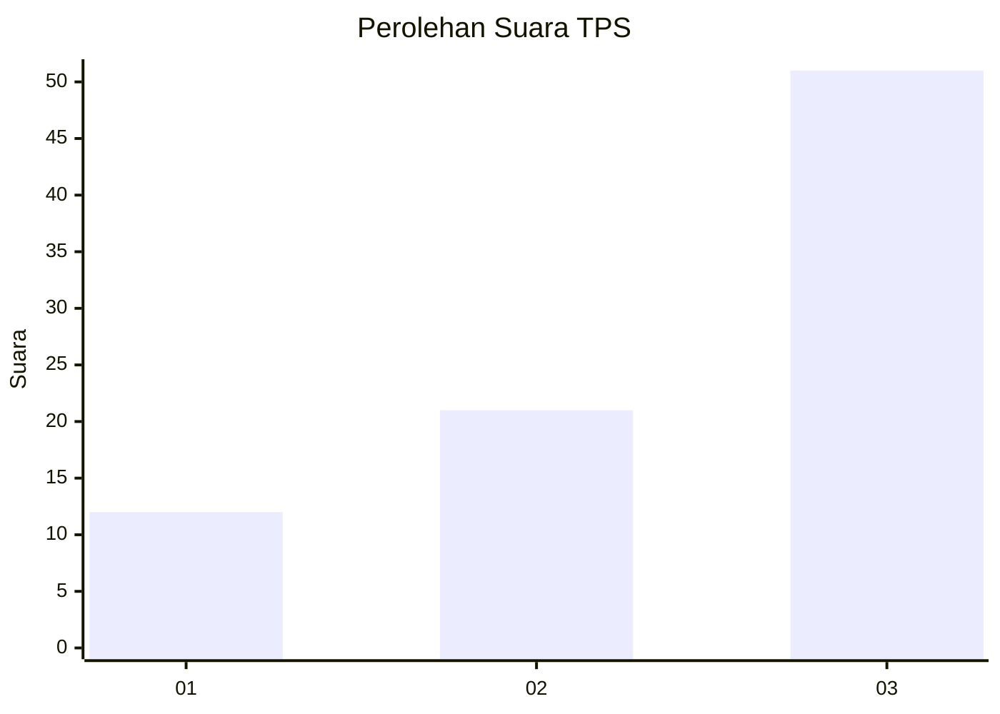
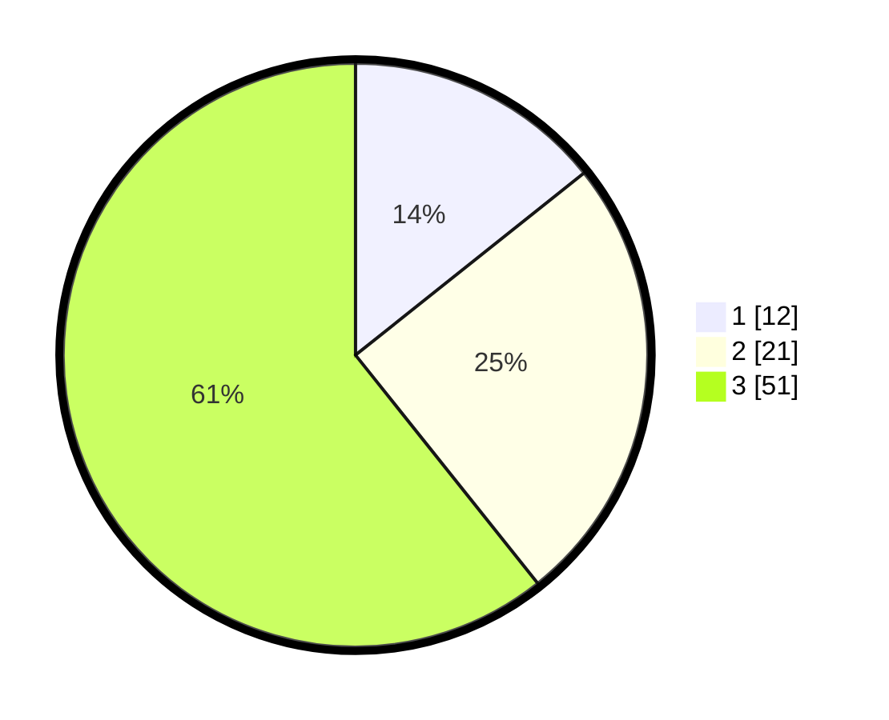

# Hasil

## Grafik

## Tabel

| No. | Nama Paslon    | Suara | Suara (raw) | Persentase |
|:--- |:-------------- | -----:| -----------:| ----------:|
| 1   | ANIES MUHAIMIN | 12    | [12][p-1]   | 14,29      |
| 2   | PRABOWO GIBRAN | 21    | [21][p-2]   | 25,00      |
| 3   | GANJAR MAHFUD  | 51    | [51][p-3]   | 60,71      |

[p-1]: https://github.com/gigit-pemilu/pemilu-2024-35-jawa-timur/blob/main/pilpres/hitung-suara/sub/35-jawa-timur/sub/18-nganjuk/sub/02-ngetos/sub/2002-kepel/sub/017-tps/sub/paslon-1.txt
[p-2]: https://github.com/gigit-pemilu/pemilu-2024-35-jawa-timur/blob/main/pilpres/hitung-suara/sub/35-jawa-timur/sub/18-nganjuk/sub/02-ngetos/sub/2002-kepel/sub/017-tps/sub/paslon-2.txt
[p-3]: https://github.com/gigit-pemilu/pemilu-2024-35-jawa-timur/blob/main/pilpres/hitung-suara/sub/35-jawa-timur/sub/18-nganjuk/sub/02-ngetos/sub/2002-kepel/sub/017-tps/sub/paslon-3.txt

## Foto C Plano

https://sirekap-obj-formc.kpu.go.id/0e69/pemilu/ppwp/35/18/02/20/02/3518022002017-20240215-001524--fa5c4b96-1875-44b8-b001-f4e86ee3b4dd.jpg

https://sirekap-obj-formc.kpu.go.id/0e69/pemilu/ppwp/35/18/02/20/02/3518022002017-20240215-001807--ca806e52-6bb0-4ae0-b70b-fb3146f869e1.jpg

https://sirekap-obj-formc.kpu.go.id/0e69/pemilu/ppwp/35/18/02/20/02/3518022002017-20240215-002053--0f9537fa-2273-472e-8aee-7c9f8532c8ea.jpg

## Metadata

| Key        | Value               |
| ---------- | ------------------- |
| Time Stamp | 2024-02-25 15:00:00 |

