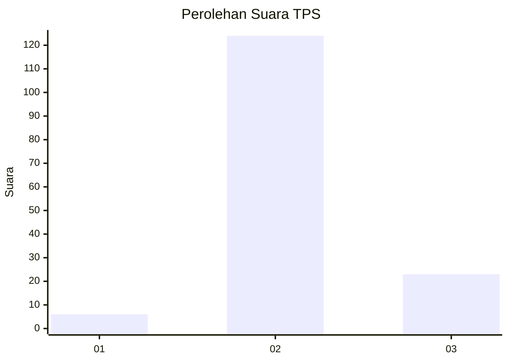

# Hasil

## Grafik

## Tabel

| No. | Nama Paslon    | Suara | Suara (raw) | Persentase |
|:--- |:-------------- | -----:| -----------:| ----------:|
| 1   | ANIES MUHAIMIN | 6     | [6][p-1]    | 3,92       |
| 2   | PRABOWO GIBRAN | 124   | [124][p-2]  | 81,05      |
| 3   | GANJAR MAHFUD  | 23    | [23][p-3]   | 15,03      |

[p-1]: https://github.com/gigit-pemilu/pemilu-2024-35-jawa-timur/blob/main/pilpres/hitung-suara/sub/35-jawa-timur/sub/18-nganjuk/sub/02-ngetos/sub/2005-klodan/sub/005-tps/sub/paslon-1.txt
[p-2]: https://github.com/gigit-pemilu/pemilu-2024-35-jawa-timur/blob/main/pilpres/hitung-suara/sub/35-jawa-timur/sub/18-nganjuk/sub/02-ngetos/sub/2005-klodan/sub/005-tps/sub/paslon-2.txt
[p-3]: https://github.com/gigit-pemilu/pemilu-2024-35-jawa-timur/blob/main/pilpres/hitung-suara/sub/35-jawa-timur/sub/18-nganjuk/sub/02-ngetos/sub/2005-klodan/sub/005-tps/sub/paslon-3.txt

## Foto C Plano

https://sirekap-obj-formc.kpu.go.id/30c5/pemilu/ppwp/35/18/02/20/05/3518022005005-20240215-011319--4292e3ba-ccd8-4559-9e5f-db1e45a1f64d.jpg

https://sirekap-obj-formc.kpu.go.id/30c5/pemilu/ppwp/35/18/02/20/05/3518022005005-20240215-011500--86be9659-f630-4e38-94d5-70ee67289b1d.jpg

https://sirekap-obj-formc.kpu.go.id/30c5/pemilu/ppwp/35/18/02/20/05/3518022005005-20240215-011805--e7bfeda1-4fda-46be-a573-5e58a88a3aa5.jpg

## Metadata

| Key        | Value               |
| ---------- | ------------------- |
| Time Stamp | 2024-02-19 06:16:00 |

