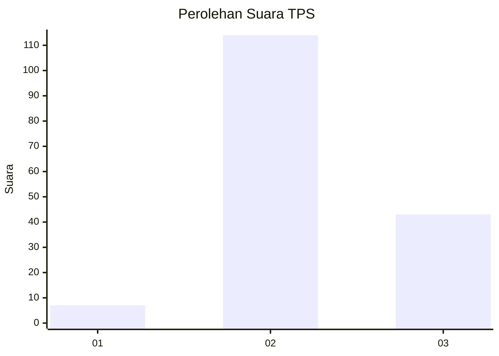

# Hasil

## Grafik

## Tabel

| No. | Nama Paslon    | Suara | Suara (raw) | Persentase |
|:--- |:-------------- | -----:| -----------:| ----------:|
| 1   | ANIES MUHAIMIN | 7     | [7][p-1]    | 4,27       |
| 2   | PRABOWO GIBRAN | 114   | [114][p-2]  | 69,51      |
| 3   | GANJAR MAHFUD  | 43    | [43][p-3]   | 26,22      |

[p-1]: https://github.com/gigit-pemilu/pemilu-2024-35-jawa-timur/blob/main/pilpres/hitung-suara/sub/35-jawa-timur/sub/18-nganjuk/sub/02-ngetos/sub/2006-mojoduwur/sub/004-tps/sub/paslon-1.txt
[p-2]: https://github.com/gigit-pemilu/pemilu-2024-35-jawa-timur/blob/main/pilpres/hitung-suara/sub/35-jawa-timur/sub/18-nganjuk/sub/02-ngetos/sub/2006-mojoduwur/sub/004-tps/sub/paslon-2.txt
[p-3]: https://github.com/gigit-pemilu/pemilu-2024-35-jawa-timur/blob/main/pilpres/hitung-suara/sub/35-jawa-timur/sub/18-nganjuk/sub/02-ngetos/sub/2006-mojoduwur/sub/004-tps/sub/paslon-3.txt

## Foto C Plano

https://sirekap-obj-formc.kpu.go.id/8c31/pemilu/ppwp/35/18/02/20/06/3518022006004-20240215-035414--82dbcaa6-393a-43b3-b414-f3301df2a936.jpg

https://sirekap-obj-formc.kpu.go.id/8c31/pemilu/ppwp/35/18/02/20/06/3518022006004-20240217-151459--8d001e51-df85-4697-ab6b-056b9cb03af4.jpg

https://sirekap-obj-formc.kpu.go.id/8c31/pemilu/ppwp/35/18/02/20/06/3518022006004-20240215-035655--200685b6-231d-499e-a03d-c26279bae890.jpg

## Metadata

| Key        | Value               |
| ---------- | ------------------- |
| Time Stamp | 2024-02-19 06:16:00 |

