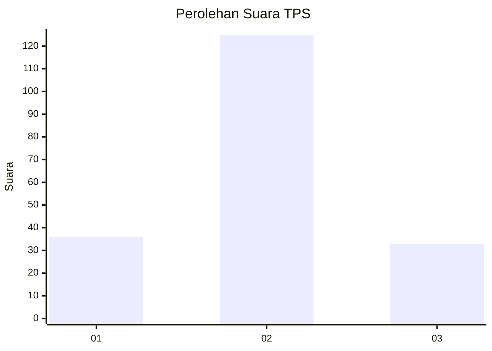
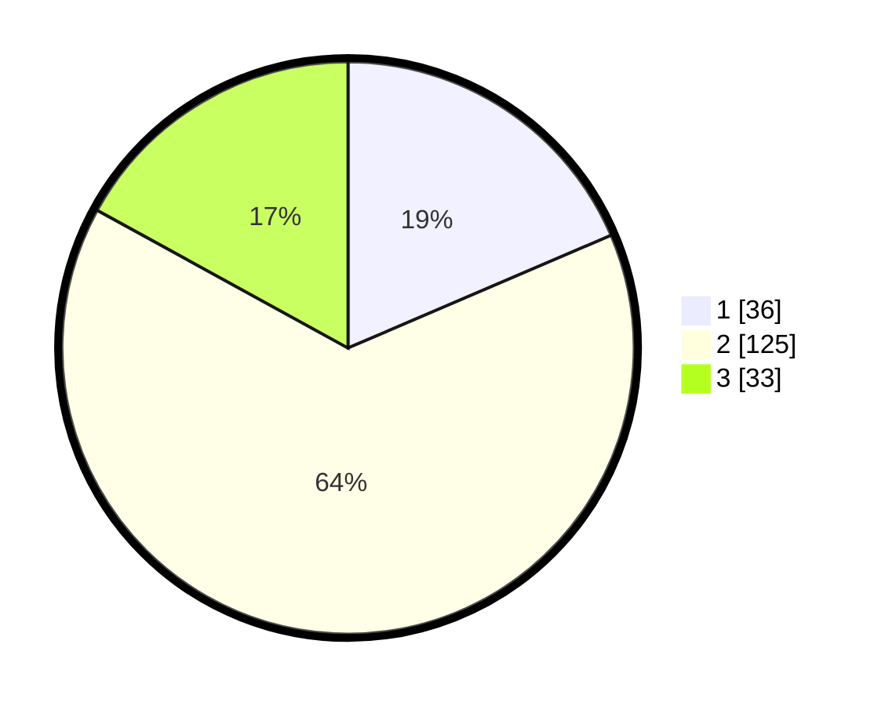

# Hasil

## Grafik

## Tabel

| No. | Nama Paslon    | Suara | Suara (raw) | Persentase |
|:--- |:-------------- | -----:| -----------:| ----------:|
| 1   | ANIES MUHAIMIN | 36    | [36][p-1]   | 18,56      |
| 2   | PRABOWO GIBRAN | 125   | [125][p-2]  | 64,43      |
| 3   | GANJAR MAHFUD  | 33    | [33][p-3]   | 17,01      |

[p-1]: https://github.com/gigit-pemilu/pemilu-2024/blob/main/pilpres/hitung-suara/sub/35-jawa-timur/sub/18-nganjuk/sub/03-berbek/sub/2005-berbek/sub/002-tps/sub/paslon-1.txt
[p-2]: https://github.com/gigit-pemilu/pemilu-2024/blob/main/pilpres/hitung-suara/sub/35-jawa-timur/sub/18-nganjuk/sub/03-berbek/sub/2005-berbek/sub/002-tps/sub/paslon-2.txt
[p-3]: https://github.com/gigit-pemilu/pemilu-2024/blob/main/pilpres/hitung-suara/sub/35-jawa-timur/sub/18-nganjuk/sub/03-berbek/sub/2005-berbek/sub/002-tps/sub/paslon-3.txt

## Foto C Plano

https://sirekap-obj-formc.kpu.go.id/ec23/pemilu/ppwp/35/18/03/20/05/3518032005002-20240214-211505--134f928a-2d8a-4057-a2cb-37542ba1e9b7.jpg

https://sirekap-obj-formc.kpu.go.id/ec23/pemilu/ppwp/35/18/03/20/05/3518032005002-20240214-212545--7ac40f8c-ee5d-4804-ae15-55f9e6d2f833.jpg

https://sirekap-obj-formc.kpu.go.id/ec23/pemilu/ppwp/35/18/03/20/05/3518032005002-20240214-213532--2b8a75da-c80c-49ea-b1ef-ea713d59cfa3.jpg

## Metadata

| Key        | Value               |
| ---------- | ------------------- |
| Time Stamp | 2024-02-16 10:00:28 |

