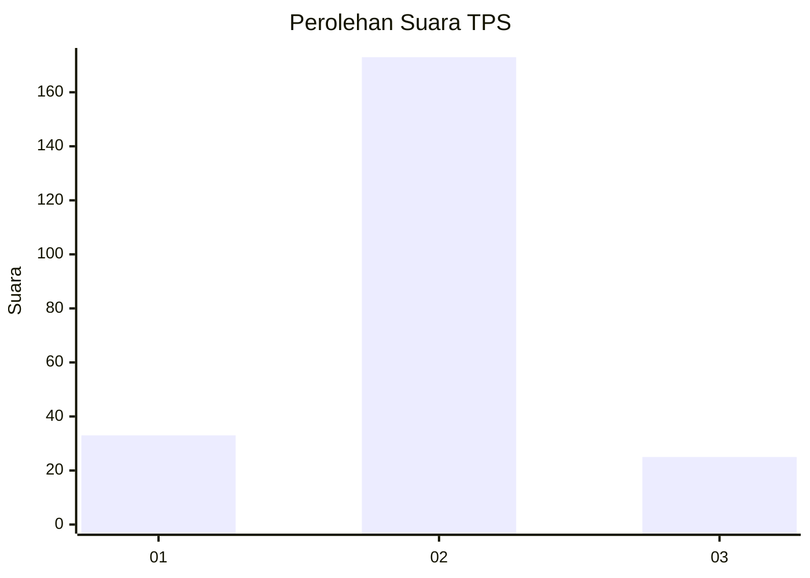
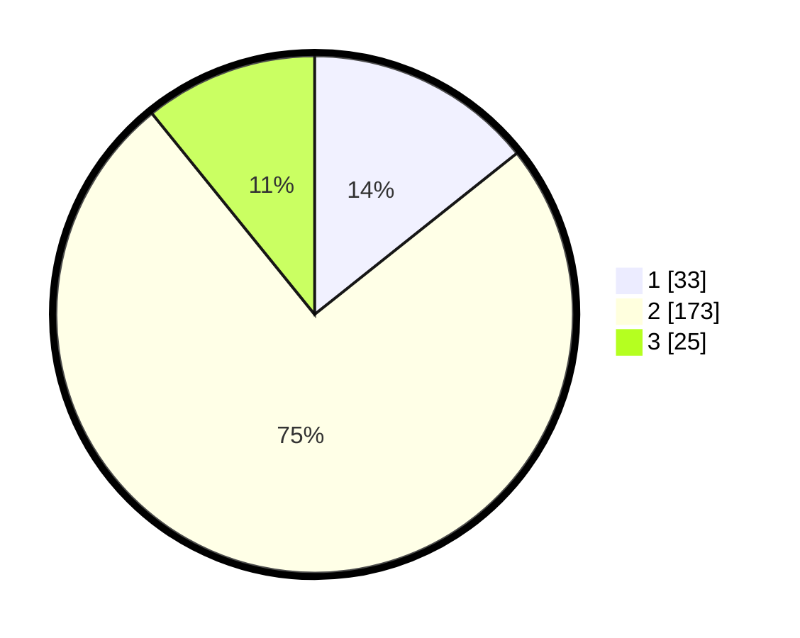

# Hasil

## Grafik

## Tabel

| No. | Nama Paslon    | Suara | Suara (raw) | Persentase |
|:--- |:-------------- | -----:| -----------:| ----------:|
| 1   | ANIES MUHAIMIN | 33    | [33][p-1]   | 14,29      |
| 2   | PRABOWO GIBRAN | 173   | [173][p-2]  | 74,89      |
| 3   | GANJAR MAHFUD  | 25    | [25][p-3]   | 10,82      |

[p-1]: https://github.com/gigit-pemilu/pemilu-2024/blob/main/pilpres/hitung-suara/sub/35-jawa-timur/sub/18-nganjuk/sub/06-prambon/sub/2001-gondanglegi/sub/002-tps/sub/paslon-1.txt
[p-2]: https://github.com/gigit-pemilu/pemilu-2024/blob/main/pilpres/hitung-suara/sub/35-jawa-timur/sub/18-nganjuk/sub/06-prambon/sub/2001-gondanglegi/sub/002-tps/sub/paslon-2.txt
[p-3]: https://github.com/gigit-pemilu/pemilu-2024/blob/main/pilpres/hitung-suara/sub/35-jawa-timur/sub/18-nganjuk/sub/06-prambon/sub/2001-gondanglegi/sub/002-tps/sub/paslon-3.txt

## Foto C Plano

https://sirekap-obj-formc.kpu.go.id/1c30/pemilu/ppwp/35/18/06/20/01/3518062001002-20240215-033639--3d2bd92f-cd96-4d98-97ae-6d7811a0d03f.jpg

https://sirekap-obj-formc.kpu.go.id/1c30/pemilu/ppwp/35/18/06/20/01/3518062001002-20240215-010415--1ab65b32-de48-4d92-b729-5aca5ee3ada7.jpg

https://sirekap-obj-formc.kpu.go.id/1c30/pemilu/ppwp/35/18/06/20/01/3518062001002-20240215-010326--3de59fe1-d74f-44f5-adf3-f4daa4da5f54.jpg

## Metadata

| Key        | Value               |
| ---------- | ------------------- |
| Time Stamp | 2024-02-17 16:36:25 |

## DATA PEMILIH TETAP

Jumlah pemilih dalam DPT: **205**.
 * L: **142**.
 * P: **143**.

## DATA PENGGUNA HAK PILIH

Jumlah pengguna hak pilih dalam DPT: **235**.
 * L: **614**.
 * P: **121**.

Jumlah pengguna hak pilih dalam DPTb: **888**.
 * L: **888**.
 * P: **888**.

Jumlah pengguna hak pilih dalam DPK: **882**.
 * L: **882**.
 * P: **888**.

Jumlah pengguna hak pilih: **237**.
 * L: **116**.
 * P: **121**.

## JUMLAH SUARA SAH DAN TIDAK SAH

JUMLAH SELURUH SUARA SAH: **231**.

JUMLAH SUARA TIDAK SAH: **6**.

JUMLAH SELURUH SUARA SAH DAN SUARA TIDAK SAH: **237**.

