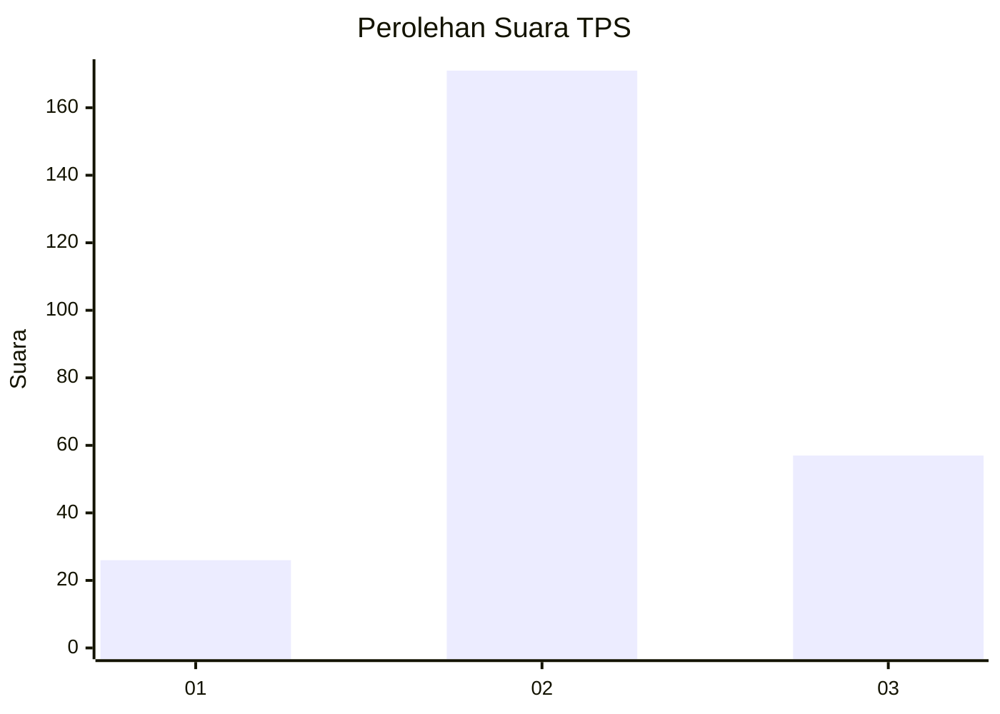
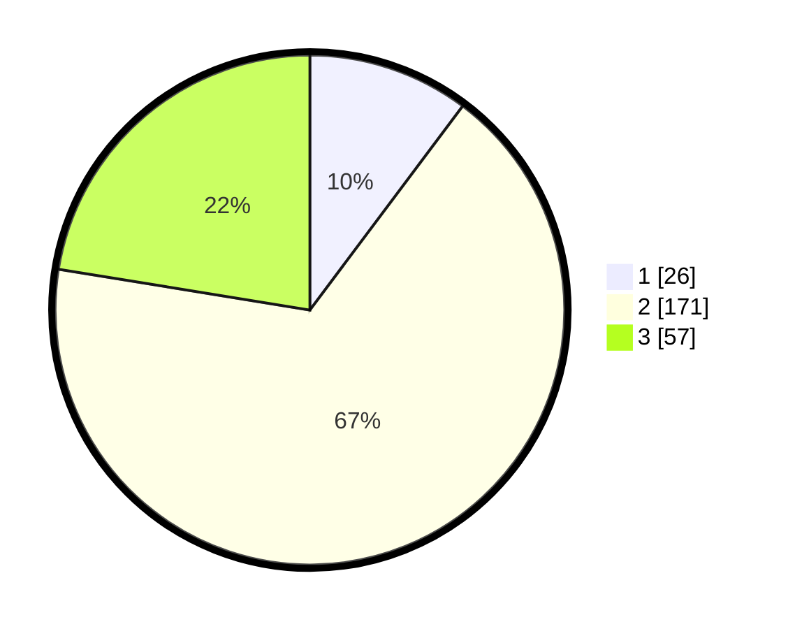

# Hasil

## Grafik

## Tabel

| No. | Nama Paslon    | Suara | Suara (raw) | Persentase |
|:--- |:-------------- | -----:| -----------:| ----------:|
| 1   | ANIES MUHAIMIN | 26    | [26][p-1]   | 10,24      |
| 2   | PRABOWO GIBRAN | 171   | [171][p-2]  | 67,32      |
| 3   | GANJAR MAHFUD  | 57    | [57][p-3]   | 22,44      |

[p-1]: https://github.com/gigit-pemilu/pemilu-2024/blob/main/pilpres/hitung-suara/sub/35-jawa-timur/sub/18-nganjuk/sub/06-prambon/sub/2007-tegaron/sub/004-tps/sub/paslon-1.txt
[p-2]: https://github.com/gigit-pemilu/pemilu-2024/blob/main/pilpres/hitung-suara/sub/35-jawa-timur/sub/18-nganjuk/sub/06-prambon/sub/2007-tegaron/sub/004-tps/sub/paslon-2.txt
[p-3]: https://github.com/gigit-pemilu/pemilu-2024/blob/main/pilpres/hitung-suara/sub/35-jawa-timur/sub/18-nganjuk/sub/06-prambon/sub/2007-tegaron/sub/004-tps/sub/paslon-3.txt

## Foto C Plano

https://sirekap-obj-formc.kpu.go.id/60c9/pemilu/ppwp/35/18/06/20/07/3518062007004-20240214-192402--42b6fdaf-511a-44c2-8c1c-ab3416c7ef09.jpg

https://sirekap-obj-formc.kpu.go.id/60c9/pemilu/ppwp/35/18/06/20/07/3518062007004-20240214-193457--59ae01d4-33c5-4ecb-afbd-1b1bebb3bef4.jpg

https://sirekap-obj-formc.kpu.go.id/60c9/pemilu/ppwp/35/18/06/20/07/3518062007004-20240214-193602--77984c8f-93a5-431a-b968-f5237fe87b24.jpg

## Metadata

| Key        | Value               |
| ---------- | ------------------- |
| Time Stamp | 2024-02-19 06:16:00 |

