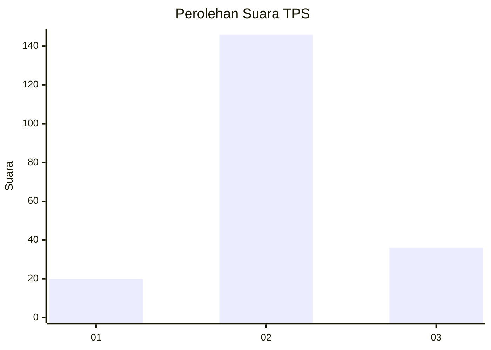
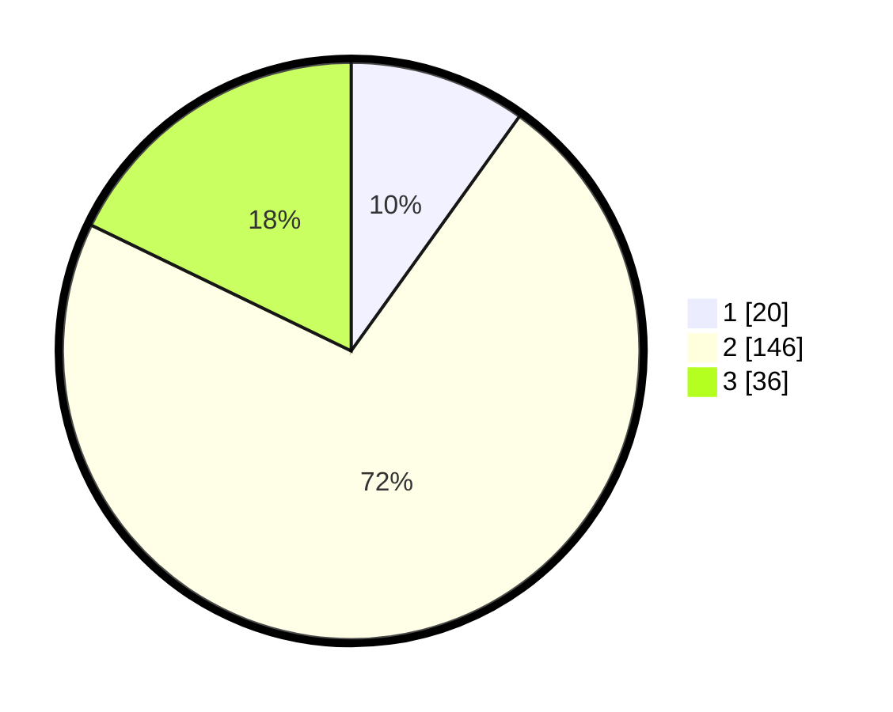

# Hasil

## Grafik

## Tabel

| No. | Nama Paslon    | Suara | Suara (raw) | Persentase |
|:--- |:-------------- | -----:| -----------:| ----------:|
| 1   | ANIES MUHAIMIN | 20    | [20][p-1]   | 9,90       |
| 2   | PRABOWO GIBRAN | 146   | [146][p-2]  | 72,28      |
| 3   | GANJAR MAHFUD  | 36    | [36][p-3]   | 17,82      |

[p-1]: https://github.com/gigit-pemilu/pemilu-2024/blob/main/pilpres/hitung-suara/sub/35-jawa-timur/sub/18-nganjuk/sub/06-prambon/sub/2008-tanjungtani/sub/005-tps/sub/paslon-1.txt
[p-2]: https://github.com/gigit-pemilu/pemilu-2024/blob/main/pilpres/hitung-suara/sub/35-jawa-timur/sub/18-nganjuk/sub/06-prambon/sub/2008-tanjungtani/sub/005-tps/sub/paslon-2.txt
[p-3]: https://github.com/gigit-pemilu/pemilu-2024/blob/main/pilpres/hitung-suara/sub/35-jawa-timur/sub/18-nganjuk/sub/06-prambon/sub/2008-tanjungtani/sub/005-tps/sub/paslon-3.txt

## Foto C Plano

https://sirekap-obj-formc.kpu.go.id/15a0/pemilu/ppwp/35/18/06/20/08/3518062008005-20240215-162148--d995deca-24f4-4518-8f2d-4419c68ff351.jpg

https://sirekap-obj-formc.kpu.go.id/15a0/pemilu/ppwp/35/18/06/20/08/3518062008005-20240215-145758--8c7439a1-cddf-44ff-9769-ca070ad0ad3b.jpg

https://sirekap-obj-formc.kpu.go.id/15a0/pemilu/ppwp/35/18/06/20/08/3518062008005-20240215-162445--82d31c16-86d2-4431-8240-ab456f5038a1.jpg

## Metadata

| Key        | Value               |
| ---------- | ------------------- |
| Time Stamp | 2024-02-19 06:16:00 |

