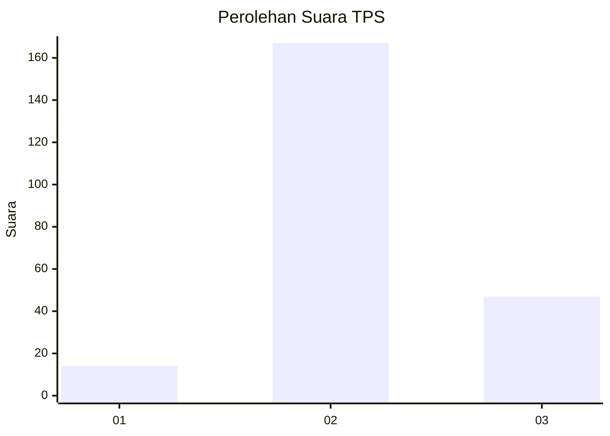

# Hasil

## Grafik

## Tabel

| No. | Nama Paslon    | Suara | Suara (raw) | Persentase |
|:--- |:-------------- | -----:| -----------:| ----------:|
| 1   | ANIES MUHAIMIN | 14    | [14][p-1]   | 6,14       |
| 2   | PRABOWO GIBRAN | 167   | [167][p-2]  | 73,25      |
| 3   | GANJAR MAHFUD  | 47    | [47][p-3]   | 20,61      |

[p-1]: https://github.com/gigit-pemilu/pemilu-2024/blob/main/pilpres/hitung-suara/sub/35-jawa-timur/sub/18-nganjuk/sub/06-prambon/sub/2013-sono-ageng/sub/004-tps/sub/paslon-1.txt
[p-2]: https://github.com/gigit-pemilu/pemilu-2024/blob/main/pilpres/hitung-suara/sub/35-jawa-timur/sub/18-nganjuk/sub/06-prambon/sub/2013-sono-ageng/sub/004-tps/sub/paslon-2.txt
[p-3]: https://github.com/gigit-pemilu/pemilu-2024/blob/main/pilpres/hitung-suara/sub/35-jawa-timur/sub/18-nganjuk/sub/06-prambon/sub/2013-sono-ageng/sub/004-tps/sub/paslon-3.txt

## Foto C Plano

https://sirekap-obj-formc.kpu.go.id/cbb3/pemilu/ppwp/35/18/06/20/13/3518062013004-20240214-213922--18cc37fd-5721-45e6-b6e2-484be4bbc09c.jpg

https://sirekap-obj-formc.kpu.go.id/cbb3/pemilu/ppwp/35/18/06/20/13/3518062013004-20240214-214028--dc55553d-a0b4-422f-a1da-79ea0acf5701.jpg

https://sirekap-obj-formc.kpu.go.id/cbb3/pemilu/ppwp/35/18/06/20/13/3518062013004-20240214-222614--4faad048-1482-4f7f-8339-9dab74d4c64d.jpg

## Metadata

| Key        | Value               |
| ---------- | ------------------- |
| Time Stamp | 2024-02-19 06:16:00 |

