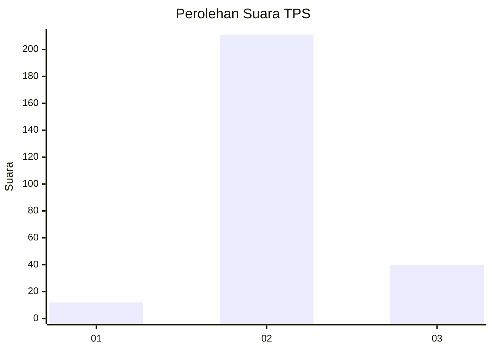
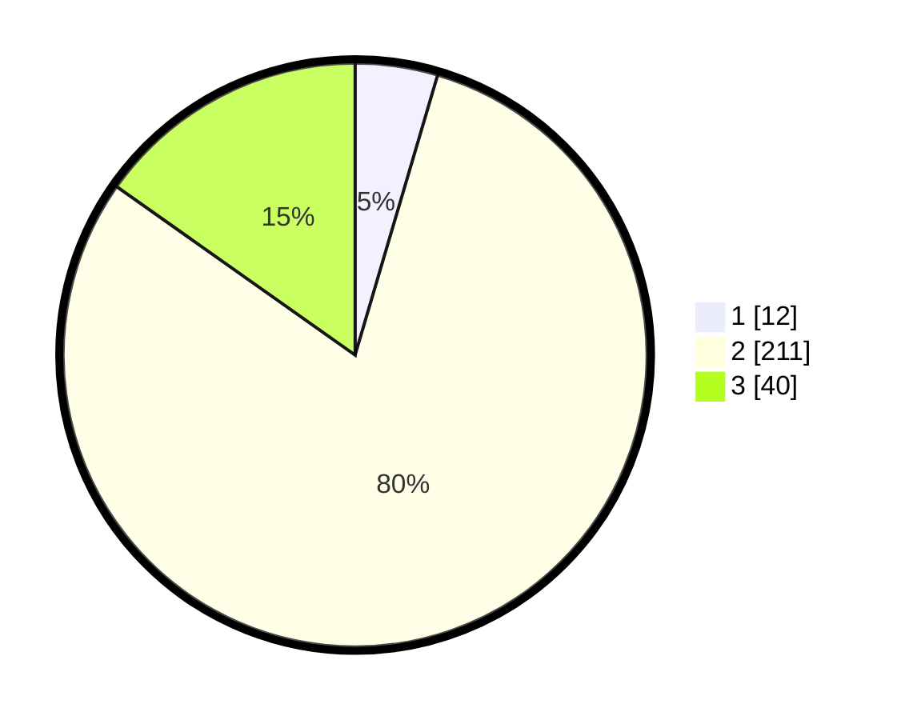

# Hasil

## Grafik

## Tabel

| No. | Nama Paslon    | Suara | Suara (raw) | Persentase |
|:--- |:-------------- | -----:| -----------:| ----------:|
| 1   | ANIES MUHAIMIN | 12    | [12][p-1]   | 4,56       |
| 2   | PRABOWO GIBRAN | 211   | [211][p-2]  | 80,23      |
| 3   | GANJAR MAHFUD  | 40    | [40][p-3]   | 15,21      |

[p-1]: https://github.com/gigit-pemilu/pemilu-2024/blob/main/pilpres/hitung-suara/sub/35-jawa-timur/sub/18-nganjuk/sub/07-ngronggot/sub/2002-tanjungkalang/sub/001-tps/sub/paslon-1.txt
[p-2]: https://github.com/gigit-pemilu/pemilu-2024/blob/main/pilpres/hitung-suara/sub/35-jawa-timur/sub/18-nganjuk/sub/07-ngronggot/sub/2002-tanjungkalang/sub/001-tps/sub/paslon-2.txt
[p-3]: https://github.com/gigit-pemilu/pemilu-2024/blob/main/pilpres/hitung-suara/sub/35-jawa-timur/sub/18-nganjuk/sub/07-ngronggot/sub/2002-tanjungkalang/sub/001-tps/sub/paslon-3.txt

## Foto C Plano

https://sirekap-obj-formc.kpu.go.id/2958/pemilu/ppwp/35/18/07/20/02/3518072002001-20240218-190527--f466a3e0-b3a1-4a1c-aa6e-5db523e4627f.jpg

https://sirekap-obj-formc.kpu.go.id/2958/pemilu/ppwp/35/18/07/20/02/3518072002001-20240218-191054--c1831740-b919-4fc0-8b92-a888024d298d.jpg

## Metadata

| Key        | Value               |
| ---------- | ------------------- |
| Time Stamp | 2024-02-19 06:16:00 |

