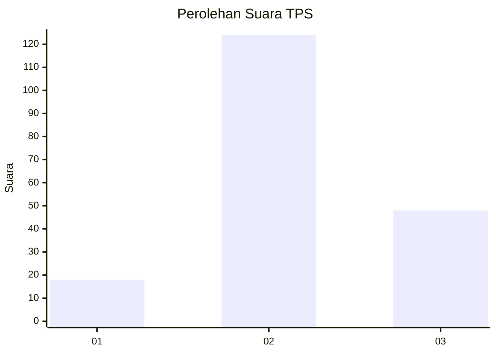
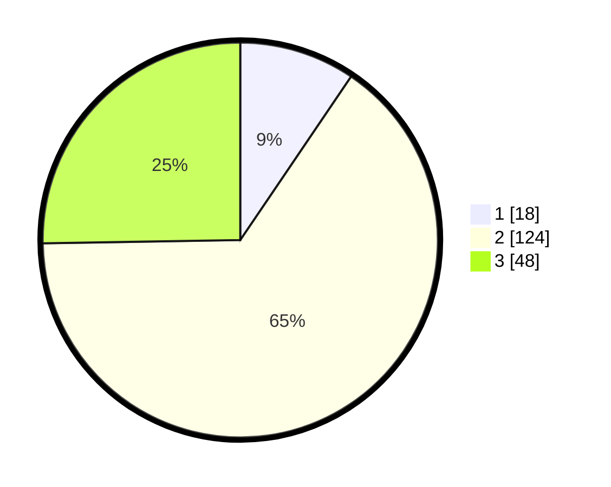

# Hasil

## Grafik

## Tabel

| No. | Nama Paslon    | Suara | Suara (raw) | Persentase |
|:--- |:-------------- | -----:| -----------:| ----------:|
| 1   | ANIES MUHAIMIN | 18    | [18][p-1]   | 9,47       |
| 2   | PRABOWO GIBRAN | 124   | [124][p-2]  | 65,26      |
| 3   | GANJAR MAHFUD  | 48    | [48][p-3]   | 25,26      |

[p-1]: https://github.com/gigit-pemilu/pemilu-2024-35-jawa-timur/blob/main/pilpres/hitung-suara/sub/35-jawa-timur/sub/18-nganjuk/sub/07-ngronggot/sub/2013-klurahan/sub/015-tps/sub/paslon-1.txt
[p-2]: https://github.com/gigit-pemilu/pemilu-2024-35-jawa-timur/blob/main/pilpres/hitung-suara/sub/35-jawa-timur/sub/18-nganjuk/sub/07-ngronggot/sub/2013-klurahan/sub/015-tps/sub/paslon-2.txt
[p-3]: https://github.com/gigit-pemilu/pemilu-2024-35-jawa-timur/blob/main/pilpres/hitung-suara/sub/35-jawa-timur/sub/18-nganjuk/sub/07-ngronggot/sub/2013-klurahan/sub/015-tps/sub/paslon-3.txt

## Foto C Plano

https://sirekap-obj-formc.kpu.go.id/3da0/pemilu/ppwp/35/18/07/20/13/3518072013015-20240218-190907--7e31a8b7-bb2c-4721-b827-cbfd6efd7902.jpg

https://sirekap-obj-formc.kpu.go.id/3da0/pemilu/ppwp/35/18/07/20/13/3518072013015-20240218-190954--a7dd8394-7f6b-44a0-819a-70cef096ce27.jpg

https://sirekap-obj-formc.kpu.go.id/3da0/pemilu/ppwp/35/18/07/20/13/3518072013015-20240218-191209--1891cace-084c-4011-8594-87d944a9edb2.jpg

## Metadata

| Key        | Value               |
| ---------- | ------------------- |
| Time Stamp | 2024-02-19 06:16:00 |

## DATA PEMILIH TETAP

Jumlah pemilih dalam DPT: **220**.
 * L: **0**.
 * P: **2**.

## DATA PENGGUNA HAK PILIH

Jumlah pengguna hak pilih dalam DPT: **200**.
 * L: **220**.
 * P: **25**.

Jumlah pengguna hak pilih dalam DPTb: **450**.
 * L: **788**.
 * P: **884**.

Jumlah pengguna hak pilih dalam DPK: **484**.
 * L: **440**.
 * P: **848**.

Jumlah pengguna hak pilih: **200**.
 * L: **109**.
 * P: **849**.

## JUMLAH SUARA SAH DAN TIDAK SAH

JUMLAH SELURUH SUARA SAH: **190**.

JUMLAH SUARA TIDAK SAH: **10**.

JUMLAH SELURUH SUARA SAH DAN SUARA TIDAK SAH: **200**.

