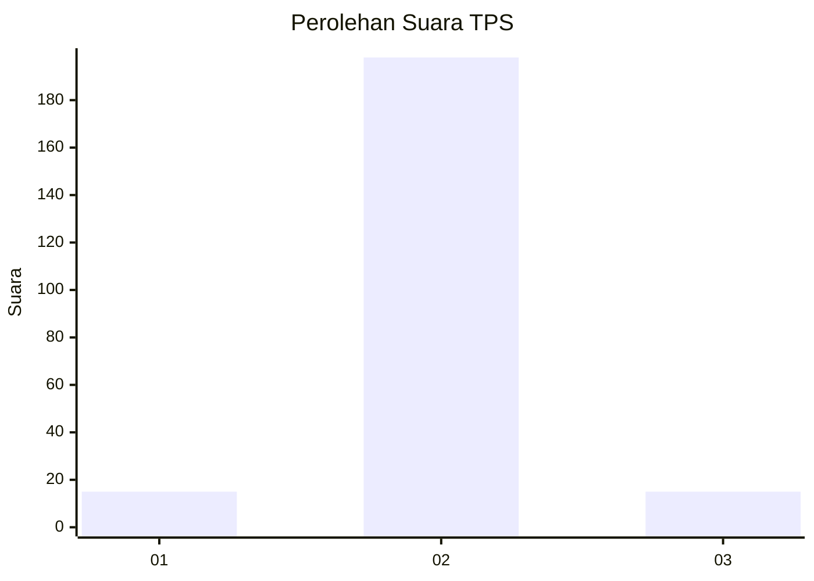
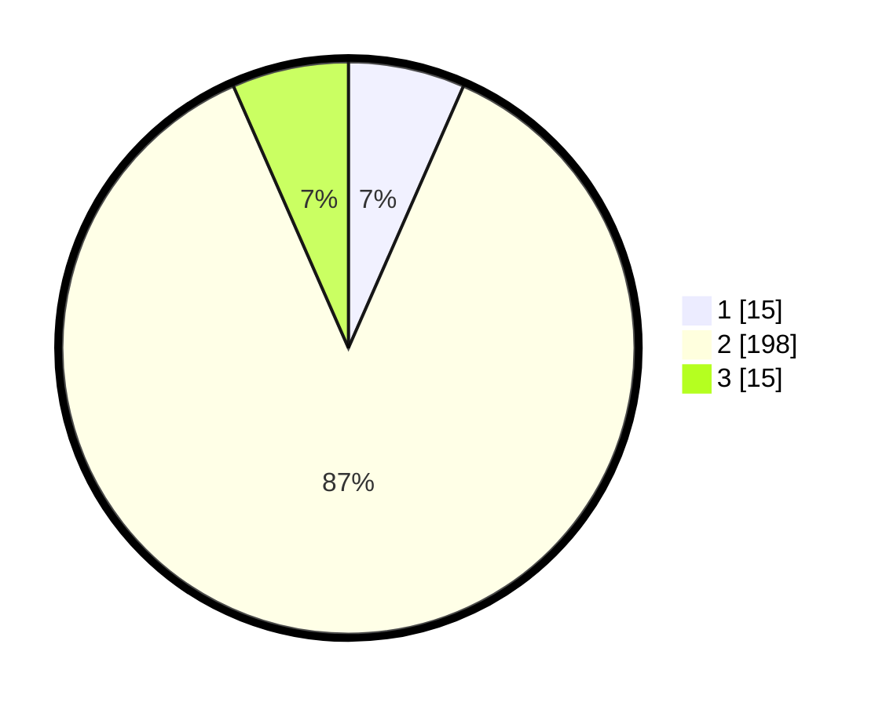

# Hasil

## Grafik

## Tabel

| No. | Nama Paslon    | Suara | Suara (raw) | Persentase |
|:--- |:-------------- | -----:| -----------:| ----------:|
| 1   | ANIES MUHAIMIN | 15    | [15][p-1]   | 6,58       |
| 2   | PRABOWO GIBRAN | 198   | [198][p-2]  | 86,84      |
| 3   | GANJAR MAHFUD  | 15    | [15][p-3]   | 6,58       |

[p-1]: https://github.com/gigit-pemilu/pemilu-2024-35-jawa-timur/blob/main/pilpres/hitung-suara/sub/35-jawa-timur/sub/18-nganjuk/sub/08-kertosono/sub/2012-lambangkuning/sub/003-tps/sub/paslon-1.txt
[p-2]: https://github.com/gigit-pemilu/pemilu-2024-35-jawa-timur/blob/main/pilpres/hitung-suara/sub/35-jawa-timur/sub/18-nganjuk/sub/08-kertosono/sub/2012-lambangkuning/sub/003-tps/sub/paslon-2.txt
[p-3]: https://github.com/gigit-pemilu/pemilu-2024-35-jawa-timur/blob/main/pilpres/hitung-suara/sub/35-jawa-timur/sub/18-nganjuk/sub/08-kertosono/sub/2012-lambangkuning/sub/003-tps/sub/paslon-3.txt

## Foto C Plano

https://sirekap-obj-formc.kpu.go.id/3c0f/pemilu/ppwp/35/18/08/20/12/3518082012003-20240217-170717--ca94ce8a-0f1b-4d11-8475-badbe26cc930.jpg

https://sirekap-obj-formc.kpu.go.id/3c0f/pemilu/ppwp/35/18/08/20/12/3518082012003-20240217-170718--a1ddc2d1-c498-4465-9f6f-38674822ce3d.jpg

https://sirekap-obj-formc.kpu.go.id/3c0f/pemilu/ppwp/35/18/08/20/12/3518082012003-20240217-170718--ca239ead-4f79-46e0-b652-245500ca3d92.jpg

## Metadata

| Key        | Value               |
| ---------- | ------------------- |
| Time Stamp | 2024-02-24 22:31:28 |

