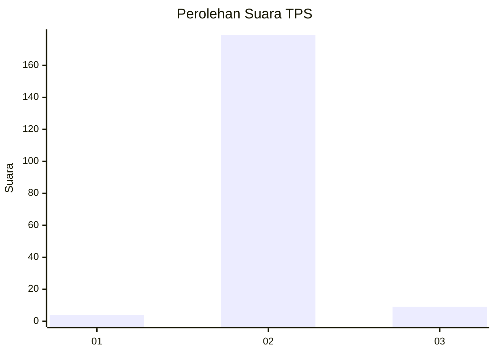
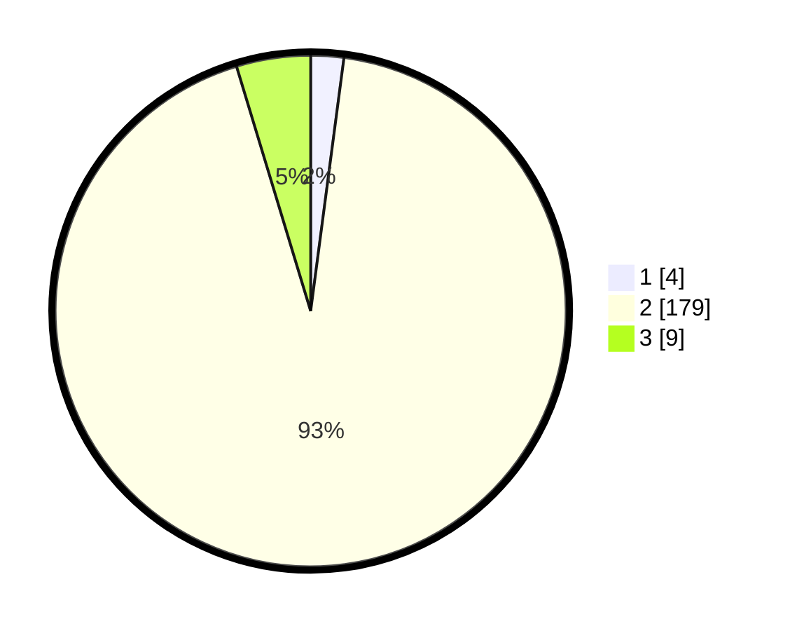

# Hasil

## Grafik

## Tabel

| No. | Nama Paslon    | Suara | Suara (raw) | Persentase |
|:--- |:-------------- | -----:| -----------:| ----------:|
| 1   | ANIES MUHAIMIN | 4     | [4][p-1]    | 2,08       |
| 2   | PRABOWO GIBRAN | 179   | [179][p-2]  | 93,23      |
| 3   | GANJAR MAHFUD  | 9     | [9][p-3]    | 4,69       |

[p-1]: https://github.com/gigit-pemilu/pemilu-2024/blob/main/pilpres/hitung-suara/sub/35-jawa-timur/sub/18-nganjuk/sub/09-patianrowo/sub/2002-babadan/sub/003-tps/sub/paslon-1.txt
[p-2]: https://github.com/gigit-pemilu/pemilu-2024/blob/main/pilpres/hitung-suara/sub/35-jawa-timur/sub/18-nganjuk/sub/09-patianrowo/sub/2002-babadan/sub/003-tps/sub/paslon-2.txt
[p-3]: https://github.com/gigit-pemilu/pemilu-2024/blob/main/pilpres/hitung-suara/sub/35-jawa-timur/sub/18-nganjuk/sub/09-patianrowo/sub/2002-babadan/sub/003-tps/sub/paslon-3.txt

## Foto C Plano

https://sirekap-obj-formc.kpu.go.id/3d89/pemilu/ppwp/35/18/09/20/02/3518092002003-20240215-001330--4f1e2ea8-c8ae-495f-9665-7761e2d9453f.jpg

https://sirekap-obj-formc.kpu.go.id/3d89/pemilu/ppwp/35/18/09/20/02/3518092002003-20240215-001736--46a88e3a-a331-4fc4-b209-6b1402b11f7f.jpg

https://sirekap-obj-formc.kpu.go.id/3d89/pemilu/ppwp/35/18/09/20/02/3518092002003-20240215-001952--a4cd737a-bb69-46d5-ae20-e29d95aef60a.jpg

## Metadata

| Key        | Value               |
| ---------- | ------------------- |
| Time Stamp | 2024-02-25 13:00:00 |

