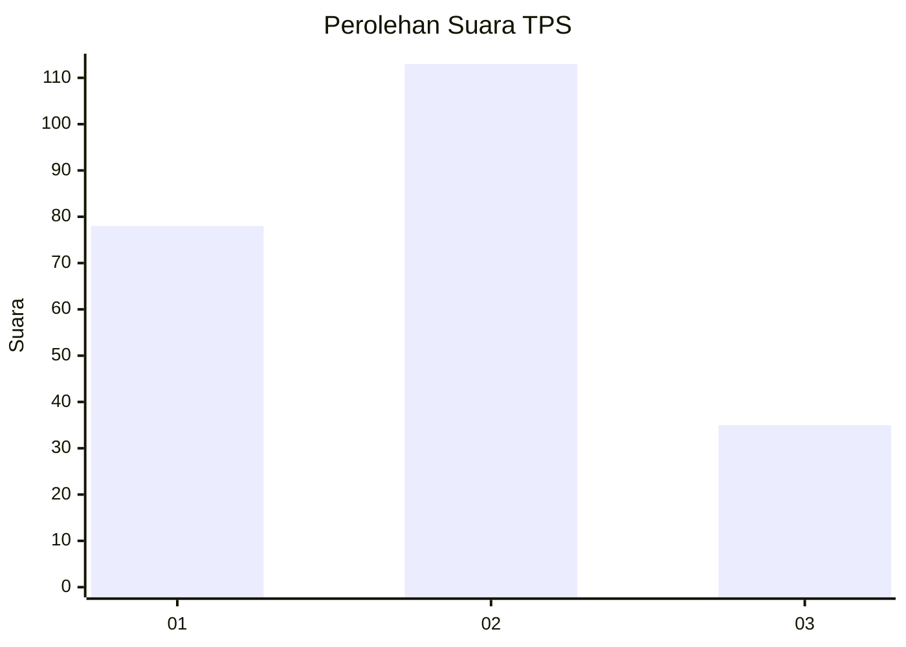
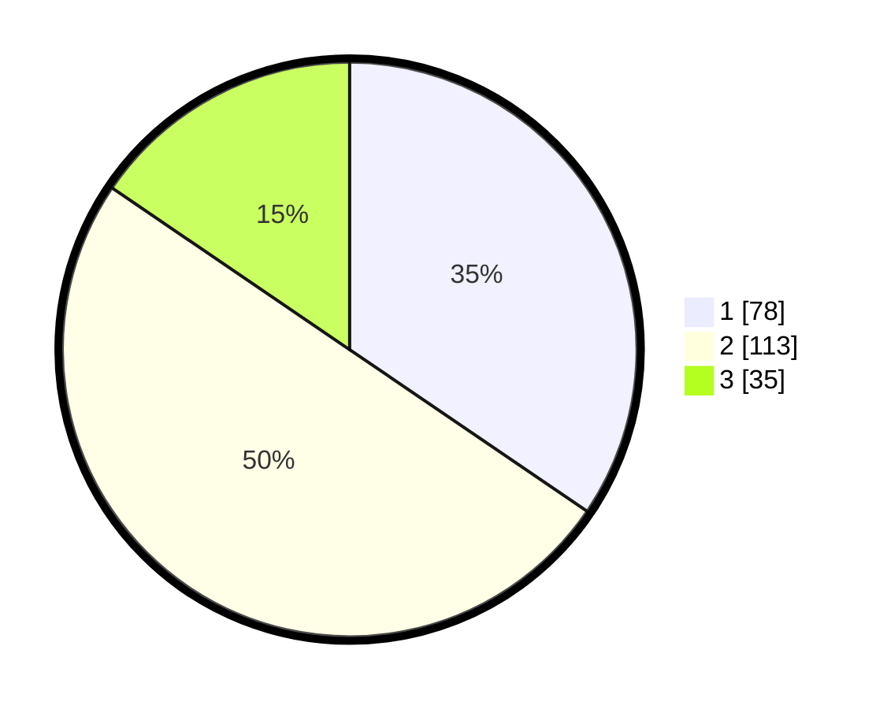

# Hasil

## Grafik

## Tabel

| No. | Nama Paslon    | Suara | Suara (raw) | Persentase |
|:--- |:-------------- | -----:| -----------:| ----------:|
| 1   | ANIES MUHAIMIN | 78    | [78][p-1]   | 34,51      |
| 2   | PRABOWO GIBRAN | 113   | [113][p-2]  | 50,00      |
| 3   | GANJAR MAHFUD  | 35    | [35][p-3]   | 15,49      |

[p-1]: https://github.com/gigit-pemilu/pemilu-2024-35-jawa-timur/blob/main/pilpres/hitung-suara/sub/35-jawa-timur/sub/18-nganjuk/sub/09-patianrowo/sub/2003-ngepung/sub/003-tps/sub/paslon-1.txt
[p-2]: https://github.com/gigit-pemilu/pemilu-2024-35-jawa-timur/blob/main/pilpres/hitung-suara/sub/35-jawa-timur/sub/18-nganjuk/sub/09-patianrowo/sub/2003-ngepung/sub/003-tps/sub/paslon-2.txt
[p-3]: https://github.com/gigit-pemilu/pemilu-2024-35-jawa-timur/blob/main/pilpres/hitung-suara/sub/35-jawa-timur/sub/18-nganjuk/sub/09-patianrowo/sub/2003-ngepung/sub/003-tps/sub/paslon-3.txt

## Foto C Plano

https://sirekap-obj-formc.kpu.go.id/7695/pemilu/ppwp/35/18/09/20/03/3518092003003-20240215-005942--dc1b25c7-1ded-4355-992d-d437df9a66fa.jpg

https://sirekap-obj-formc.kpu.go.id/7695/pemilu/ppwp/35/18/09/20/03/3518092003003-20240216-115235--6437ab07-12ee-42ff-90d2-2c763fadcc4e.jpg

https://sirekap-obj-formc.kpu.go.id/7695/pemilu/ppwp/35/18/09/20/03/3518092003003-20240215-111857--56104e37-0b10-4a02-8aef-753b14292411.jpg

## Metadata

| Key        | Value               |
| ---------- | ------------------- |
| Time Stamp | 2024-02-22 10:00:00 |

