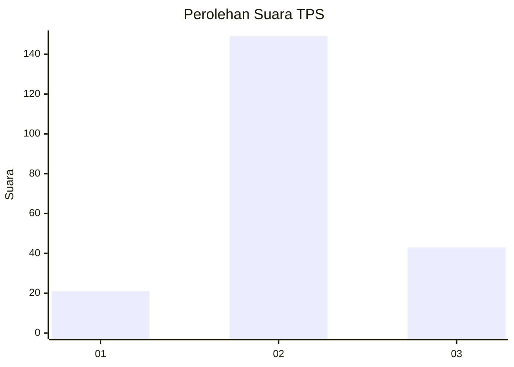
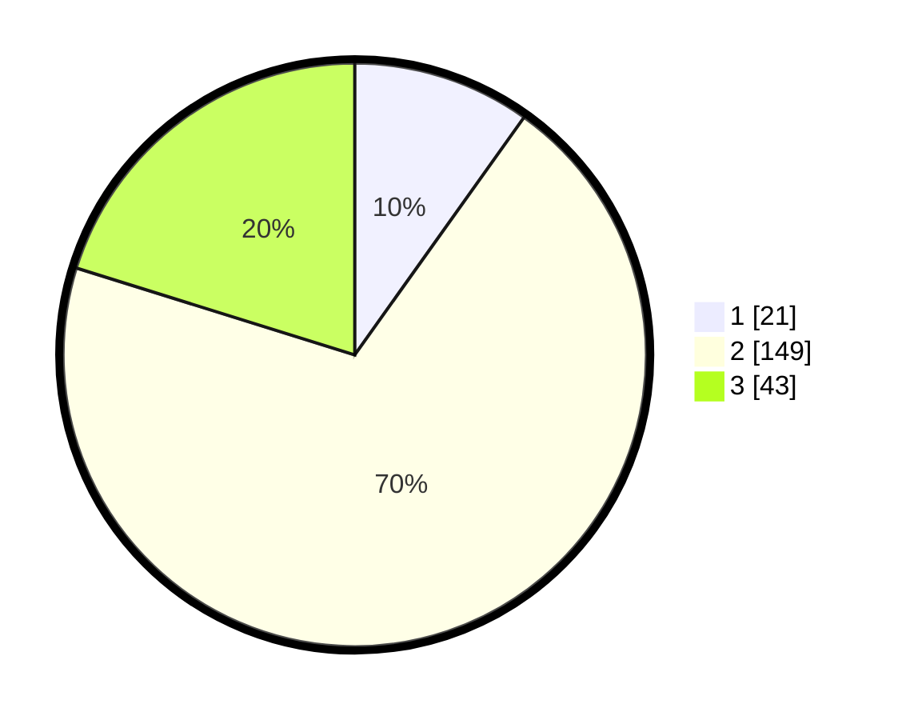

# Hasil

## Grafik

## Tabel

| No. | Nama Paslon    | Suara | Suara (raw) | Persentase |
|:--- |:-------------- | -----:| -----------:| ----------:|
| 1   | ANIES MUHAIMIN | 21    | [21][p-1]   | 9,86       |
| 2   | PRABOWO GIBRAN | 149   | [149][p-2]  | 69,95      |
| 3   | GANJAR MAHFUD  | 43    | [43][p-3]   | 20,19      |

[p-1]: https://github.com/gigit-pemilu/pemilu-2024/blob/main/pilpres/hitung-suara/sub/35-jawa-timur/sub/18-nganjuk/sub/11-tanjunganom/sub/1013-warujayeng/sub/008-tps/sub/paslon-1.txt
[p-2]: https://github.com/gigit-pemilu/pemilu-2024/blob/main/pilpres/hitung-suara/sub/35-jawa-timur/sub/18-nganjuk/sub/11-tanjunganom/sub/1013-warujayeng/sub/008-tps/sub/paslon-2.txt
[p-3]: https://github.com/gigit-pemilu/pemilu-2024/blob/main/pilpres/hitung-suara/sub/35-jawa-timur/sub/18-nganjuk/sub/11-tanjunganom/sub/1013-warujayeng/sub/008-tps/sub/paslon-3.txt

## Foto C Plano

https://sirekap-obj-formc.kpu.go.id/6d01/pemilu/ppwp/35/18/11/10/13/3518111013008-20240218-210744--b00c1f26-767a-49a1-ab36-202f44531b77.jpg

https://sirekap-obj-formc.kpu.go.id/6d01/pemilu/ppwp/35/18/11/10/13/3518111013008-20240218-210854--7fe8df18-01bd-4fd4-b34c-72b53df0bec1.jpg

https://sirekap-obj-formc.kpu.go.id/6d01/pemilu/ppwp/35/18/11/10/13/3518111013008-20240218-210553--af3ab321-f6e5-4298-b2ad-714e565140f5.jpg

## Metadata

| Key        | Value               |
| ---------- | ------------------- |
| Time Stamp | 2024-02-19 17:00:00 |

## DATA PEMILIH TETAP

Jumlah pemilih dalam DPT: **265**.
 * L: **838**.
 * P: **834**.

## DATA PENGGUNA HAK PILIH

Jumlah pengguna hak pilih dalam DPT: **200**.
 * L: **893**.
 * P: **607**.

Jumlah pengguna hak pilih dalam DPTb: **70**.
 * L: **889**.
 * P: **807**.

Jumlah pengguna hak pilih dalam DPK: **2**.
 * L: **804**.
 * P: **1**.

Jumlah pengguna hak pilih: **222**.
 * L: **403**.
 * P: **109**.

## JUMLAH SUARA SAH DAN TIDAK SAH

JUMLAH SELURUH SUARA SAH: **213**.

JUMLAH SUARA TIDAK SAH: **1**.

JUMLAH SELURUH SUARA SAH DAN SUARA TIDAK SAH: **214**.

