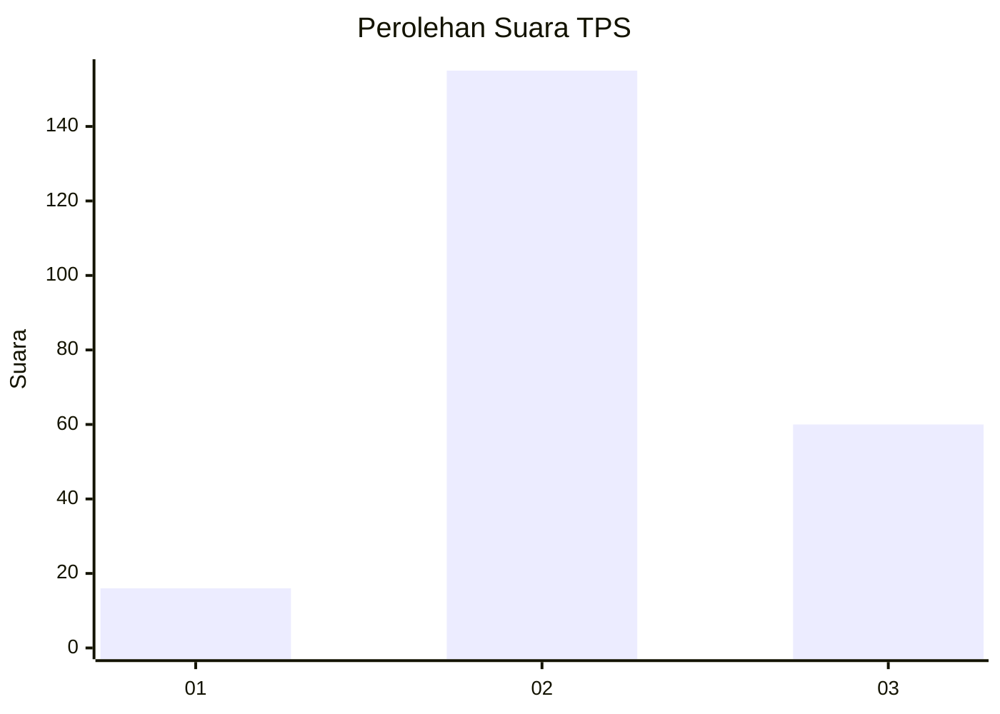

# Hasil

## Grafik

## Tabel

| No. | Nama Paslon    | Suara | Suara (raw) | Persentase |
|:--- |:-------------- | -----:| -----------:| ----------:|
| 1   | ANIES MUHAIMIN | 16    | [16][p-1]   | 6,93       |
| 2   | PRABOWO GIBRAN | 155   | [155][p-2]  | 67,10      |
| 3   | GANJAR MAHFUD  | 60    | [60][p-3]   | 25,97      |

[p-1]: https://github.com/gigit-pemilu/pemilu-2024/blob/main/pilpres/hitung-suara/sub/35-jawa-timur/sub/18-nganjuk/sub/12-sukomoro/sub/2001-sumengko/sub/004-tps/sub/paslon-1.txt
[p-2]: https://github.com/gigit-pemilu/pemilu-2024/blob/main/pilpres/hitung-suara/sub/35-jawa-timur/sub/18-nganjuk/sub/12-sukomoro/sub/2001-sumengko/sub/004-tps/sub/paslon-2.txt
[p-3]: https://github.com/gigit-pemilu/pemilu-2024/blob/main/pilpres/hitung-suara/sub/35-jawa-timur/sub/18-nganjuk/sub/12-sukomoro/sub/2001-sumengko/sub/004-tps/sub/paslon-3.txt

## Foto C Plano

https://sirekap-obj-formc.kpu.go.id/ffcb/pemilu/ppwp/35/18/12/20/01/3518122001004-20240218-174344--fab2b76c-5719-473c-910b-7c67aa2ad8f5.jpg

https://sirekap-obj-formc.kpu.go.id/ffcb/pemilu/ppwp/35/18/12/20/01/3518122001004-20240218-175535--fb4e4ed7-944d-42ec-a9e0-4c90e26c571f.jpg

https://sirekap-obj-formc.kpu.go.id/ffcb/pemilu/ppwp/35/18/12/20/01/3518122001004-20240216-152635--8ba8f1b2-2ca9-4f7f-a2eb-f4f216507e99.jpg

## Metadata

| Key        | Value               |
| ---------- | ------------------- |
| Time Stamp | 2024-02-25 16:00:00 |

