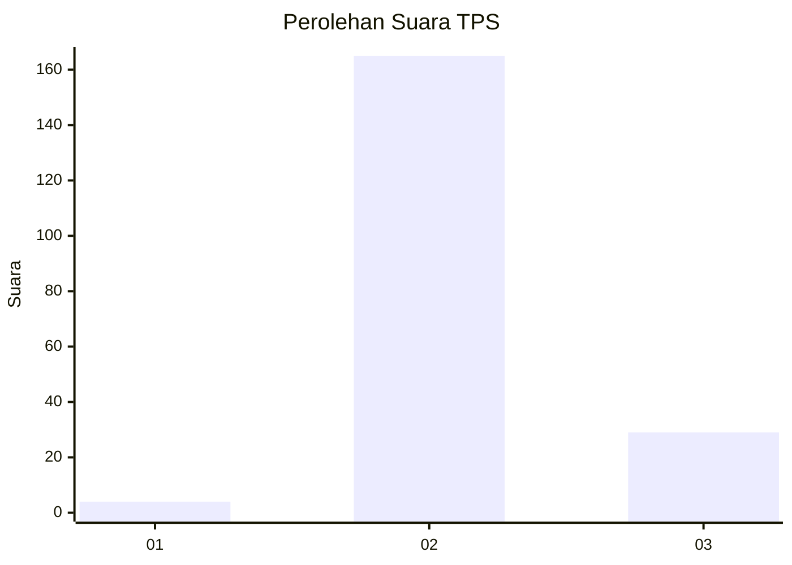
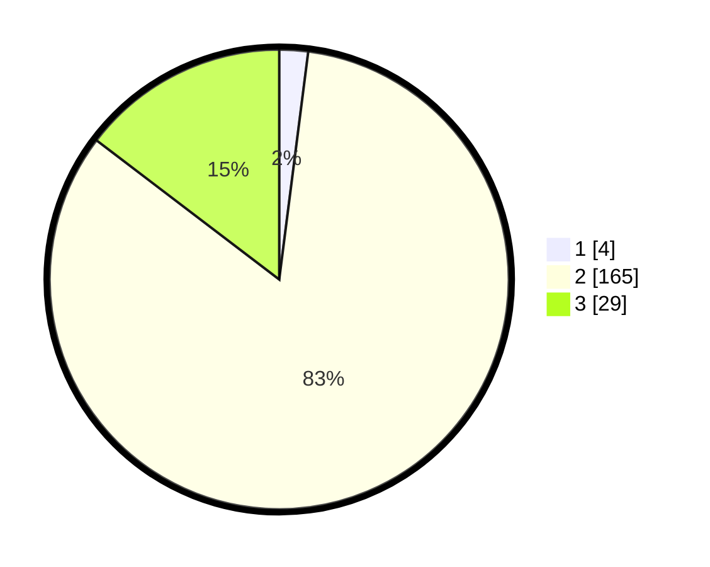

# Hasil

## Grafik

## Tabel

| No. | Nama Paslon    | Suara | Suara (raw) | Persentase |
|:--- |:-------------- | -----:| -----------:| ----------:|
| 1   | ANIES MUHAIMIN | 4     | [4][p-1]    | 2,02       |
| 2   | PRABOWO GIBRAN | 165   | [165][p-2]  | 83,33      |
| 3   | GANJAR MAHFUD  | 29    | [29][p-3]   | 14,65      |

[p-1]: https://github.com/gigit-pemilu/pemilu-2024-35-jawa-timur/blob/main/pilpres/hitung-suara/sub/35-jawa-timur/sub/18-nganjuk/sub/12-sukomoro/sub/2004-kedungsoko/sub/005-tps/sub/paslon-1.txt
[p-2]: https://github.com/gigit-pemilu/pemilu-2024-35-jawa-timur/blob/main/pilpres/hitung-suara/sub/35-jawa-timur/sub/18-nganjuk/sub/12-sukomoro/sub/2004-kedungsoko/sub/005-tps/sub/paslon-2.txt
[p-3]: https://github.com/gigit-pemilu/pemilu-2024-35-jawa-timur/blob/main/pilpres/hitung-suara/sub/35-jawa-timur/sub/18-nganjuk/sub/12-sukomoro/sub/2004-kedungsoko/sub/005-tps/sub/paslon-3.txt

## Foto C Plano

https://sirekap-obj-formc.kpu.go.id/26b5/pemilu/ppwp/35/18/12/20/04/3518122004005-20240215-150214--82598db2-c891-40f3-b0e3-8b125399dc6c.jpg

https://sirekap-obj-formc.kpu.go.id/26b5/pemilu/ppwp/35/18/12/20/04/3518122004005-20240215-191443--58c3a3f8-aa69-443f-980d-dbf3503f6907.jpg

https://sirekap-obj-formc.kpu.go.id/26b5/pemilu/ppwp/35/18/12/20/04/3518122004005-20240217-113348--a35a2e1a-3fda-4c62-8dae-8b23d0cf2c7c.jpg

## Metadata

| Key        | Value               |
| ---------- | ------------------- |
| Time Stamp | 2024-02-19 06:16:00 |

## DATA PEMILIH TETAP

Jumlah pemilih dalam DPT: **2**.
 * L: **0**.
 * P: **0**.

## DATA PENGGUNA HAK PILIH

Jumlah pengguna hak pilih dalam DPT: **4**.
 * L: **0**.
 * P: **0**.

Jumlah pengguna hak pilih dalam DPTb: **537**.
 * L: **0**.
 * P: **322**.

Jumlah pengguna hak pilih dalam DPK: **377**.
 * L: **57**.
 * P: **337**.

Jumlah pengguna hak pilih: **106**.
 * L: **0**.
 * P: **777**.

## JUMLAH SUARA SAH DAN TIDAK SAH

JUMLAH SELURUH SUARA SAH: **198**.

JUMLAH SUARA TIDAK SAH: **8**.

JUMLAH SELURUH SUARA SAH DAN SUARA TIDAK SAH: **206**.

