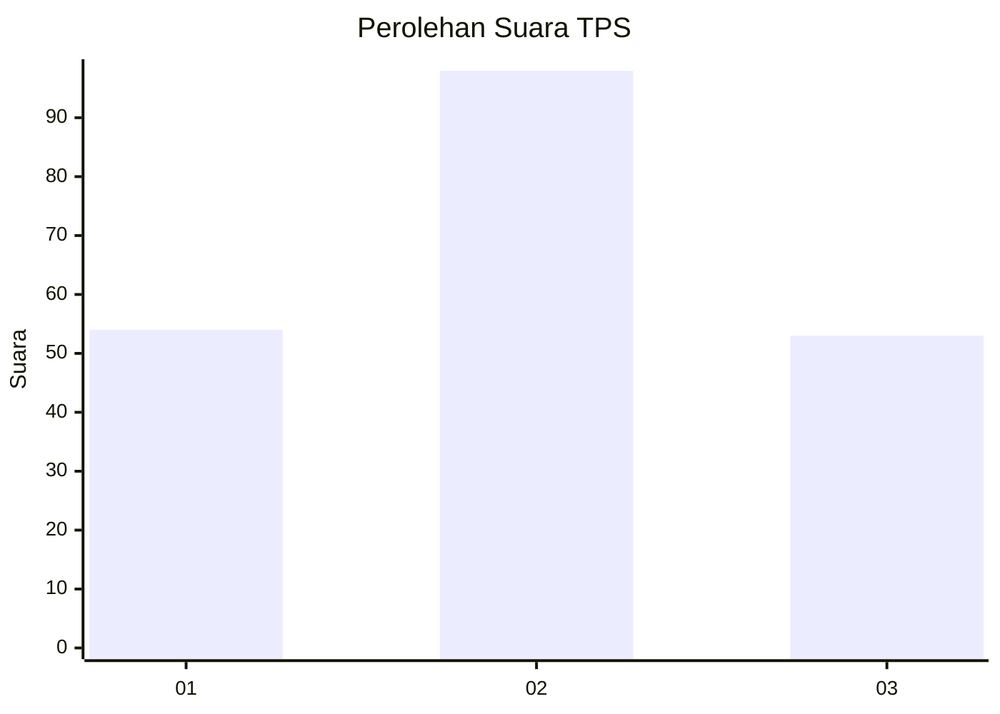
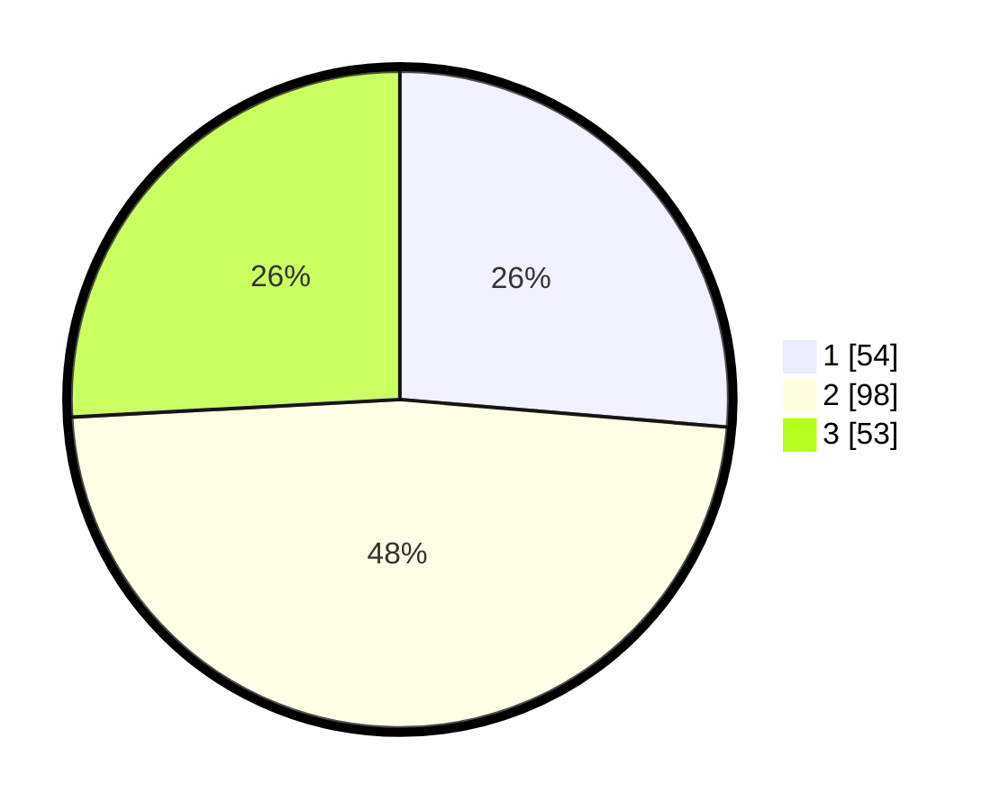

# Hasil

## Grafik

## Tabel

| No. | Nama Paslon    | Suara | Suara (raw) | Persentase |
|:--- |:-------------- | -----:| -----------:| ----------:|
| 1   | ANIES MUHAIMIN | 54    | [54][p-1]   | 26,34      |
| 2   | PRABOWO GIBRAN | 98    | [98][p-2]   | 47,80      |
| 3   | GANJAR MAHFUD  | 53    | [53][p-3]   | 25,85      |

[p-1]: https://github.com/gigit-pemilu/pemilu-2024/blob/main/pilpres/hitung-suara/sub/35-jawa-timur/sub/18-nganjuk/sub/13-nganjuk/sub/1007-mangundikaran/sub/002-tps/sub/paslon-1.txt
[p-2]: https://github.com/gigit-pemilu/pemilu-2024/blob/main/pilpres/hitung-suara/sub/35-jawa-timur/sub/18-nganjuk/sub/13-nganjuk/sub/1007-mangundikaran/sub/002-tps/sub/paslon-2.txt
[p-3]: https://github.com/gigit-pemilu/pemilu-2024/blob/main/pilpres/hitung-suara/sub/35-jawa-timur/sub/18-nganjuk/sub/13-nganjuk/sub/1007-mangundikaran/sub/002-tps/sub/paslon-3.txt

## Foto C Plano

https://sirekap-obj-formc.kpu.go.id/08c8/pemilu/ppwp/35/18/13/10/07/3518131007002-20240215-003529--94e75727-0031-4120-8424-cb9b9dc75bc0.jpg

https://sirekap-obj-formc.kpu.go.id/08c8/pemilu/ppwp/35/18/13/10/07/3518131007002-20240215-003801--837b9249-bc13-413f-a6ba-65b2e7bc31ae.jpg

https://sirekap-obj-formc.kpu.go.id/08c8/pemilu/ppwp/35/18/13/10/07/3518131007002-20240215-003950--ee1b38c6-4e7a-44ae-a594-1c974a42eb35.jpg

## Metadata

| Key        | Value               |
| ---------- | ------------------- |
| Time Stamp | 2024-02-24 22:31:28 |

