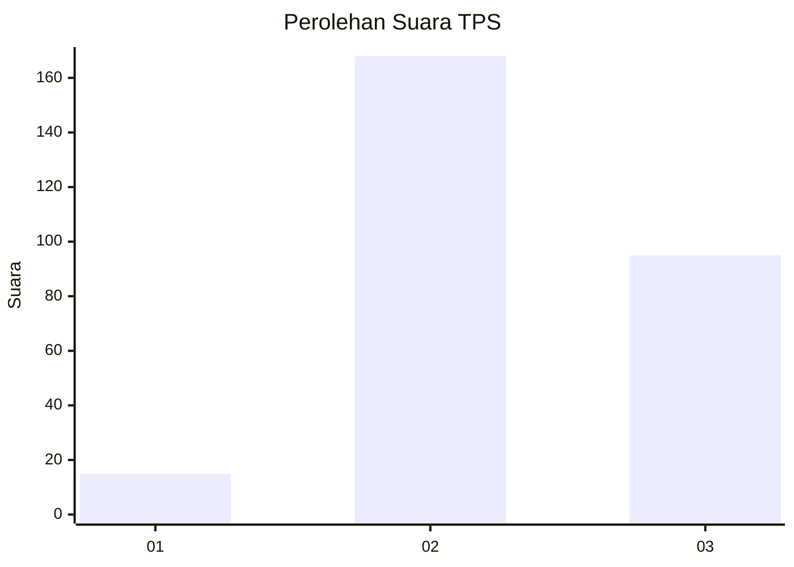
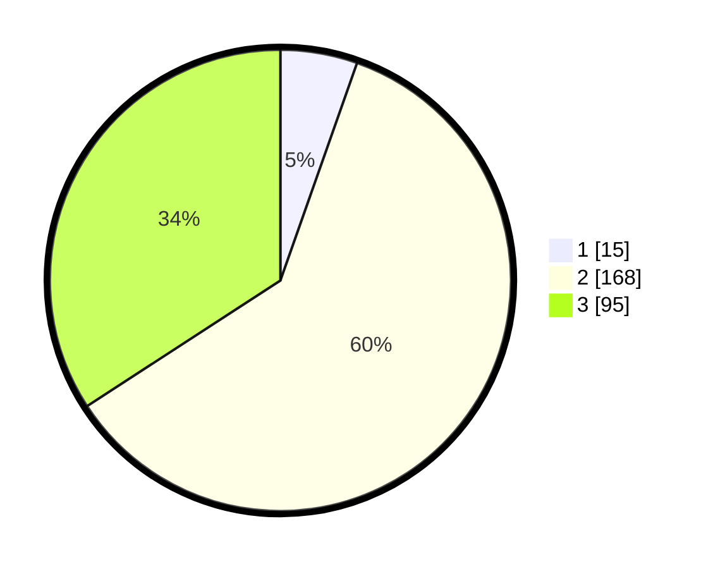

# Hasil

## Grafik

## Tabel

| No. | Nama Paslon    | Suara | Suara (raw) | Persentase |
|:--- |:-------------- | -----:| -----------:| ----------:|
| 1   | ANIES MUHAIMIN | 15    | [15][p-1]   | 5,40       |
| 2   | PRABOWO GIBRAN | 168   | [168][p-2]  | 60,43      |
| 3   | GANJAR MAHFUD  | 95    | [95][p-3]   | 34,17      |

[p-1]: https://github.com/gigit-pemilu/pemilu-2024/blob/main/pilpres/hitung-suara/sub/35-jawa-timur/sub/18-nganjuk/sub/13-nganjuk/sub/1008-kauman/sub/901-tps/sub/paslon-1.txt
[p-2]: https://github.com/gigit-pemilu/pemilu-2024/blob/main/pilpres/hitung-suara/sub/35-jawa-timur/sub/18-nganjuk/sub/13-nganjuk/sub/1008-kauman/sub/901-tps/sub/paslon-2.txt
[p-3]: https://github.com/gigit-pemilu/pemilu-2024/blob/main/pilpres/hitung-suara/sub/35-jawa-timur/sub/18-nganjuk/sub/13-nganjuk/sub/1008-kauman/sub/901-tps/sub/paslon-3.txt

## Foto C Plano

https://sirekap-obj-formc.kpu.go.id/6c92/pemilu/ppwp/35/18/13/10/08/3518131008901-20240216-215903--c3ba460d-ef03-49bf-8c24-d3ab9e0fc019.jpg

https://sirekap-obj-formc.kpu.go.id/6c92/pemilu/ppwp/35/18/13/10/08/3518131008901-20240216-215904--b53d7589-29a9-41cb-b7cb-0f64ae54438f.jpg

https://sirekap-obj-formc.kpu.go.id/6c92/pemilu/ppwp/35/18/13/10/08/3518131008901-20240216-215904--94b5bafe-44ef-4a04-9af9-367555b47af9.jpg

## Metadata

| Key        | Value               |
| ---------- | ------------------- |
| Time Stamp | 2024-02-17 10:00:02 |

## DATA PEMILIH TETAP

Jumlah pemilih dalam DPT: **133**.
 * L: **132**.
 * P: **1**.

## DATA PENGGUNA HAK PILIH

Jumlah pengguna hak pilih dalam DPT: **64**.
 * L: **64**.
 * P: **0**.

Jumlah pengguna hak pilih dalam DPTb: **229**.
 * L: **213**.
 * P: **16**.

Jumlah pengguna hak pilih dalam DPK: **0**.
 * L: **0**.
 * P: **0**.

Jumlah pengguna hak pilih: **293**.
 * L: **277**.
 * P: **16**.

## JUMLAH SUARA SAH DAN TIDAK SAH

JUMLAH SELURUH SUARA SAH: **278**.

JUMLAH SUARA TIDAK SAH: **15**.

JUMLAH SELURUH SUARA SAH DAN SUARA TIDAK SAH: **293**.

