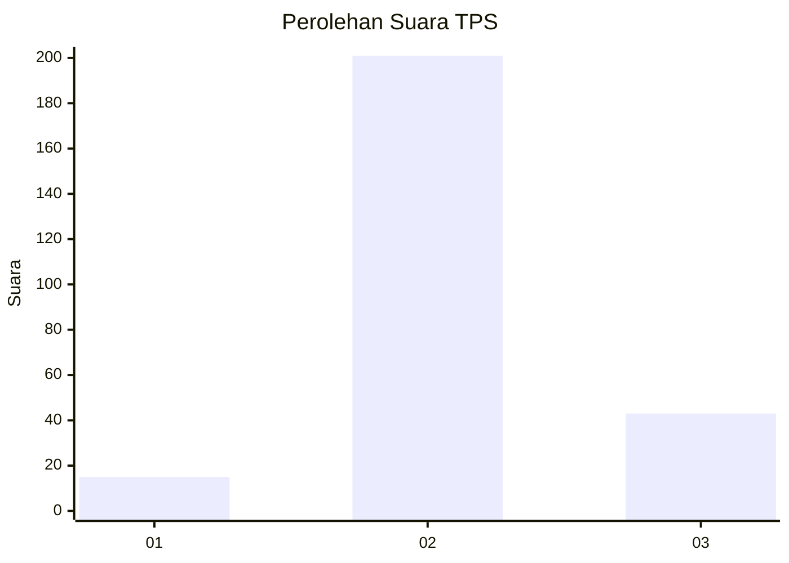
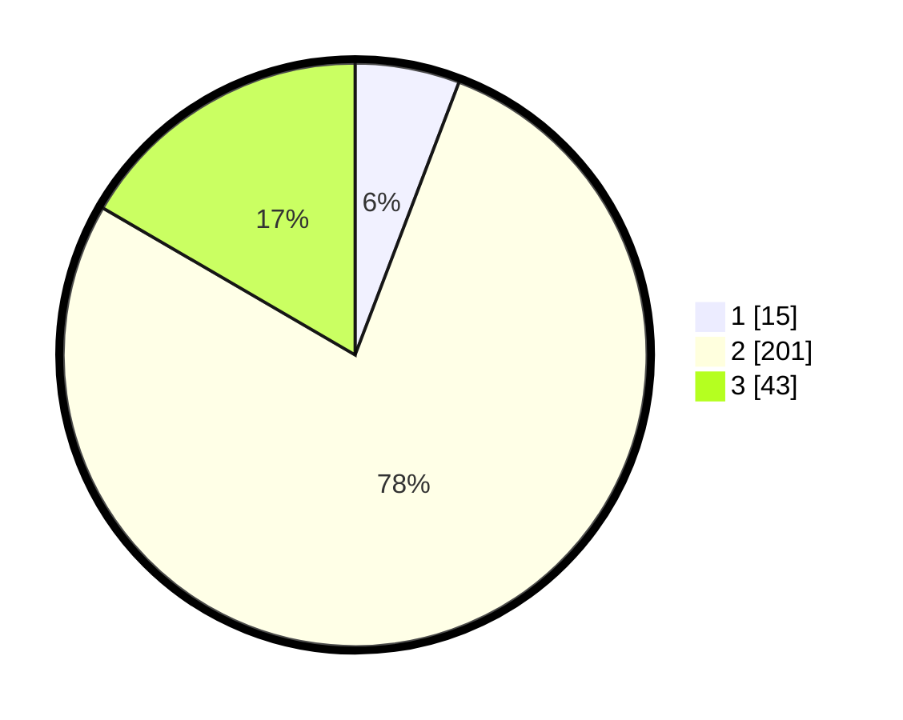

# Hasil

## Grafik

## Tabel

| No. | Nama Paslon    | Suara | Suara (raw) | Persentase |
|:--- |:-------------- | -----:| -----------:| ----------:|
| 1   | ANIES MUHAIMIN | 15    | [15][p-1]   | 5,79       |
| 2   | PRABOWO GIBRAN | 201   | [201][p-2]  | 77,61      |
| 3   | GANJAR MAHFUD  | 43    | [43][p-3]   | 16,60      |

[p-1]: https://github.com/gigit-pemilu/pemilu-2024-35-jawa-timur/blob/main/pilpres/hitung-suara/sub/35-jawa-timur/sub/18-nganjuk/sub/16-rejoso/sub/2008-rejoso/sub/008-tps/sub/paslon-1.txt
[p-2]: https://github.com/gigit-pemilu/pemilu-2024-35-jawa-timur/blob/main/pilpres/hitung-suara/sub/35-jawa-timur/sub/18-nganjuk/sub/16-rejoso/sub/2008-rejoso/sub/008-tps/sub/paslon-2.txt
[p-3]: https://github.com/gigit-pemilu/pemilu-2024-35-jawa-timur/blob/main/pilpres/hitung-suara/sub/35-jawa-timur/sub/18-nganjuk/sub/16-rejoso/sub/2008-rejoso/sub/008-tps/sub/paslon-3.txt

## Foto C Plano

https://sirekap-obj-formc.kpu.go.id/3e17/pemilu/ppwp/35/18/16/20/08/3518162008008-20240218-185751--90e0e35e-08fd-40b8-9bb1-d471fe24c1f0.jpg

https://sirekap-obj-formc.kpu.go.id/3e17/pemilu/ppwp/35/18/16/20/08/3518162008008-20240218-190928--9791981c-2f30-4da1-83ce-df216ce4a85a.jpg

https://sirekap-obj-formc.kpu.go.id/3e17/pemilu/ppwp/35/18/16/20/08/3518162008008-20240218-191337--769e892a-0027-4c97-8bc5-2d7e3f0a0b29.jpg

## Metadata

| Key        | Value               |
| ---------- | ------------------- |
| Time Stamp | 2024-02-19 06:16:00 |

