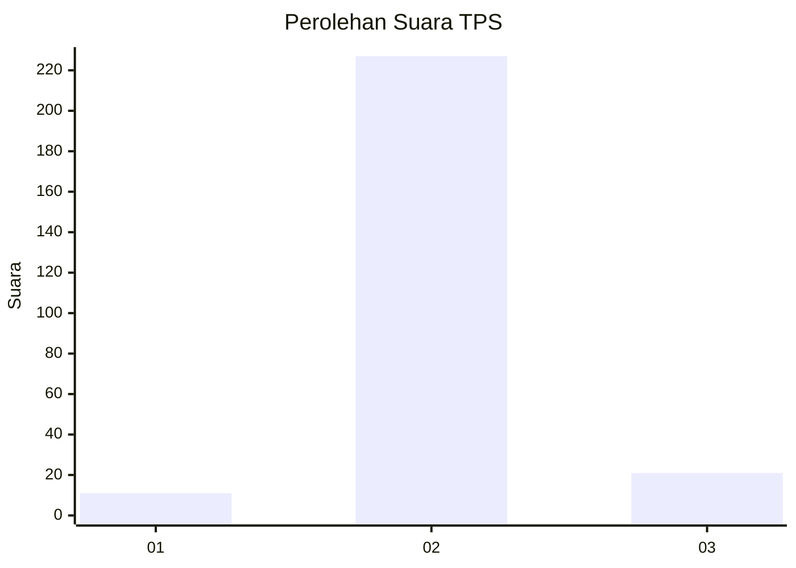
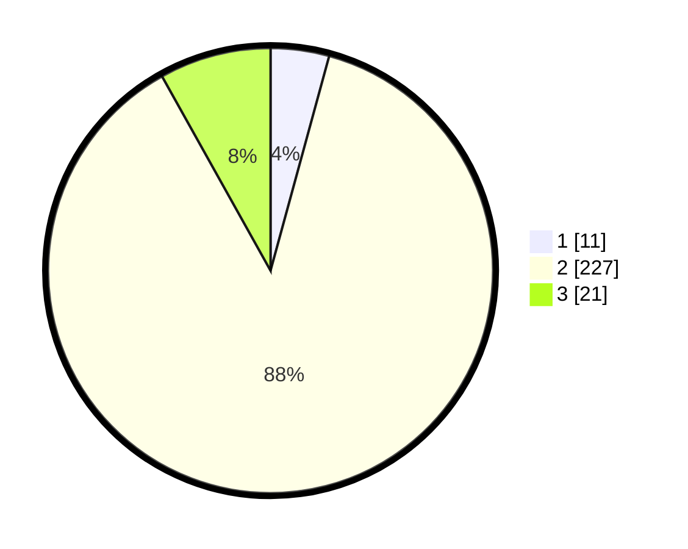

# Hasil

## Grafik

## Tabel

| No. | Nama Paslon    | Suara | Suara (raw) | Persentase |
|:--- |:-------------- | -----:| -----------:| ----------:|
| 1   | ANIES MUHAIMIN | 11    | [11][p-1]   | 4,25       |
| 2   | PRABOWO GIBRAN | 227   | [227][p-2]  | 87,64      |
| 3   | GANJAR MAHFUD  | 21    | [21][p-3]   | 8,11       |

[p-1]: https://github.com/gigit-pemilu/pemilu-2024-35-jawa-timur/blob/main/pilpres/hitung-suara/sub/35-jawa-timur/sub/18-nganjuk/sub/16-rejoso/sub/2012-puhkerep/sub/013-tps/sub/paslon-1.txt
[p-2]: https://github.com/gigit-pemilu/pemilu-2024-35-jawa-timur/blob/main/pilpres/hitung-suara/sub/35-jawa-timur/sub/18-nganjuk/sub/16-rejoso/sub/2012-puhkerep/sub/013-tps/sub/paslon-2.txt
[p-3]: https://github.com/gigit-pemilu/pemilu-2024-35-jawa-timur/blob/main/pilpres/hitung-suara/sub/35-jawa-timur/sub/18-nganjuk/sub/16-rejoso/sub/2012-puhkerep/sub/013-tps/sub/paslon-3.txt

## Foto C Plano

https://sirekap-obj-formc.kpu.go.id/46c4/pemilu/ppwp/35/18/16/20/12/3518162012013-20240214-160121--fd069110-4105-4f04-8a91-d580667c95d6.jpg

https://sirekap-obj-formc.kpu.go.id/46c4/pemilu/ppwp/35/18/16/20/12/3518162012013-20240214-213803--7f90db88-75b0-4a58-afa4-8735872ae09f.jpg

https://sirekap-obj-formc.kpu.go.id/46c4/pemilu/ppwp/35/18/16/20/12/3518162012013-20240214-213816--eab64923-9232-4cae-8a10-a79d1a434da0.jpg

## Metadata

| Key        | Value               |
| ---------- | ------------------- |
| Time Stamp | 2024-02-25 16:00:00 |

