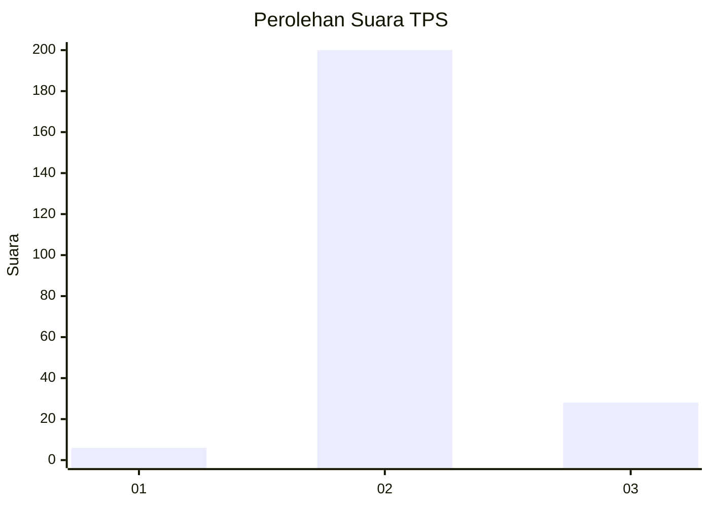
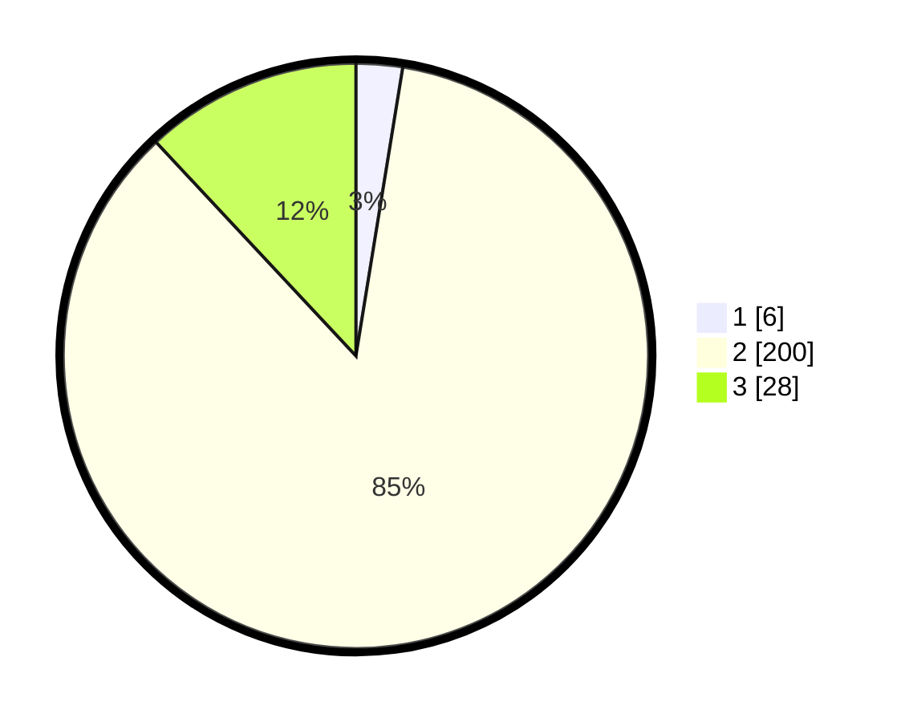

# Hasil

## Grafik

## Tabel

| No. | Nama Paslon    | Suara | Suara (raw) | Persentase |
|:--- |:-------------- | -----:| -----------:| ----------:|
| 1   | ANIES MUHAIMIN | 6     | [6][p-1]    | 2,56       |
| 2   | PRABOWO GIBRAN | 200   | [200][p-2]  | 85,47      |
| 3   | GANJAR MAHFUD  | 28    | [28][p-3]   | 11,97      |

[p-1]: https://github.com/gigit-pemilu/pemilu-2024/blob/main/pilpres/hitung-suara/sub/35-jawa-timur/sub/18-nganjuk/sub/16-rejoso/sub/2013-talun/sub/005-tps/sub/paslon-1.txt
[p-2]: https://github.com/gigit-pemilu/pemilu-2024/blob/main/pilpres/hitung-suara/sub/35-jawa-timur/sub/18-nganjuk/sub/16-rejoso/sub/2013-talun/sub/005-tps/sub/paslon-2.txt
[p-3]: https://github.com/gigit-pemilu/pemilu-2024/blob/main/pilpres/hitung-suara/sub/35-jawa-timur/sub/18-nganjuk/sub/16-rejoso/sub/2013-talun/sub/005-tps/sub/paslon-3.txt

## Foto C Plano

https://sirekap-obj-formc.kpu.go.id/2509/pemilu/ppwp/35/18/16/20/13/3518162013005-20240218-185002--8396ecaa-27c0-4764-b511-d153f9a64094.jpg

https://sirekap-obj-formc.kpu.go.id/2509/pemilu/ppwp/35/18/16/20/13/3518162013005-20240218-184707--2a7275af-1b12-4193-aaec-821c6b54a9a7.jpg

https://sirekap-obj-formc.kpu.go.id/2509/pemilu/ppwp/35/18/16/20/13/3518162013005-20240215-000739--fcd1bda6-d20a-4e2c-b810-538baef6a0c9.jpg

## Metadata

| Key        | Value               |
| ---------- | ------------------- |
| Time Stamp | 2024-02-25 17:00:00 |

