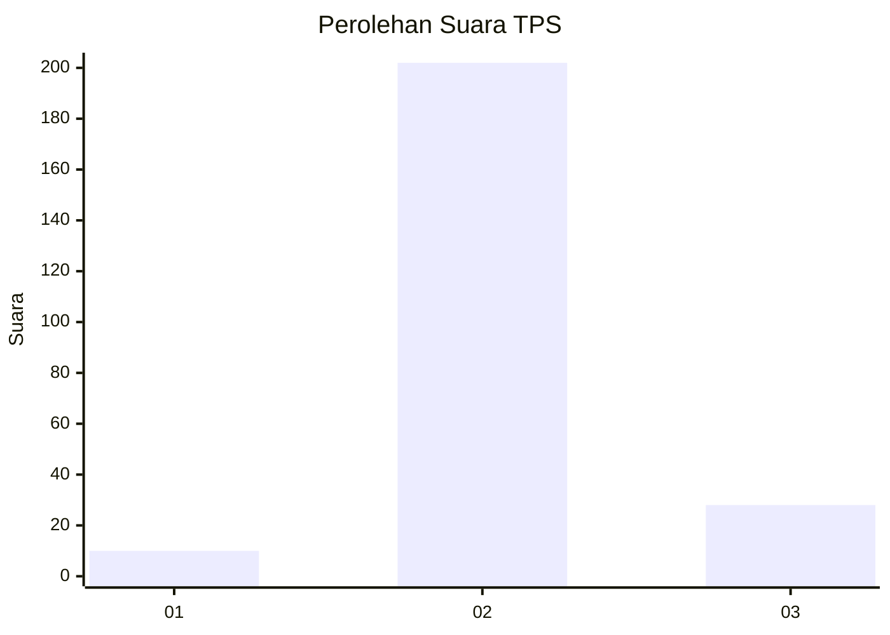
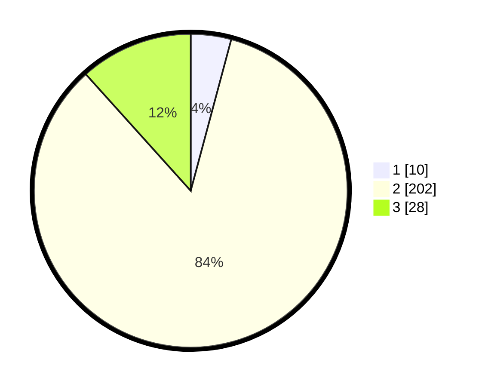

# Hasil

## Grafik

## Tabel

| No. | Nama Paslon    | Suara | Suara (raw) | Persentase |
|:--- |:-------------- | -----:| -----------:| ----------:|
| 1   | ANIES MUHAIMIN | 10    | [10][p-1]   | 4,17       |
| 2   | PRABOWO GIBRAN | 202   | [202][p-2]  | 84,17      |
| 3   | GANJAR MAHFUD  | 28    | [28][p-3]   | 11,67      |

[p-1]: https://github.com/gigit-pemilu/pemilu-2024/blob/main/pilpres/hitung-suara/sub/35-jawa-timur/sub/18-nganjuk/sub/16-rejoso/sub/2013-talun/sub/006-tps/sub/paslon-1.txt
[p-2]: https://github.com/gigit-pemilu/pemilu-2024/blob/main/pilpres/hitung-suara/sub/35-jawa-timur/sub/18-nganjuk/sub/16-rejoso/sub/2013-talun/sub/006-tps/sub/paslon-2.txt
[p-3]: https://github.com/gigit-pemilu/pemilu-2024/blob/main/pilpres/hitung-suara/sub/35-jawa-timur/sub/18-nganjuk/sub/16-rejoso/sub/2013-talun/sub/006-tps/sub/paslon-3.txt

## Foto C Plano

https://sirekap-obj-formc.kpu.go.id/8fab/pemilu/ppwp/35/18/16/20/13/3518162013006-20240219-090846--ece8bdfb-db29-4e6e-a42e-936f4ced9650.jpg

https://sirekap-obj-formc.kpu.go.id/8fab/pemilu/ppwp/35/18/16/20/13/3518162013006-20240219-104357--411bde8f-2196-417e-b8ee-274c6c1e9ab2.jpg

https://sirekap-obj-formc.kpu.go.id/8fab/pemilu/ppwp/35/18/16/20/13/3518162013006-20240220-162708--a10a033d-2760-4754-88e7-88ef7c4074d8.jpg

## Metadata

| Key        | Value               |
| ---------- | ------------------- |
| Time Stamp | 2024-02-24 22:31:28 |

