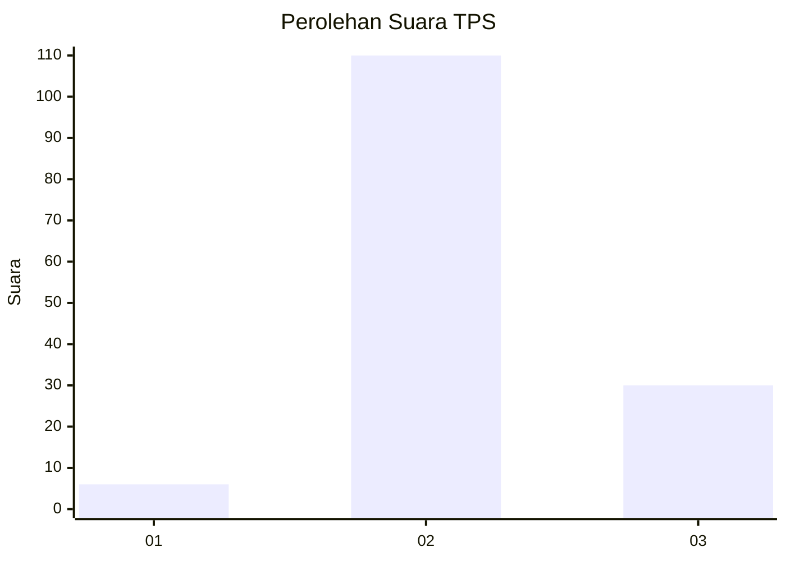

# Hasil

## Grafik

## Tabel

| No. | Nama Paslon    | Suara | Suara (raw) | Persentase |
|:--- |:-------------- | -----:| -----------:| ----------:|
| 1   | ANIES MUHAIMIN | 6     | [6][p-1]    | 4,11       |
| 2   | PRABOWO GIBRAN | 110   | [110][p-2]  | 75,34      |
| 3   | GANJAR MAHFUD  | 30    | [30][p-3]   | 20,55      |

[p-1]: https://github.com/gigit-pemilu/pemilu-2024/blob/main/pilpres/hitung-suara/sub/35-jawa-timur/sub/18-nganjuk/sub/16-rejoso/sub/2014-ngangkatan/sub/002-tps/sub/paslon-1.txt
[p-2]: https://github.com/gigit-pemilu/pemilu-2024/blob/main/pilpres/hitung-suara/sub/35-jawa-timur/sub/18-nganjuk/sub/16-rejoso/sub/2014-ngangkatan/sub/002-tps/sub/paslon-2.txt
[p-3]: https://github.com/gigit-pemilu/pemilu-2024/blob/main/pilpres/hitung-suara/sub/35-jawa-timur/sub/18-nganjuk/sub/16-rejoso/sub/2014-ngangkatan/sub/002-tps/sub/paslon-3.txt

## Foto C Plano

https://sirekap-obj-formc.kpu.go.id/d311/pemilu/ppwp/35/18/16/20/14/3518162014002-20240220-212144--b141cc26-5e3b-490d-b23f-9d9f36b442ad.jpg

https://sirekap-obj-formc.kpu.go.id/d311/pemilu/ppwp/35/18/16/20/14/3518162014002-20240220-204055--87d8a8c0-3ba9-4be0-acee-7b7fc3270eb0.jpg

https://sirekap-obj-formc.kpu.go.id/d311/pemilu/ppwp/35/18/16/20/14/3518162014002-20240220-212539--edbd58c3-a39c-417a-90d8-caa499638412.jpg

## Metadata

| Key        | Value               |
| ---------- | ------------------- |
| Time Stamp | 2024-02-26 02:00:00 |

