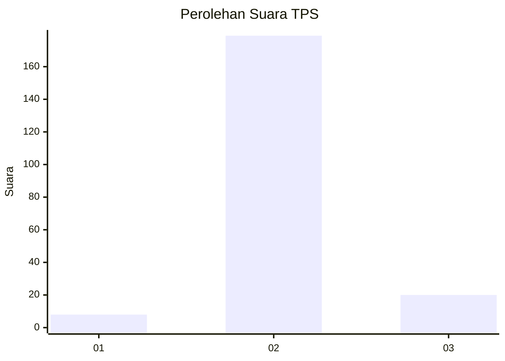
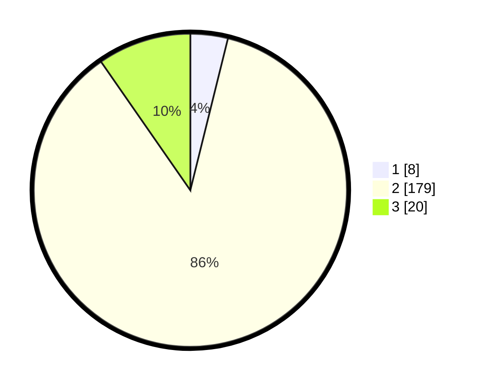

# Hasil

## Grafik

## Tabel

| No. | Nama Paslon    | Suara | Suara (raw) | Persentase |
|:--- |:-------------- | -----:| -----------:| ----------:|
| 1   | ANIES MUHAIMIN | 8     | [8][p-1]    | 3,86       |
| 2   | PRABOWO GIBRAN | 179   | [179][p-2]  | 86,47      |
| 3   | GANJAR MAHFUD  | 20    | [20][p-3]   | 9,66       |

[p-1]: https://github.com/gigit-pemilu/pemilu-2024-35-jawa-timur/blob/main/pilpres/hitung-suara/sub/35-jawa-timur/sub/18-nganjuk/sub/19-lengkong/sub/2012-sumberkepuh/sub/005-tps/sub/paslon-1.txt
[p-2]: https://github.com/gigit-pemilu/pemilu-2024-35-jawa-timur/blob/main/pilpres/hitung-suara/sub/35-jawa-timur/sub/18-nganjuk/sub/19-lengkong/sub/2012-sumberkepuh/sub/005-tps/sub/paslon-2.txt
[p-3]: https://github.com/gigit-pemilu/pemilu-2024-35-jawa-timur/blob/main/pilpres/hitung-suara/sub/35-jawa-timur/sub/18-nganjuk/sub/19-lengkong/sub/2012-sumberkepuh/sub/005-tps/sub/paslon-3.txt

## Foto C Plano

https://sirekap-obj-formc.kpu.go.id/bf5f/pemilu/ppwp/35/18/19/20/12/3518192012005-20240215-022051--e8df5cb9-b963-42f9-b5d8-9665fc684af4.jpg

https://sirekap-obj-formc.kpu.go.id/bf5f/pemilu/ppwp/35/18/19/20/12/3518192012005-20240215-022434--490c50f1-7f7a-4abd-969c-1a0165d4081f.jpg

https://sirekap-obj-formc.kpu.go.id/bf5f/pemilu/ppwp/35/18/19/20/12/3518192012005-20240215-043102--587305d4-64e2-470a-a7ec-de9a3fd4d88c.jpg

## Metadata

| Key        | Value               |
| ---------- | ------------------- |
| Time Stamp | 2024-02-19 06:16:00 |

