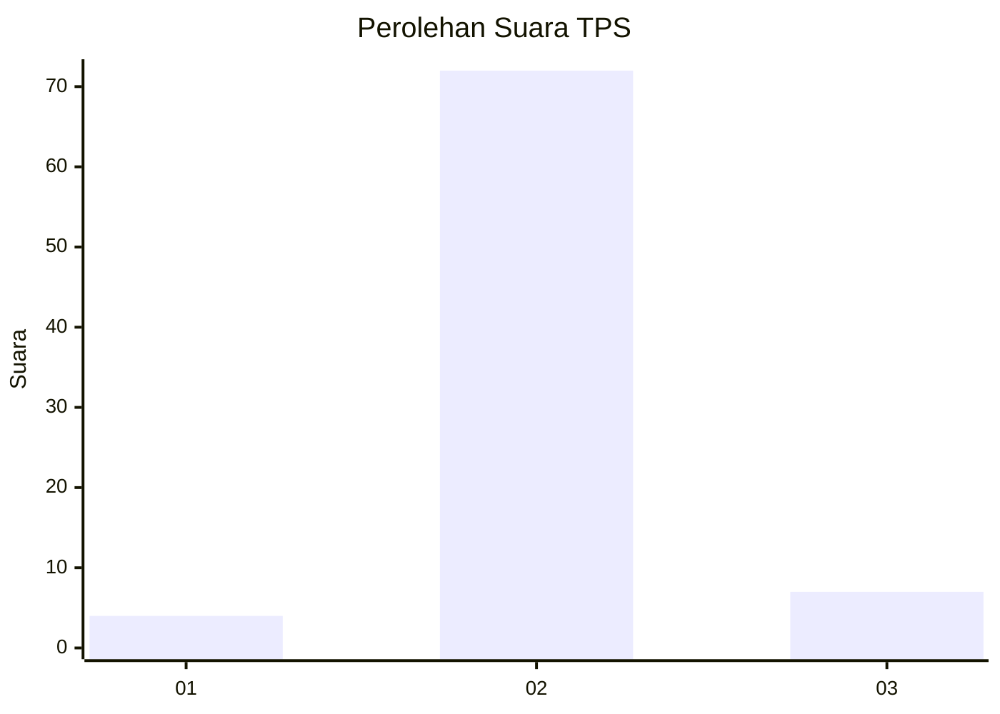
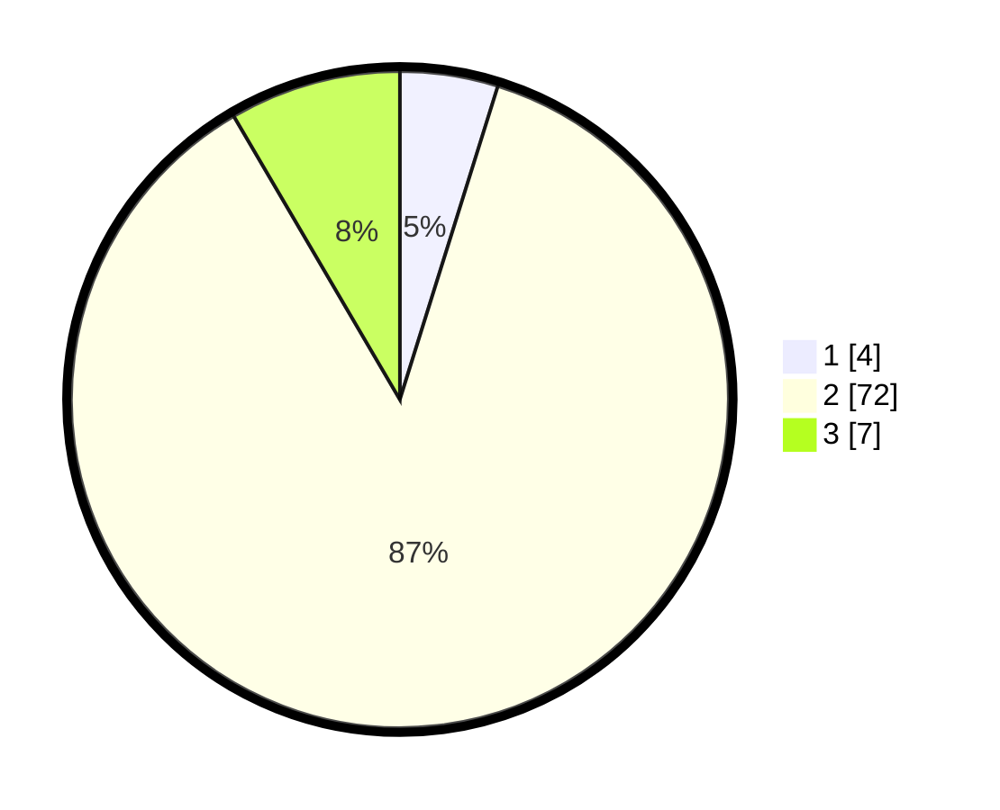

# Hasil

## Grafik

## Tabel

| No. | Nama Paslon    | Suara | Suara (raw) | Persentase |
|:--- |:-------------- | -----:| -----------:| ----------:|
| 1   | ANIES MUHAIMIN | 4     | [4][p-1]    | 4,82       |
| 2   | PRABOWO GIBRAN | 72    | [72][p-2]   | 86,75      |
| 3   | GANJAR MAHFUD  | 7     | [7][p-3]    | 8,43       |

[p-1]: https://github.com/gigit-pemilu/pemilu-2024/blob/main/pilpres/hitung-suara/sub/35-jawa-timur/sub/18-nganjuk/sub/19-lengkong/sub/2013-ngepung/sub/001-tps/sub/paslon-1.txt
[p-2]: https://github.com/gigit-pemilu/pemilu-2024/blob/main/pilpres/hitung-suara/sub/35-jawa-timur/sub/18-nganjuk/sub/19-lengkong/sub/2013-ngepung/sub/001-tps/sub/paslon-2.txt
[p-3]: https://github.com/gigit-pemilu/pemilu-2024/blob/main/pilpres/hitung-suara/sub/35-jawa-timur/sub/18-nganjuk/sub/19-lengkong/sub/2013-ngepung/sub/001-tps/sub/paslon-3.txt

## Foto C Plano

https://sirekap-obj-formc.kpu.go.id/f2de/pemilu/ppwp/35/18/19/20/13/3518192013001-20240217-205109--dbce6f1c-9705-41bb-a98b-89227fe89002.jpg

https://sirekap-obj-formc.kpu.go.id/f2de/pemilu/ppwp/35/18/19/20/13/3518192013001-20240217-205110--4b33a396-0a12-4543-9408-4c3df8ebc1a6.jpg

https://sirekap-obj-formc.kpu.go.id/f2de/pemilu/ppwp/35/18/19/20/13/3518192013001-20240217-205109--82c7a576-22ad-4556-80c9-53d5ab83fac9.jpg

## Metadata

| Key        | Value               |
| ---------- | ------------------- |
| Time Stamp | 2024-02-19 06:16:00 |

## DATA PEMILIH TETAP

Jumlah pemilih dalam DPT: **98**.
 * L: **52**.
 * P: **46**.

## DATA PENGGUNA HAK PILIH

Jumlah pengguna hak pilih dalam DPT: **86**.
 * L: **48**.
 * P: **38**.

Jumlah pengguna hak pilih dalam DPTb: **0**.
 * L: **0**.
 * P: **0**.

Jumlah pengguna hak pilih dalam DPK: **0**.
 * L: **0**.
 * P: **0**.

Jumlah pengguna hak pilih: **86**.
 * L: **48**.
 * P: **38**.

## JUMLAH SUARA SAH DAN TIDAK SAH

JUMLAH SELURUH SUARA SAH: **83**.

JUMLAH SUARA TIDAK SAH: **3**.

JUMLAH SELURUH SUARA SAH DAN SUARA TIDAK SAH: **86**.

