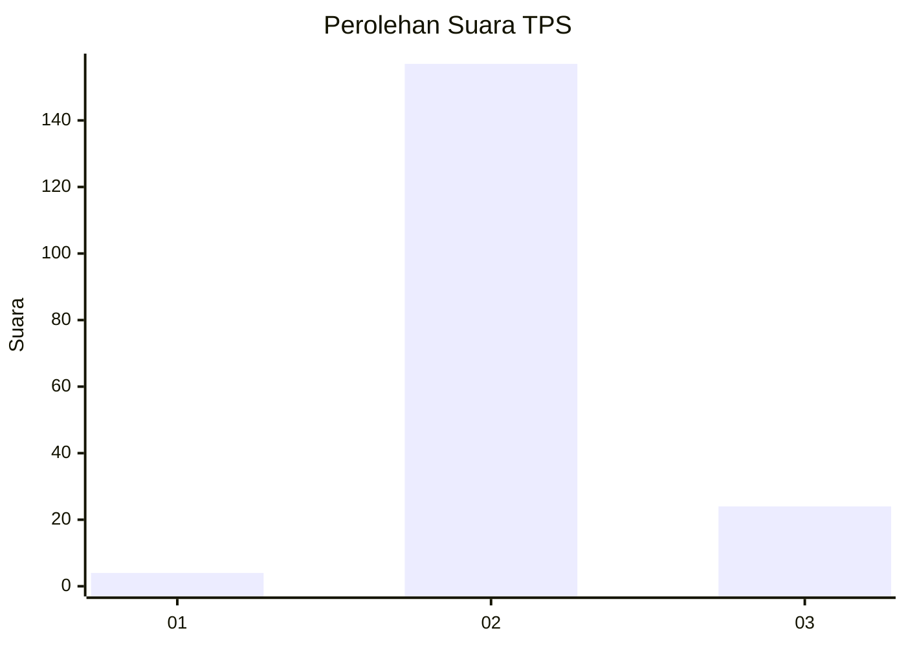
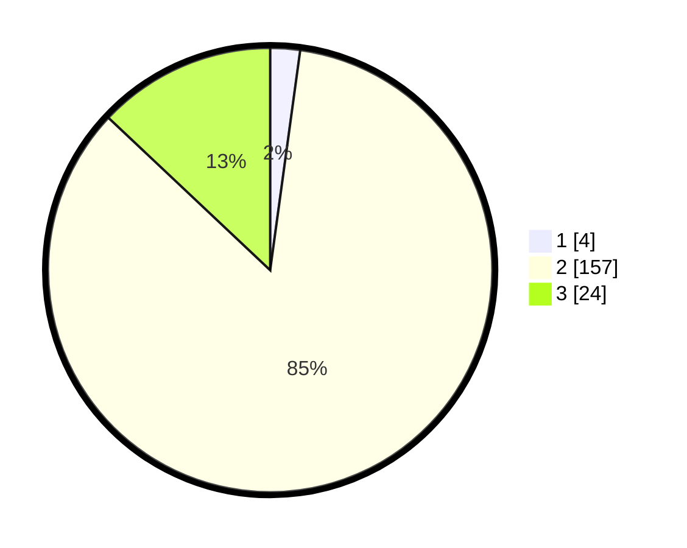

# Hasil

## Grafik

## Tabel

| No. | Nama Paslon    | Suara | Suara (raw) | Persentase |
|:--- |:-------------- | -----:| -----------:| ----------:|
| 1   | ANIES MUHAIMIN | 4     | [4][p-1]    | 2,16       |
| 2   | PRABOWO GIBRAN | 157   | [157][p-2]  | 84,86      |
| 3   | GANJAR MAHFUD  | 24    | [24][p-3]   | 12,97      |

[p-1]: https://github.com/gigit-pemilu/pemilu-2024-35-jawa-timur/blob/main/pilpres/hitung-suara/sub/35-jawa-timur/sub/19-madiun/sub/04-dagangan/sub/2016-banjarsari-kulon/sub/011-tps/sub/paslon-1.txt
[p-2]: https://github.com/gigit-pemilu/pemilu-2024-35-jawa-timur/blob/main/pilpres/hitung-suara/sub/35-jawa-timur/sub/19-madiun/sub/04-dagangan/sub/2016-banjarsari-kulon/sub/011-tps/sub/paslon-2.txt
[p-3]: https://github.com/gigit-pemilu/pemilu-2024-35-jawa-timur/blob/main/pilpres/hitung-suara/sub/35-jawa-timur/sub/19-madiun/sub/04-dagangan/sub/2016-banjarsari-kulon/sub/011-tps/sub/paslon-3.txt

## Foto C Plano

https://sirekap-obj-formc.kpu.go.id/dc38/pemilu/ppwp/35/19/04/20/16/3519042016011-20240214-211853--4a5f8757-441b-43d4-9784-8e13819b2f99.jpg

https://sirekap-obj-formc.kpu.go.id/dc38/pemilu/ppwp/35/19/04/20/16/3519042016011-20240214-212003--a8986c19-27ce-4c69-8221-1526406410ac.jpg

https://sirekap-obj-formc.kpu.go.id/dc38/pemilu/ppwp/35/19/04/20/16/3519042016011-20240214-212058--9e1e1c05-2309-416d-a187-94e3f54c14ce.jpg

## Metadata

| Key        | Value               |
| ---------- | ------------------- |
| Time Stamp | 2024-02-15 03:06:03 |

