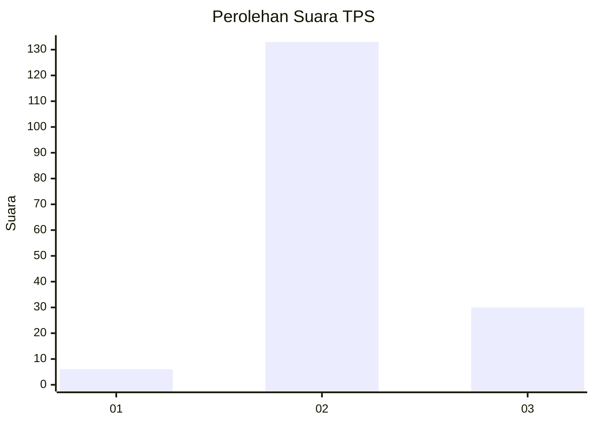

# Hasil

## Grafik

## Tabel

| No. | Nama Paslon    | Suara | Suara (raw) | Persentase |
|:--- |:-------------- | -----:| -----------:| ----------:|
| 1   | ANIES MUHAIMIN | 6     | [6][p-1]    | 3,55       |
| 2   | PRABOWO GIBRAN | 133   | [133][p-2]  | 78,70      |
| 3   | GANJAR MAHFUD  | 30    | [30][p-3]   | 17,75      |

[p-1]: https://github.com/gigit-pemilu/pemilu-2024-35-jawa-timur/blob/main/pilpres/hitung-suara/sub/35-jawa-timur/sub/19-madiun/sub/06-gemarang/sub/2002-durenan/sub/002-tps/sub/paslon-1.txt
[p-2]: https://github.com/gigit-pemilu/pemilu-2024-35-jawa-timur/blob/main/pilpres/hitung-suara/sub/35-jawa-timur/sub/19-madiun/sub/06-gemarang/sub/2002-durenan/sub/002-tps/sub/paslon-2.txt
[p-3]: https://github.com/gigit-pemilu/pemilu-2024-35-jawa-timur/blob/main/pilpres/hitung-suara/sub/35-jawa-timur/sub/19-madiun/sub/06-gemarang/sub/2002-durenan/sub/002-tps/sub/paslon-3.txt

## Foto C Plano

https://sirekap-obj-formc.kpu.go.id/5146/pemilu/ppwp/35/19/06/20/02/3519062002002-20240217-202221--ea71f6ab-5bbc-4684-810f-4e3b16b2b235.jpg

https://sirekap-obj-formc.kpu.go.id/5146/pemilu/ppwp/35/19/06/20/02/3519062002002-20240218-195324--e3989a5d-d8ed-4ae3-aa60-46b2a6c48d4d.jpg

https://sirekap-obj-formc.kpu.go.id/5146/pemilu/ppwp/35/19/06/20/02/3519062002002-20240218-195517--36f50037-c2ca-40de-942a-ef1b9d87c3bf.jpg

## Metadata

| Key        | Value               |
| ---------- | ------------------- |
| Time Stamp | 2024-02-22 10:00:00 |

