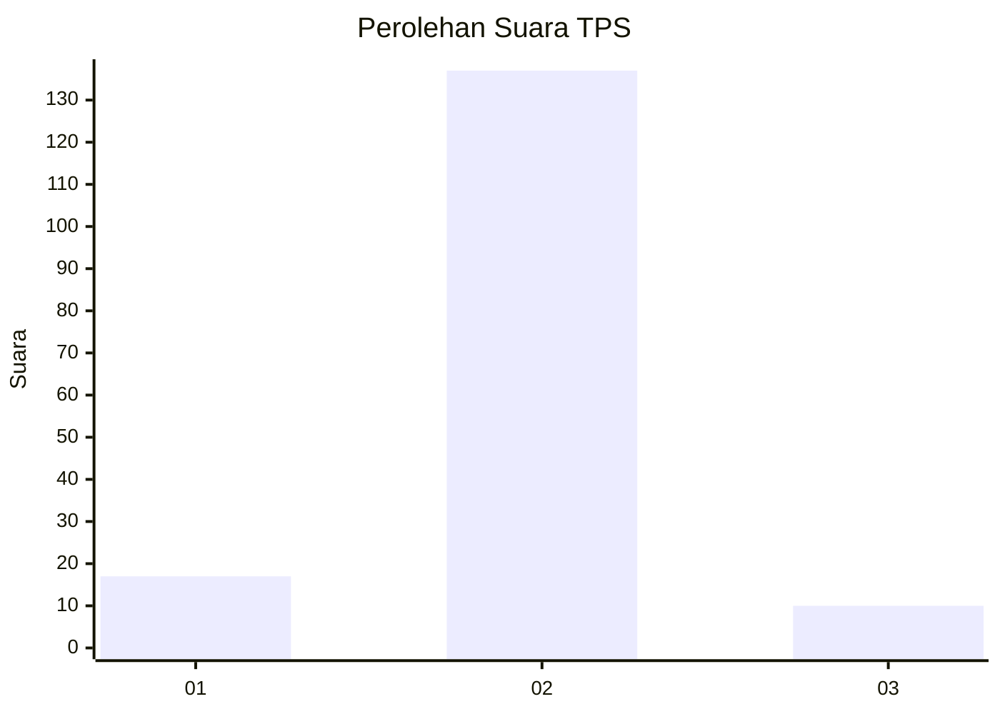
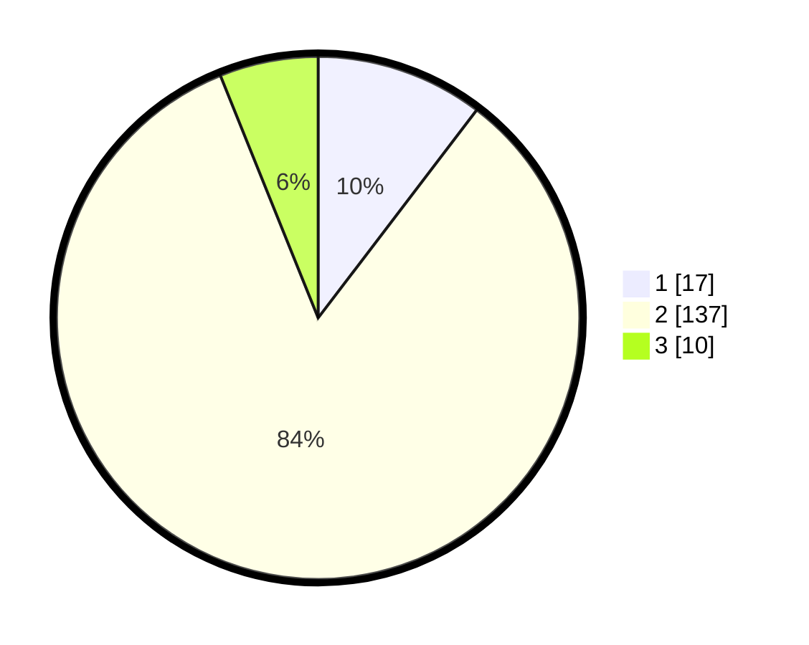

# Hasil

## Grafik

## Tabel

| No. | Nama Paslon    | Suara | Suara (raw) | Persentase |
|:--- |:-------------- | -----:| -----------:| ----------:|
| 1   | ANIES MUHAIMIN | 17    | [17][p-1]   | 10,37      |
| 2   | PRABOWO GIBRAN | 137   | [137][p-2]  | 83,54      |
| 3   | GANJAR MAHFUD  | 10    | [10][p-3]   | 6,10       |

[p-1]: https://github.com/gigit-pemilu/pemilu-2024-35-jawa-timur/blob/main/pilpres/hitung-suara/sub/35-jawa-timur/sub/19-madiun/sub/06-gemarang/sub/2002-durenan/sub/017-tps/sub/paslon-1.txt
[p-2]: https://github.com/gigit-pemilu/pemilu-2024-35-jawa-timur/blob/main/pilpres/hitung-suara/sub/35-jawa-timur/sub/19-madiun/sub/06-gemarang/sub/2002-durenan/sub/017-tps/sub/paslon-2.txt
[p-3]: https://github.com/gigit-pemilu/pemilu-2024-35-jawa-timur/blob/main/pilpres/hitung-suara/sub/35-jawa-timur/sub/19-madiun/sub/06-gemarang/sub/2002-durenan/sub/017-tps/sub/paslon-3.txt

## Foto C Plano

https://sirekap-obj-formc.kpu.go.id/699a/pemilu/ppwp/35/19/06/20/02/3519062002017-20240215-020641--e7b256c3-465e-4bfe-b5b4-3f02ef4720cf.jpg

https://sirekap-obj-formc.kpu.go.id/699a/pemilu/ppwp/35/19/06/20/02/3519062002017-20240215-020718--655137d5-b85e-4609-a18d-9e305a44e0a7.jpg

https://sirekap-obj-formc.kpu.go.id/699a/pemilu/ppwp/35/19/06/20/02/3519062002017-20240215-020800--4c8d4601-9552-4bce-ba35-80c4be737e73.jpg

## Metadata

| Key        | Value               |
| ---------- | ------------------- |
| Time Stamp | 2024-02-16 12:51:22 |

