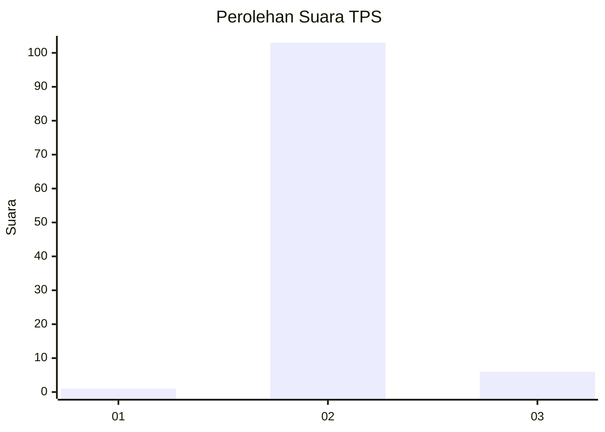
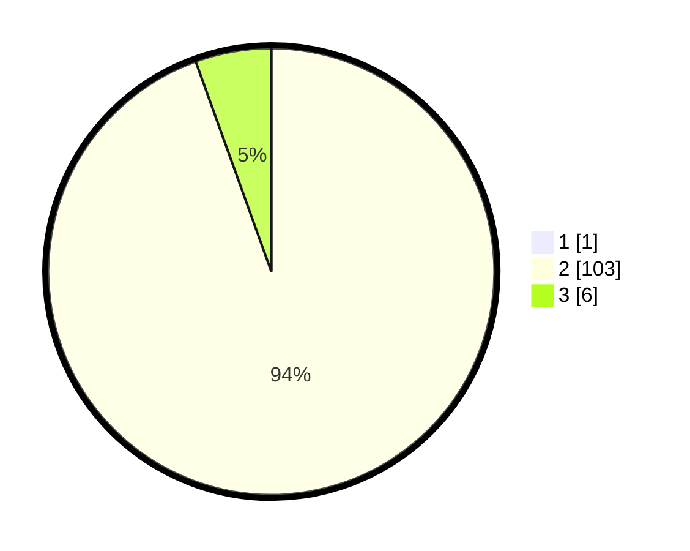

# Hasil

## Grafik

## Tabel

| No. | Nama Paslon    | Suara | Suara (raw) | Persentase |
|:--- |:-------------- | -----:| -----------:| ----------:|
| 1   | ANIES MUHAIMIN | 1     | [1][p-1]    | 0,91       |
| 2   | PRABOWO GIBRAN | 103   | [103][p-2]  | 93,64      |
| 3   | GANJAR MAHFUD  | 6     | [6][p-3]    | 5,45       |

[p-1]: https://github.com/gigit-pemilu/pemilu-2024/blob/main/pilpres/hitung-suara/sub/35-jawa-timur/sub/19-madiun/sub/06-gemarang/sub/2004-tawangrejo/sub/013-tps/sub/paslon-1.txt
[p-2]: https://github.com/gigit-pemilu/pemilu-2024/blob/main/pilpres/hitung-suara/sub/35-jawa-timur/sub/19-madiun/sub/06-gemarang/sub/2004-tawangrejo/sub/013-tps/sub/paslon-2.txt
[p-3]: https://github.com/gigit-pemilu/pemilu-2024/blob/main/pilpres/hitung-suara/sub/35-jawa-timur/sub/19-madiun/sub/06-gemarang/sub/2004-tawangrejo/sub/013-tps/sub/paslon-3.txt

## Foto C Plano

https://sirekap-obj-formc.kpu.go.id/4669/pemilu/ppwp/35/19/06/20/04/3519062004013-20240214-155500--ec9fc01d-cad2-4049-a251-9937fc487eaf.jpg

https://sirekap-obj-formc.kpu.go.id/4669/pemilu/ppwp/35/19/06/20/04/3519062004013-20240215-190933--4093d83c-c8ee-4029-b07e-d71d79e25f4c.jpg

https://sirekap-obj-formc.kpu.go.id/4669/pemilu/ppwp/35/19/06/20/04/3519062004013-20240214-155321--710b4882-18ac-4af7-b352-0e8c5bc983e7.jpg

## Metadata

| Key        | Value               |
| ---------- | ------------------- |
| Time Stamp | 2024-02-21 16:00:00 |

