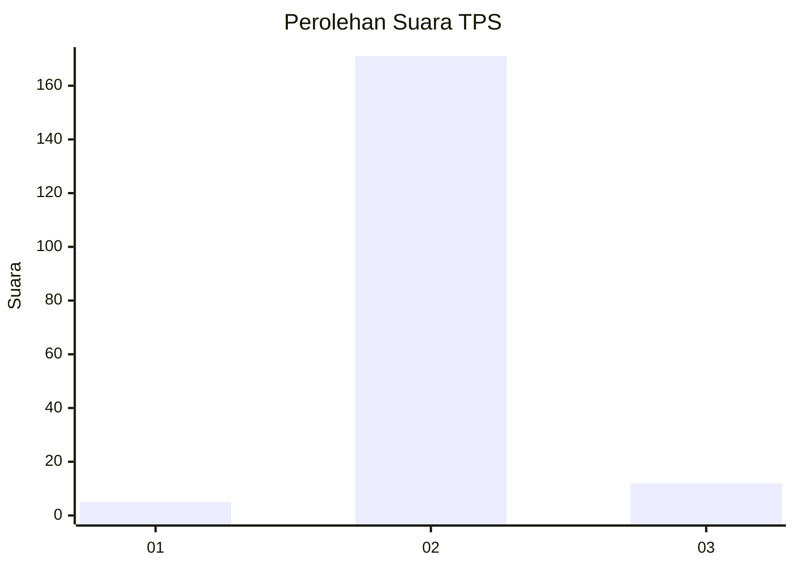
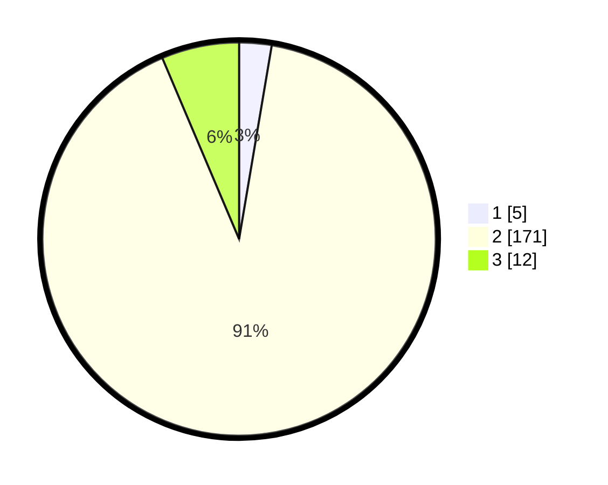

# Hasil

## Grafik

## Tabel

| No. | Nama Paslon    | Suara | Suara (raw) | Persentase |
|:--- |:-------------- | -----:| -----------:| ----------:|
| 1   | ANIES MUHAIMIN | 5     | [5][p-1]    | 2,66       |
| 2   | PRABOWO GIBRAN | 171   | [171][p-2]  | 90,96      |
| 3   | GANJAR MAHFUD  | 12    | [12][p-3]   | 6,38       |

[p-1]: https://github.com/gigit-pemilu/pemilu-2024-35-jawa-timur/blob/main/pilpres/hitung-suara/sub/35-jawa-timur/sub/19-madiun/sub/06-gemarang/sub/2004-tawangrejo/sub/017-tps/sub/paslon-1.txt
[p-2]: https://github.com/gigit-pemilu/pemilu-2024-35-jawa-timur/blob/main/pilpres/hitung-suara/sub/35-jawa-timur/sub/19-madiun/sub/06-gemarang/sub/2004-tawangrejo/sub/017-tps/sub/paslon-2.txt
[p-3]: https://github.com/gigit-pemilu/pemilu-2024-35-jawa-timur/blob/main/pilpres/hitung-suara/sub/35-jawa-timur/sub/19-madiun/sub/06-gemarang/sub/2004-tawangrejo/sub/017-tps/sub/paslon-3.txt

## Foto C Plano

https://sirekap-obj-formc.kpu.go.id/30ba/pemilu/ppwp/35/19/06/20/04/3519062004017-20240221-144501--38d6c022-f9f6-4b57-ad03-0c2080d16736.jpg

https://sirekap-obj-formc.kpu.go.id/30ba/pemilu/ppwp/35/19/06/20/04/3519062004017-20240221-144516--9f3ff01c-7bde-491e-92f8-0e680256786a.jpg

https://sirekap-obj-formc.kpu.go.id/30ba/pemilu/ppwp/35/19/06/20/04/3519062004017-20240221-144526--5e8a2036-603f-4a2e-8ebb-a72d7c393ce5.jpg

## Metadata

| Key        | Value               |
| ---------- | ------------------- |
| Time Stamp | 2024-02-24 22:31:28 |

