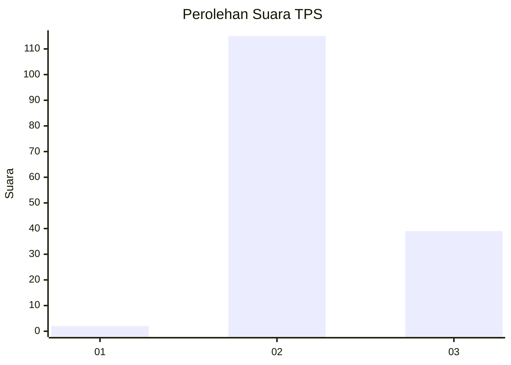
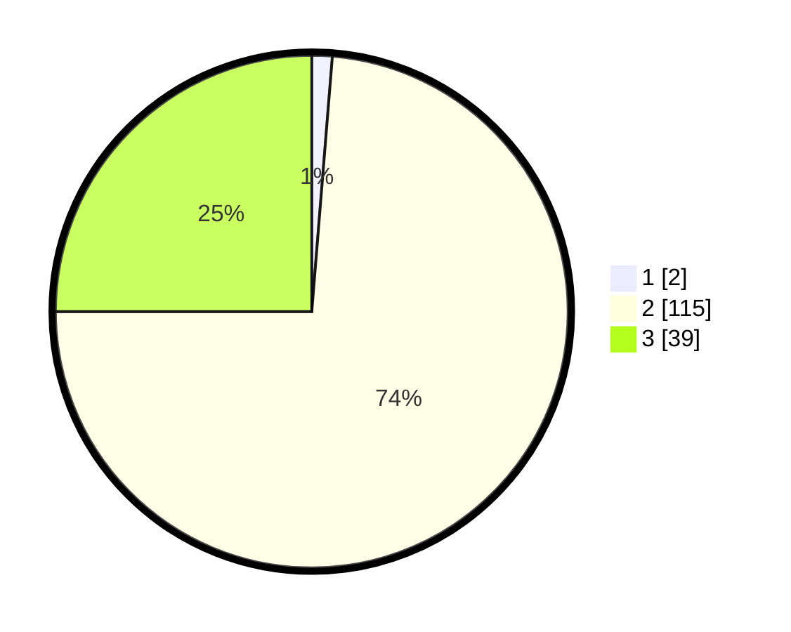

# Hasil

## Grafik

## Tabel

| No. | Nama Paslon    | Suara | Suara (raw) | Persentase |
|:--- |:-------------- | -----:| -----------:| ----------:|
| 1   | ANIES MUHAIMIN | 2     | [2][p-1]    | 1,28       |
| 2   | PRABOWO GIBRAN | 115   | [115][p-2]  | 73,72      |
| 3   | GANJAR MAHFUD  | 39    | [39][p-3]   | 25,00      |

[p-1]: https://github.com/gigit-pemilu/pemilu-2024/blob/main/pilpres/hitung-suara/sub/35-jawa-timur/sub/19-madiun/sub/06-gemarang/sub/2004-tawangrejo/sub/022-tps/sub/paslon-1.txt
[p-2]: https://github.com/gigit-pemilu/pemilu-2024/blob/main/pilpres/hitung-suara/sub/35-jawa-timur/sub/19-madiun/sub/06-gemarang/sub/2004-tawangrejo/sub/022-tps/sub/paslon-2.txt
[p-3]: https://github.com/gigit-pemilu/pemilu-2024/blob/main/pilpres/hitung-suara/sub/35-jawa-timur/sub/19-madiun/sub/06-gemarang/sub/2004-tawangrejo/sub/022-tps/sub/paslon-3.txt

## Foto C Plano

https://sirekap-obj-formc.kpu.go.id/898c/pemilu/ppwp/35/19/06/20/04/3519062004022-20240221-144416--5cb37add-fead-48d9-a7ba-854c87f558d2.jpg

https://sirekap-obj-formc.kpu.go.id/898c/pemilu/ppwp/35/19/06/20/04/3519062004022-20240221-144426--b1155a8e-8d37-46df-a384-097457c8e664.jpg

https://sirekap-obj-formc.kpu.go.id/898c/pemilu/ppwp/35/19/06/20/04/3519062004022-20240221-144435--3f4815a8-6d9e-45cb-964a-7ab0588335a3.jpg

## Metadata

| Key        | Value               |
| ---------- | ------------------- |
| Time Stamp | 2024-02-24 22:31:28 |

