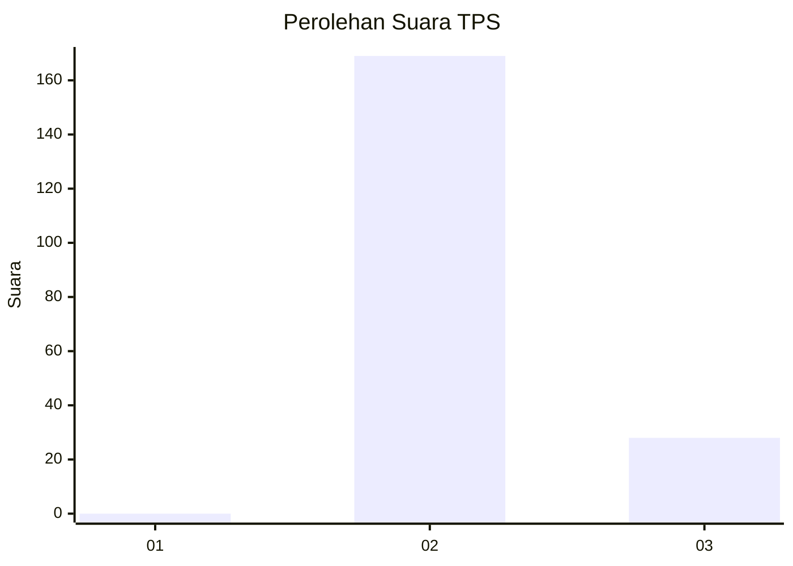
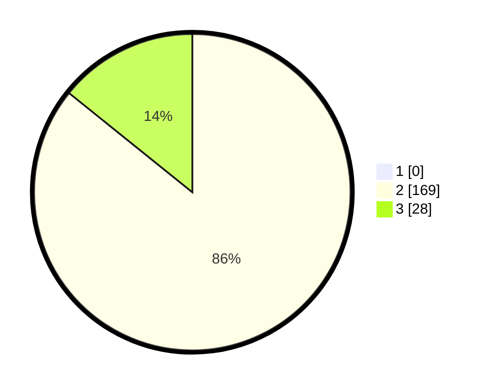

# Hasil

## Grafik

## Tabel

| No. | Nama Paslon    | Suara | Suara (raw) | Persentase |
|:--- |:-------------- | -----:| -----------:| ----------:|
| 1   | ANIES MUHAIMIN | 0     | [0][p-1]    | 0,00       |
| 2   | PRABOWO GIBRAN | 169   | [169][p-2]  | 85,79      |
| 3   | GANJAR MAHFUD  | 28    | [28][p-3]   | 14,21      |

[p-1]: https://github.com/gigit-pemilu/pemilu-2024/blob/main/pilpres/hitung-suara/sub/35-jawa-timur/sub/19-madiun/sub/06-gemarang/sub/2004-tawangrejo/sub/024-tps/sub/paslon-1.txt
[p-2]: https://github.com/gigit-pemilu/pemilu-2024/blob/main/pilpres/hitung-suara/sub/35-jawa-timur/sub/19-madiun/sub/06-gemarang/sub/2004-tawangrejo/sub/024-tps/sub/paslon-2.txt
[p-3]: https://github.com/gigit-pemilu/pemilu-2024/blob/main/pilpres/hitung-suara/sub/35-jawa-timur/sub/19-madiun/sub/06-gemarang/sub/2004-tawangrejo/sub/024-tps/sub/paslon-3.txt

## Foto C Plano

https://sirekap-obj-formc.kpu.go.id/cafe/pemilu/ppwp/35/19/06/20/04/3519062004024-20240221-145520--46073ac7-c3b9-43f1-b1b4-ca186623fac2.jpg

https://sirekap-obj-formc.kpu.go.id/cafe/pemilu/ppwp/35/19/06/20/04/3519062004024-20240221-145656--89324e20-ffb9-4b61-a2d8-e3ef9bb5913e.jpg

https://sirekap-obj-formc.kpu.go.id/cafe/pemilu/ppwp/35/19/06/20/04/3519062004024-20240221-145704--fdc9b96a-1248-41a3-b78c-6aacb5b956fd.jpg

## Metadata

| Key        | Value               |
| ---------- | ------------------- |
| Time Stamp | 2024-02-24 22:31:28 |

