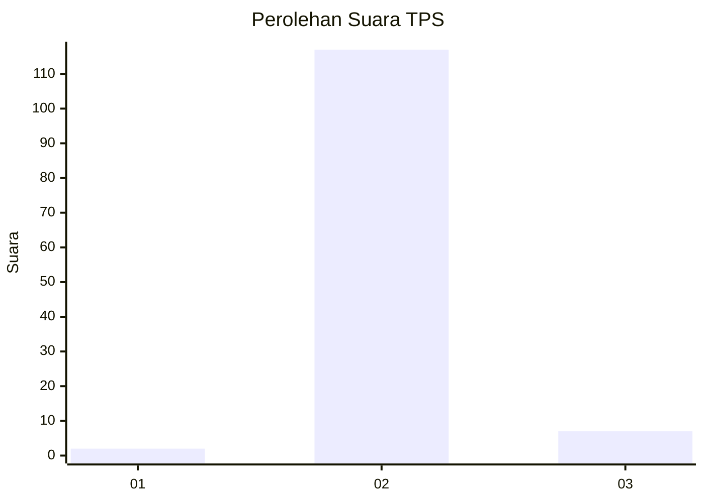
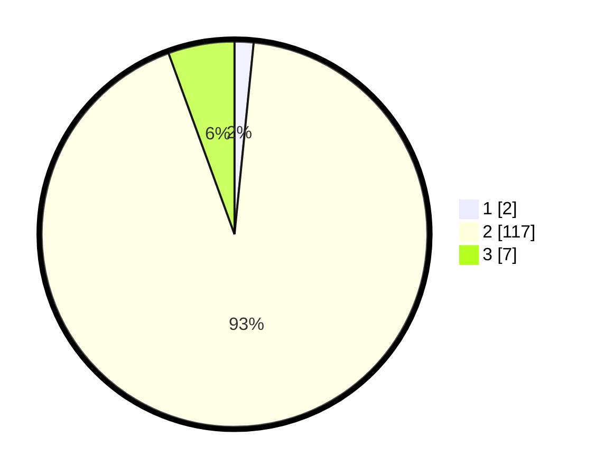

# Hasil

## Grafik

## Tabel

| No. | Nama Paslon    | Suara | Suara (raw) | Persentase |
|:--- |:-------------- | -----:| -----------:| ----------:|
| 1   | ANIES MUHAIMIN | 2     | [2][p-1]    | 1,59       |
| 2   | PRABOWO GIBRAN | 117   | [117][p-2]  | 92,86      |
| 3   | GANJAR MAHFUD  | 7     | [7][p-3]    | 5,56       |

[p-1]: https://github.com/gigit-pemilu/pemilu-2024-35-jawa-timur/blob/main/pilpres/hitung-suara/sub/35-jawa-timur/sub/19-madiun/sub/06-gemarang/sub/2005-gemarang/sub/001-tps/sub/paslon-1.txt
[p-2]: https://github.com/gigit-pemilu/pemilu-2024-35-jawa-timur/blob/main/pilpres/hitung-suara/sub/35-jawa-timur/sub/19-madiun/sub/06-gemarang/sub/2005-gemarang/sub/001-tps/sub/paslon-2.txt
[p-3]: https://github.com/gigit-pemilu/pemilu-2024-35-jawa-timur/blob/main/pilpres/hitung-suara/sub/35-jawa-timur/sub/19-madiun/sub/06-gemarang/sub/2005-gemarang/sub/001-tps/sub/paslon-3.txt

## Foto C Plano

https://sirekap-obj-formc.kpu.go.id/6609/pemilu/ppwp/35/19/06/20/05/3519062005001-20240214-221712--73ea7e06-d4b2-4448-b16d-05565dae1b5d.jpg

https://sirekap-obj-formc.kpu.go.id/6609/pemilu/ppwp/35/19/06/20/05/3519062005001-20240217-140645--23b6beb9-9ea4-4ad0-bcb1-e2d7bcadc562.jpg

https://sirekap-obj-formc.kpu.go.id/6609/pemilu/ppwp/35/19/06/20/05/3519062005001-20240217-140702--9bf4e738-b866-4d82-bbbd-4100c511245d.jpg

## Metadata

| Key        | Value               |
| ---------- | ------------------- |
| Time Stamp | 2024-02-17 14:45:18 |

