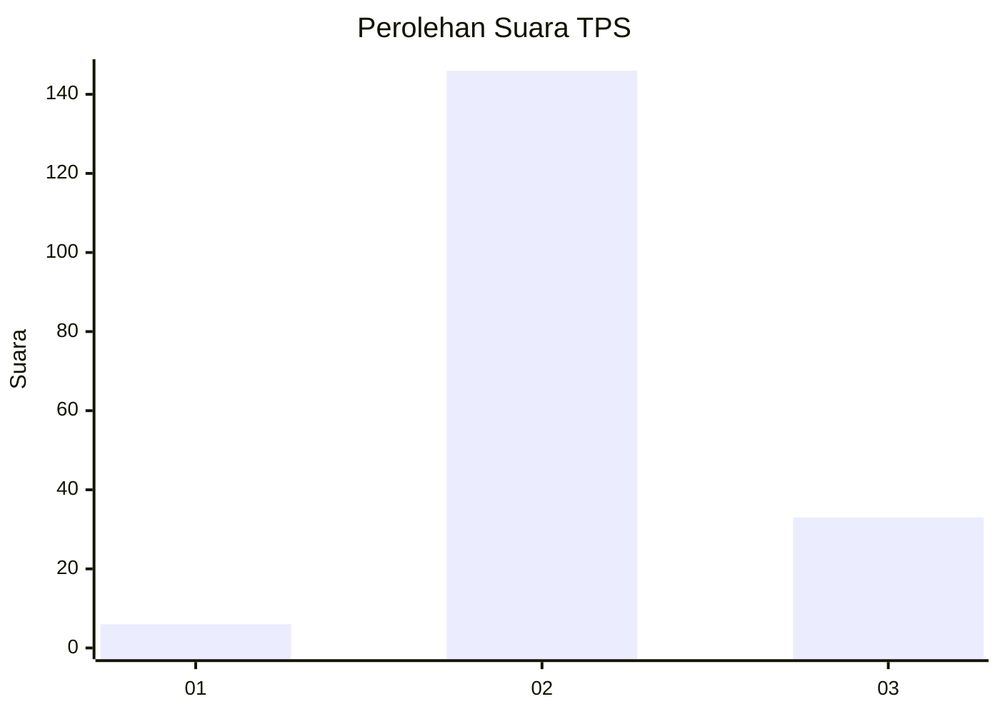

# Hasil

## Grafik

## Tabel

| No. | Nama Paslon    | Suara | Suara (raw) | Persentase |
|:--- |:-------------- | -----:| -----------:| ----------:|
| 1   | ANIES MUHAIMIN | 6     | [6][p-1]    | 3,24       |
| 2   | PRABOWO GIBRAN | 146   | [146][p-2]  | 78,92      |
| 3   | GANJAR MAHFUD  | 33    | [33][p-3]   | 17,84      |

[p-1]: https://github.com/gigit-pemilu/pemilu-2024/blob/main/pilpres/hitung-suara/sub/35-jawa-timur/sub/19-madiun/sub/06-gemarang/sub/2005-gemarang/sub/006-tps/sub/paslon-1.txt
[p-2]: https://github.com/gigit-pemilu/pemilu-2024/blob/main/pilpres/hitung-suara/sub/35-jawa-timur/sub/19-madiun/sub/06-gemarang/sub/2005-gemarang/sub/006-tps/sub/paslon-2.txt
[p-3]: https://github.com/gigit-pemilu/pemilu-2024/blob/main/pilpres/hitung-suara/sub/35-jawa-timur/sub/19-madiun/sub/06-gemarang/sub/2005-gemarang/sub/006-tps/sub/paslon-3.txt

## Foto C Plano

https://sirekap-obj-formc.kpu.go.id/0d88/pemilu/ppwp/35/19/06/20/05/3519062005006-20240219-140205--b7b6801e-0f50-4e08-86e2-9ea9c2bb97ad.jpg

https://sirekap-obj-formc.kpu.go.id/0d88/pemilu/ppwp/35/19/06/20/05/3519062005006-20240214-141129--f2382a69-f054-4111-9c0a-f9200ee40ddf.jpg

https://sirekap-obj-formc.kpu.go.id/0d88/pemilu/ppwp/35/19/06/20/05/3519062005006-20240214-141318--b4bd871b-e81f-4e9b-95e4-1a7f03a244e9.jpg

## Metadata

| Key        | Value               |
| ---------- | ------------------- |
| Time Stamp | 2024-02-19 15:00:00 |

