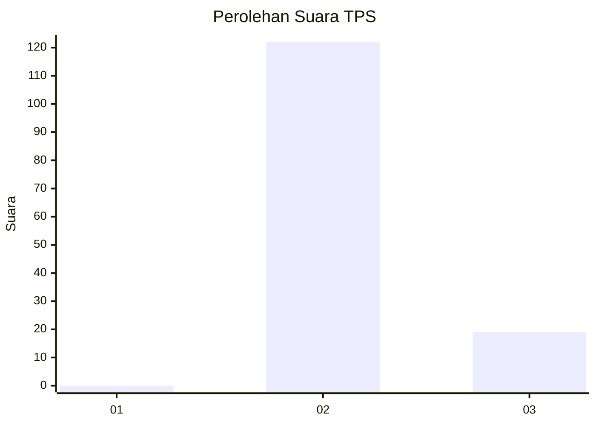
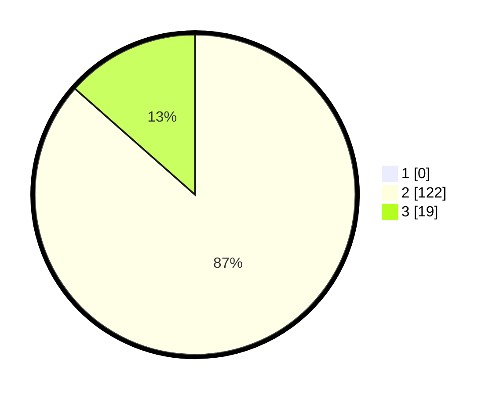

# Hasil

## Grafik

## Tabel

| No. | Nama Paslon    | Suara | Suara (raw) | Persentase |
|:--- |:-------------- | -----:| -----------:| ----------:|
| 1   | ANIES MUHAIMIN | 0     | [0][p-1]    | 0,00       |
| 2   | PRABOWO GIBRAN | 122   | [122][p-2]  | 86,52      |
| 3   | GANJAR MAHFUD  | 19    | [19][p-3]   | 13,48      |

[p-1]: https://github.com/gigit-pemilu/pemilu-2024-35-jawa-timur/blob/main/pilpres/hitung-suara/sub/35-jawa-timur/sub/19-madiun/sub/06-gemarang/sub/2005-gemarang/sub/008-tps/sub/paslon-1.txt
[p-2]: https://github.com/gigit-pemilu/pemilu-2024-35-jawa-timur/blob/main/pilpres/hitung-suara/sub/35-jawa-timur/sub/19-madiun/sub/06-gemarang/sub/2005-gemarang/sub/008-tps/sub/paslon-2.txt
[p-3]: https://github.com/gigit-pemilu/pemilu-2024-35-jawa-timur/blob/main/pilpres/hitung-suara/sub/35-jawa-timur/sub/19-madiun/sub/06-gemarang/sub/2005-gemarang/sub/008-tps/sub/paslon-3.txt

## Foto C Plano

https://sirekap-obj-formc.kpu.go.id/e9a7/pemilu/ppwp/35/19/06/20/05/3519062005008-20240214-200951--48476cc0-a708-40d8-be88-a70f66ef9fad.jpg

https://sirekap-obj-formc.kpu.go.id/e9a7/pemilu/ppwp/35/19/06/20/05/3519062005008-20240219-163617--46cf1f82-a890-4a3d-b1b7-24db80188812.jpg

https://sirekap-obj-formc.kpu.go.id/e9a7/pemilu/ppwp/35/19/06/20/05/3519062005008-20240219-162813--fc443dc9-7e56-4b74-b72a-c8a21ffd8222.jpg

## Metadata

| Key        | Value               |
| ---------- | ------------------- |
| Time Stamp | 2024-02-25 11:00:00 |

