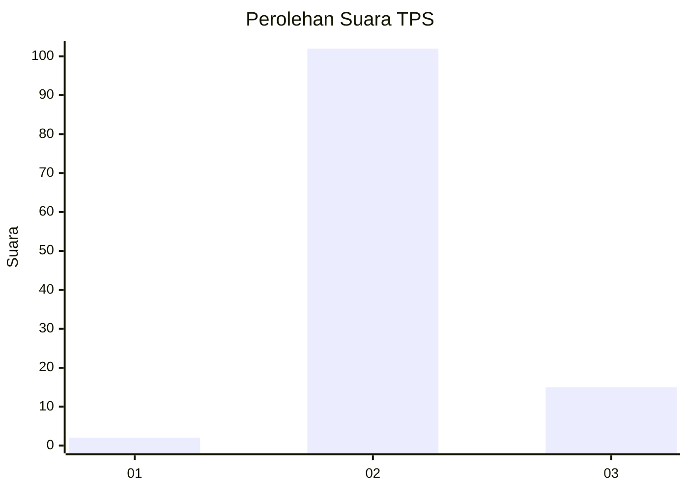
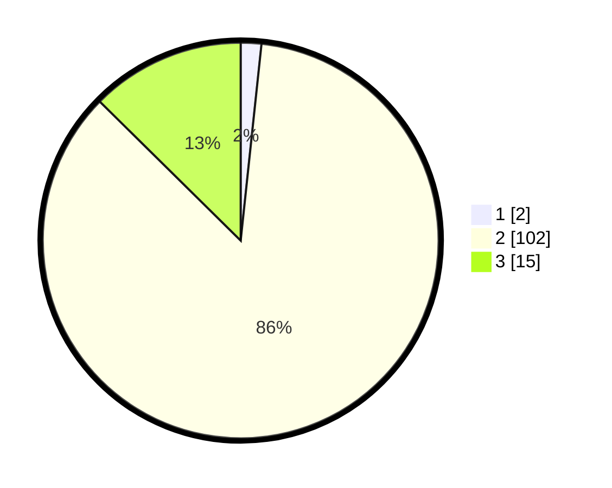

# Hasil

## Grafik

## Tabel

| No. | Nama Paslon    | Suara | Suara (raw) | Persentase |
|:--- |:-------------- | -----:| -----------:| ----------:|
| 1   | ANIES MUHAIMIN | 2     | [2][p-1]    | 1,68       |
| 2   | PRABOWO GIBRAN | 102   | [102][p-2]  | 85,71      |
| 3   | GANJAR MAHFUD  | 15    | [15][p-3]   | 12,61      |

[p-1]: https://github.com/gigit-pemilu/pemilu-2024/blob/main/pilpres/hitung-suara/sub/35-jawa-timur/sub/19-madiun/sub/06-gemarang/sub/2005-gemarang/sub/009-tps/sub/paslon-1.txt
[p-2]: https://github.com/gigit-pemilu/pemilu-2024/blob/main/pilpres/hitung-suara/sub/35-jawa-timur/sub/19-madiun/sub/06-gemarang/sub/2005-gemarang/sub/009-tps/sub/paslon-2.txt
[p-3]: https://github.com/gigit-pemilu/pemilu-2024/blob/main/pilpres/hitung-suara/sub/35-jawa-timur/sub/19-madiun/sub/06-gemarang/sub/2005-gemarang/sub/009-tps/sub/paslon-3.txt

## Foto C Plano

https://sirekap-obj-formc.kpu.go.id/2560/pemilu/ppwp/35/19/06/20/05/3519062005009-20240214-204451--fefaf94e-1210-4c2c-ac44-1cdcde3147eb.jpg

https://sirekap-obj-formc.kpu.go.id/2560/pemilu/ppwp/35/19/06/20/05/3519062005009-20240214-204626--7402bc03-239f-4313-beb9-951058e783fa.jpg

https://sirekap-obj-formc.kpu.go.id/2560/pemilu/ppwp/35/19/06/20/05/3519062005009-20240214-204655--e44d7fcf-5bba-448f-895a-545254d28176.jpg

## Metadata

| Key        | Value               |
| ---------- | ------------------- |
| Time Stamp | 2024-02-16 12:51:22 |

