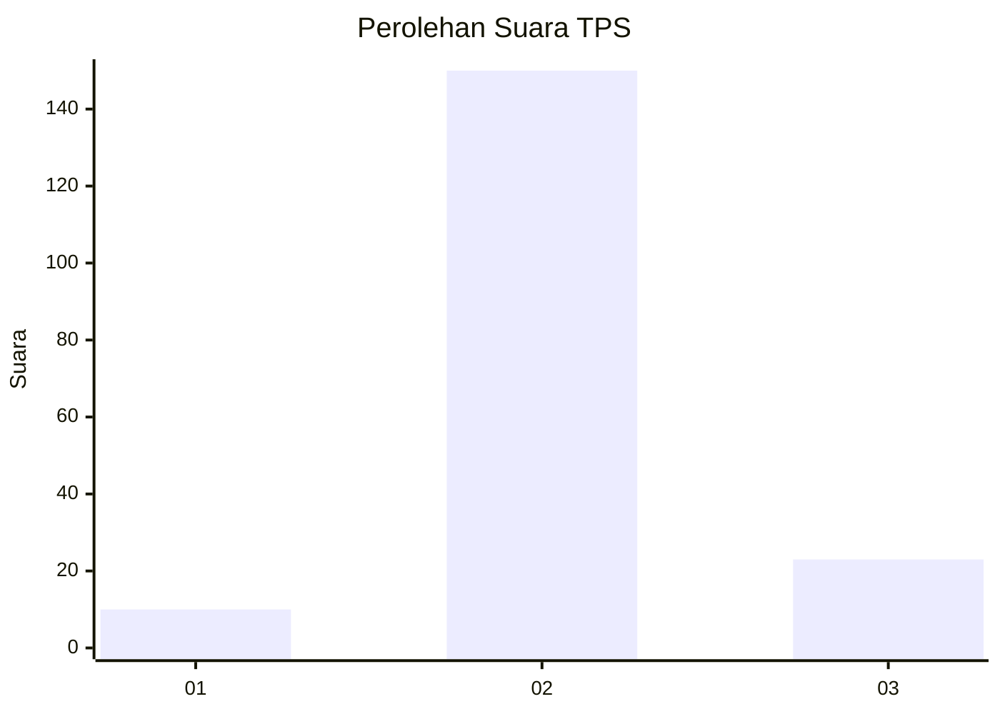
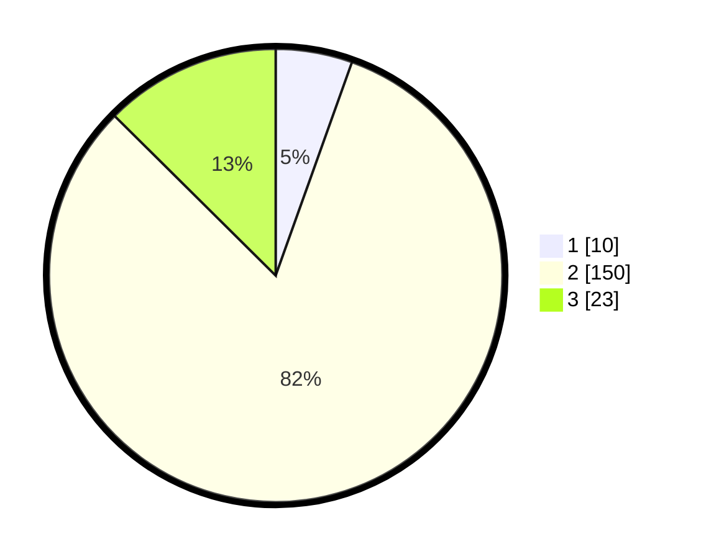

# Hasil

## Grafik

## Tabel

| No. | Nama Paslon    | Suara | Suara (raw) | Persentase |
|:--- |:-------------- | -----:| -----------:| ----------:|
| 1   | ANIES MUHAIMIN | 10    | [10][p-1]   | 5,46       |
| 2   | PRABOWO GIBRAN | 150   | [150][p-2]  | 81,97      |
| 3   | GANJAR MAHFUD  | 23    | [23][p-3]   | 12,57      |

[p-1]: https://github.com/gigit-pemilu/pemilu-2024/blob/main/pilpres/hitung-suara/sub/35-jawa-timur/sub/19-madiun/sub/06-gemarang/sub/2005-gemarang/sub/011-tps/sub/paslon-1.txt
[p-2]: https://github.com/gigit-pemilu/pemilu-2024/blob/main/pilpres/hitung-suara/sub/35-jawa-timur/sub/19-madiun/sub/06-gemarang/sub/2005-gemarang/sub/011-tps/sub/paslon-2.txt
[p-3]: https://github.com/gigit-pemilu/pemilu-2024/blob/main/pilpres/hitung-suara/sub/35-jawa-timur/sub/19-madiun/sub/06-gemarang/sub/2005-gemarang/sub/011-tps/sub/paslon-3.txt

## Foto C Plano

https://sirekap-obj-formc.kpu.go.id/5625/pemilu/ppwp/35/19/06/20/05/3519062005011-20240214-191558--210305cf-2983-4bc1-8b0e-3ddb94c59b91.jpg

https://sirekap-obj-formc.kpu.go.id/5625/pemilu/ppwp/35/19/06/20/05/3519062005011-20240217-143326--a5d302cb-cfb7-43f7-9f4d-64a39d5827cd.jpg

https://sirekap-obj-formc.kpu.go.id/5625/pemilu/ppwp/35/19/06/20/05/3519062005011-20240217-143343--b72d8f4f-caf6-480b-9e0f-368f2b85ac62.jpg

## Metadata

| Key        | Value               |
| ---------- | ------------------- |
| Time Stamp | 2024-02-17 14:45:18 |

