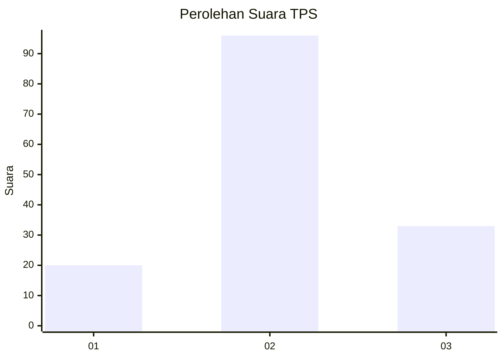
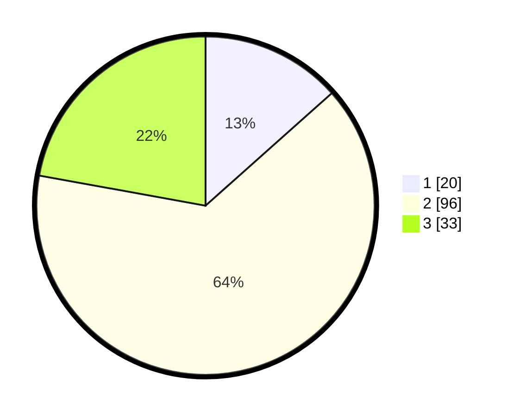

# Hasil

## Grafik

## Tabel

| No. | Nama Paslon    | Suara | Suara (raw) | Persentase |
|:--- |:-------------- | -----:| -----------:| ----------:|
| 1   | ANIES MUHAIMIN | 20    | [20][p-1]   | 13,42      |
| 2   | PRABOWO GIBRAN | 96    | [96][p-2]   | 64,43      |
| 3   | GANJAR MAHFUD  | 33    | [33][p-3]   | 22,15      |

[p-1]: https://github.com/gigit-pemilu/pemilu-2024/blob/main/pilpres/hitung-suara/sub/35-jawa-timur/sub/19-madiun/sub/06-gemarang/sub/2006-sebayi/sub/001-tps/sub/paslon-1.txt
[p-2]: https://github.com/gigit-pemilu/pemilu-2024/blob/main/pilpres/hitung-suara/sub/35-jawa-timur/sub/19-madiun/sub/06-gemarang/sub/2006-sebayi/sub/001-tps/sub/paslon-2.txt
[p-3]: https://github.com/gigit-pemilu/pemilu-2024/blob/main/pilpres/hitung-suara/sub/35-jawa-timur/sub/19-madiun/sub/06-gemarang/sub/2006-sebayi/sub/001-tps/sub/paslon-3.txt

## Foto C Plano

https://sirekap-obj-formc.kpu.go.id/164f/pemilu/ppwp/35/19/06/20/06/3519062006001-20240215-005329--4eba0a31-35fc-43e0-8577-1a379393c282.jpg

https://sirekap-obj-formc.kpu.go.id/164f/pemilu/ppwp/35/19/06/20/06/3519062006001-20240215-005440--5c464763-031d-4480-8dda-e04260e162df.jpg

https://sirekap-obj-formc.kpu.go.id/164f/pemilu/ppwp/35/19/06/20/06/3519062006001-20240215-005645--e52eab8f-dddf-4165-b2e9-004584b72dc5.jpg

## Metadata

| Key        | Value               |
| ---------- | ------------------- |
| Time Stamp | 2024-02-16 12:51:22 |

