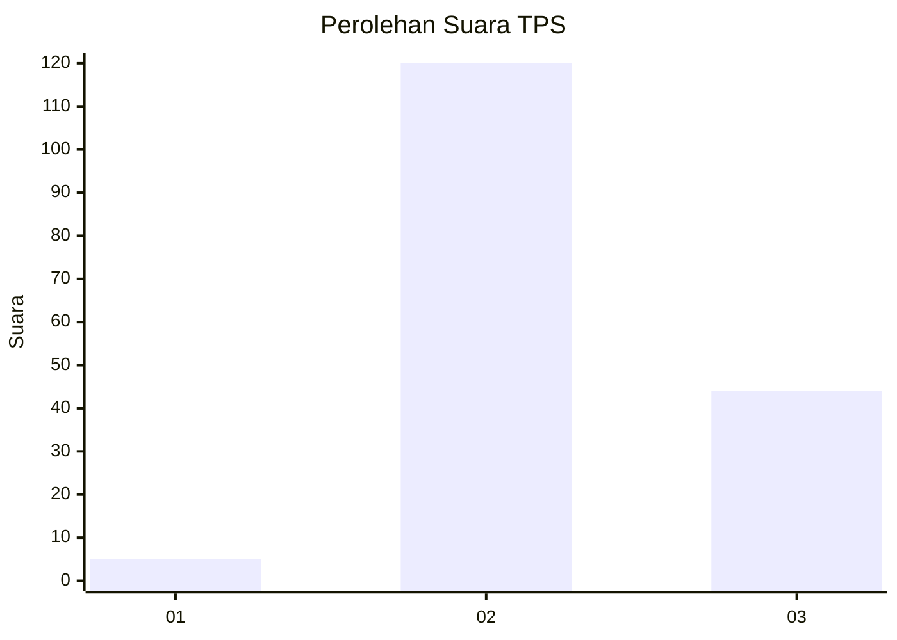
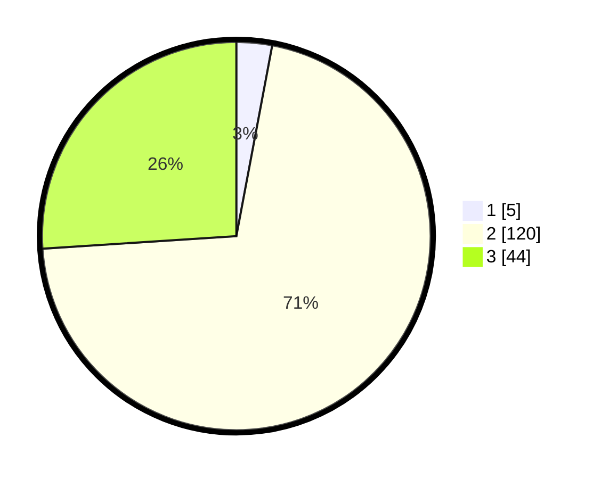

# Hasil

## Grafik

## Tabel

| No. | Nama Paslon    | Suara | Suara (raw) | Persentase |
|:--- |:-------------- | -----:| -----------:| ----------:|
| 1   | ANIES MUHAIMIN | 5     | [5][p-1]    | 2,96       |
| 2   | PRABOWO GIBRAN | 120   | [120][p-2]  | 71,01      |
| 3   | GANJAR MAHFUD  | 44    | [44][p-3]   | 26,04      |

[p-1]: https://github.com/gigit-pemilu/pemilu-2024/blob/main/pilpres/hitung-suara/sub/35-jawa-timur/sub/19-madiun/sub/06-gemarang/sub/2006-sebayi/sub/003-tps/sub/paslon-1.txt
[p-2]: https://github.com/gigit-pemilu/pemilu-2024/blob/main/pilpres/hitung-suara/sub/35-jawa-timur/sub/19-madiun/sub/06-gemarang/sub/2006-sebayi/sub/003-tps/sub/paslon-2.txt
[p-3]: https://github.com/gigit-pemilu/pemilu-2024/blob/main/pilpres/hitung-suara/sub/35-jawa-timur/sub/19-madiun/sub/06-gemarang/sub/2006-sebayi/sub/003-tps/sub/paslon-3.txt

## Foto C Plano

https://sirekap-obj-formc.kpu.go.id/ea6c/pemilu/ppwp/35/19/06/20/06/3519062006003-20240214-233142--61b79379-1edd-4113-b9a9-403f62f8e71f.jpg

https://sirekap-obj-formc.kpu.go.id/ea6c/pemilu/ppwp/35/19/06/20/06/3519062006003-20240214-233321--c20354c8-b45e-49b5-807c-f084668b402d.jpg

https://sirekap-obj-formc.kpu.go.id/ea6c/pemilu/ppwp/35/19/06/20/06/3519062006003-20240214-233443--e14011e2-2faa-47c5-a4d7-db096cb6237e.jpg

## Metadata

| Key        | Value               |
| ---------- | ------------------- |
| Time Stamp | 2024-02-16 12:51:22 |

