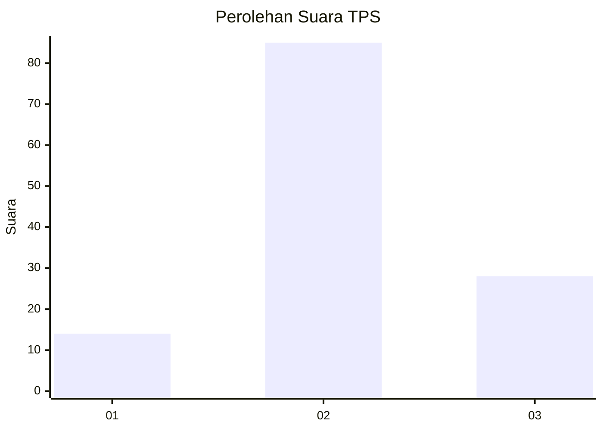
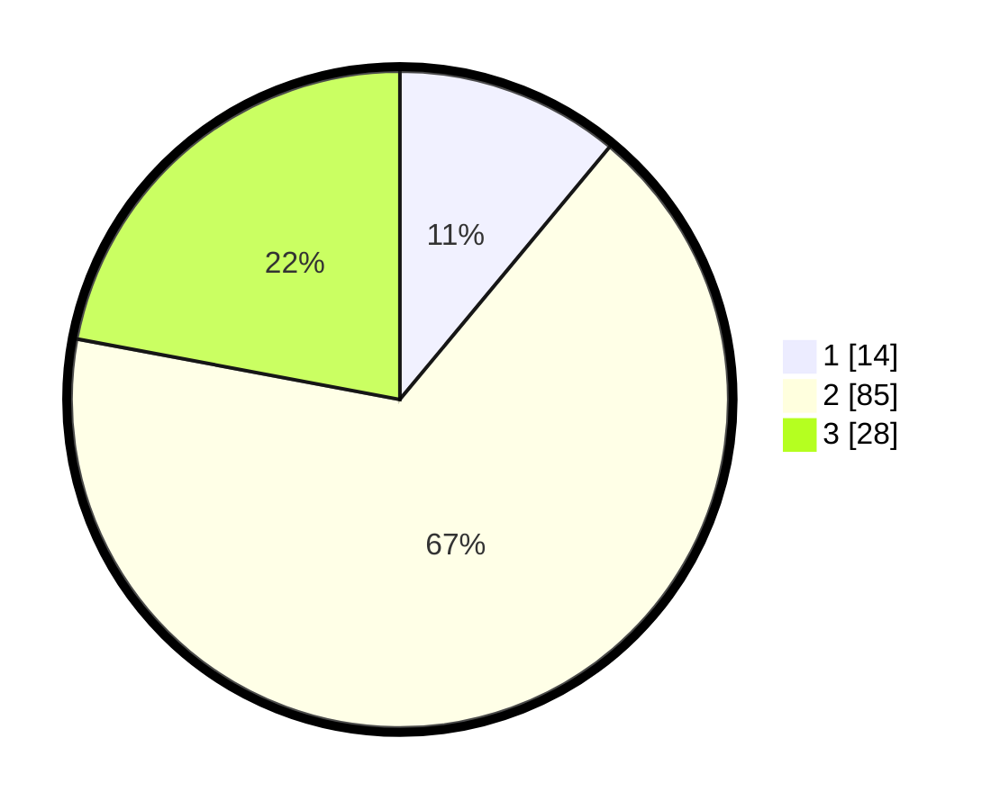

# Hasil

## Grafik

## Tabel

| No. | Nama Paslon    | Suara | Suara (raw) | Persentase |
|:--- |:-------------- | -----:| -----------:| ----------:|
| 1   | ANIES MUHAIMIN | 14    | [14][p-1]   | 11,02      |
| 2   | PRABOWO GIBRAN | 85    | [85][p-2]   | 66,93      |
| 3   | GANJAR MAHFUD  | 28    | [28][p-3]   | 22,05      |

[p-1]: https://github.com/gigit-pemilu/pemilu-2024/blob/main/pilpres/hitung-suara/sub/35-jawa-timur/sub/19-madiun/sub/06-gemarang/sub/2006-sebayi/sub/005-tps/sub/paslon-1.txt
[p-2]: https://github.com/gigit-pemilu/pemilu-2024/blob/main/pilpres/hitung-suara/sub/35-jawa-timur/sub/19-madiun/sub/06-gemarang/sub/2006-sebayi/sub/005-tps/sub/paslon-2.txt
[p-3]: https://github.com/gigit-pemilu/pemilu-2024/blob/main/pilpres/hitung-suara/sub/35-jawa-timur/sub/19-madiun/sub/06-gemarang/sub/2006-sebayi/sub/005-tps/sub/paslon-3.txt

## Foto C Plano

https://sirekap-obj-formc.kpu.go.id/8b18/pemilu/ppwp/35/19/06/20/06/3519062006005-20240214-203017--d5f1c7d9-7c67-4378-a5f3-39daacbf60d8.jpg

https://sirekap-obj-formc.kpu.go.id/8b18/pemilu/ppwp/35/19/06/20/06/3519062006005-20240214-141438--63b68a90-4ae4-42ff-92cf-c15eefa213a1.jpg

https://sirekap-obj-formc.kpu.go.id/8b18/pemilu/ppwp/35/19/06/20/06/3519062006005-20240214-141601--a2ab9233-698a-4df5-a2fc-20a87ea80e62.jpg

## Metadata

| Key        | Value               |
| ---------- | ------------------- |
| Time Stamp | 2024-02-16 12:51:22 |

