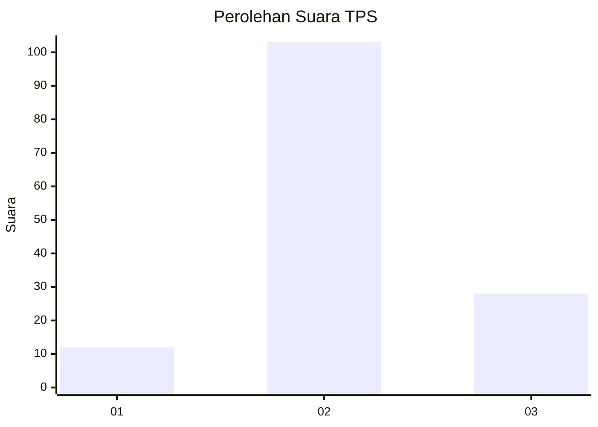
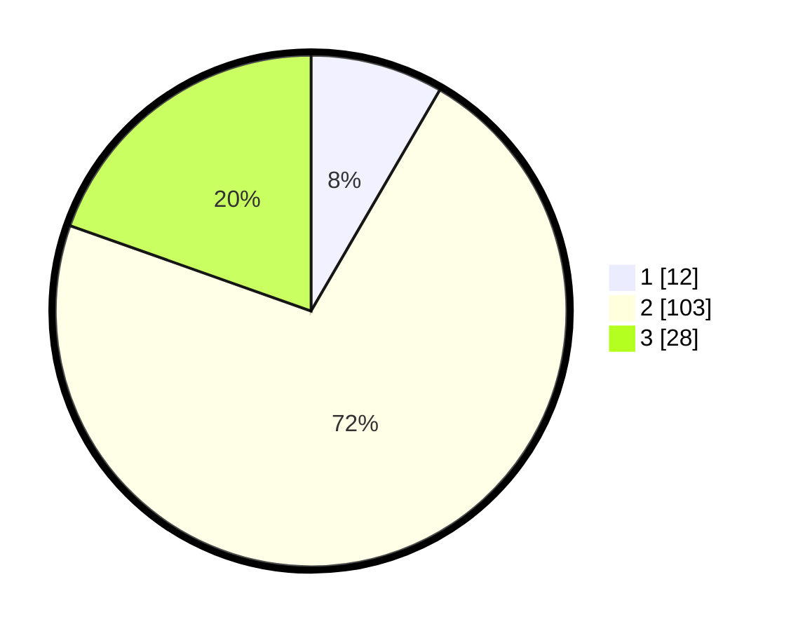

# Hasil

## Grafik

## Tabel

| No. | Nama Paslon    | Suara | Suara (raw) | Persentase |
|:--- |:-------------- | -----:| -----------:| ----------:|
| 1   | ANIES MUHAIMIN | 12    | [12][p-1]   | 8,39       |
| 2   | PRABOWO GIBRAN | 103   | [103][p-2]  | 72,03      |
| 3   | GANJAR MAHFUD  | 28    | [28][p-3]   | 19,58      |

[p-1]: https://github.com/gigit-pemilu/pemilu-2024/blob/main/pilpres/hitung-suara/sub/35-jawa-timur/sub/19-madiun/sub/06-gemarang/sub/2006-sebayi/sub/007-tps/sub/paslon-1.txt
[p-2]: https://github.com/gigit-pemilu/pemilu-2024/blob/main/pilpres/hitung-suara/sub/35-jawa-timur/sub/19-madiun/sub/06-gemarang/sub/2006-sebayi/sub/007-tps/sub/paslon-2.txt
[p-3]: https://github.com/gigit-pemilu/pemilu-2024/blob/main/pilpres/hitung-suara/sub/35-jawa-timur/sub/19-madiun/sub/06-gemarang/sub/2006-sebayi/sub/007-tps/sub/paslon-3.txt

## Foto C Plano

https://sirekap-obj-formc.kpu.go.id/0392/pemilu/ppwp/35/19/06/20/06/3519062006007-20240214-224437--efa5c379-b466-40f7-9349-f9d054f22b9f.jpg

https://sirekap-obj-formc.kpu.go.id/0392/pemilu/ppwp/35/19/06/20/06/3519062006007-20240214-222233--af158287-94c8-473d-b0ea-3b9be2f2527c.jpg

https://sirekap-obj-formc.kpu.go.id/0392/pemilu/ppwp/35/19/06/20/06/3519062006007-20240214-222308--2df25577-8f20-434e-884d-bdabdc2d0d19.jpg

## Metadata

| Key        | Value               |
| ---------- | ------------------- |
| Time Stamp | 2024-02-16 12:51:22 |

