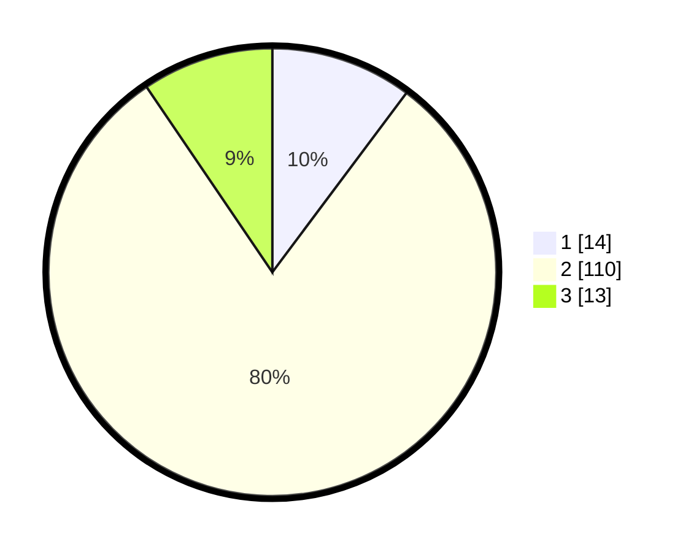

# Hasil

## Grafik

## Tabel

| No. | Nama Paslon    | Suara | Suara (raw) | Persentase |
|:--- |:-------------- | -----:| -----------:| ----------:|
| 1   | ANIES MUHAIMIN | 14    | [14][p-1]   | 10,22      |
| 2   | PRABOWO GIBRAN | 110   | [110][p-2]  | 80,29      |
| 3   | GANJAR MAHFUD  | 13    | [13][p-3]   | 9,49       |

[p-1]: https://github.com/gigit-pemilu/pemilu-2024/blob/main/pilpres/hitung-suara/sub/35-jawa-timur/sub/19-madiun/sub/06-gemarang/sub/2007-nampu/sub/001-tps/sub/paslon-1.txt
[p-2]: https://github.com/gigit-pemilu/pemilu-2024/blob/main/pilpres/hitung-suara/sub/35-jawa-timur/sub/19-madiun/sub/06-gemarang/sub/2007-nampu/sub/001-tps/sub/paslon-2.txt
[p-3]: https://github.com/gigit-pemilu/pemilu-2024/blob/main/pilpres/hitung-suara/sub/35-jawa-timur/sub/19-madiun/sub/06-gemarang/sub/2007-nampu/sub/001-tps/sub/paslon-3.txt

## Foto C Plano

https://sirekap-obj-formc.kpu.go.id/99f3/pemilu/ppwp/35/19/06/20/07/3519062007001-20240214-213546--ccc29dea-8a57-4b94-badb-891e64023db7.jpg

https://sirekap-obj-formc.kpu.go.id/99f3/pemilu/ppwp/35/19/06/20/07/3519062007001-20240214-213757--0a3c5840-c3e8-4beb-88b0-b57c739421f6.jpg

https://sirekap-obj-formc.kpu.go.id/99f3/pemilu/ppwp/35/19/06/20/07/3519062007001-20240214-213920--6f6be72c-2392-432c-a7b1-5581e3ce9b40.jpg

## Metadata

| Key        | Value               |
| ---------- | ------------------- |
| Time Stamp | 2024-02-16 12:51:22 |

